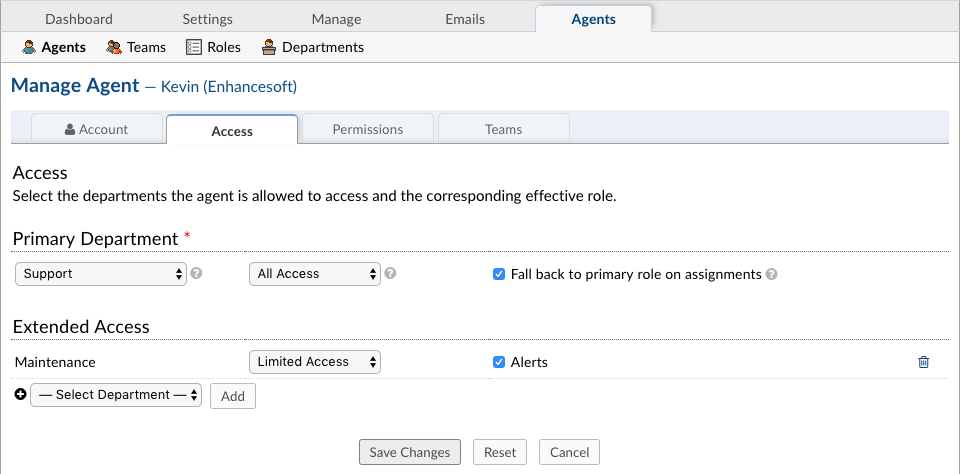

API Keys
========

**Admin Panel > Agents > Agents**

Agents are given access to the help desk with the intent to respond and resolve the tickets. When adding an Agent to the help desk, they will need to be assigned to a Primary Department and given a Primary Role for the Tickets/Tasks routed to that department. Agents can be given Extended Access to additional departments of the help desk as well as assigned different Roles to those departments; this can be configured in the Access tab of the Agent’s Profile.
