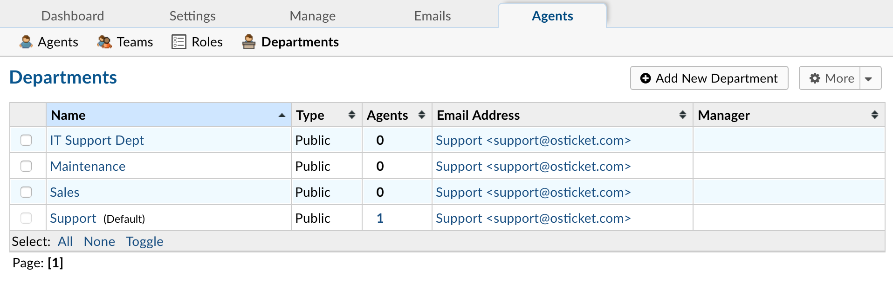

Departments
===========

**Admin Panel > Agents > Departments**

Since tickets are routed through Departments in the help desk, there are many settings that can be set for each Department.

**Department Information:**

  **Parent:**  If nesting departments, this is the Parent Department to nest the department under. Please note: If an agent has access to the Parent Department, they will see the tickets of nested or child departments also, but access does not extend from child departments to Parent Departments.

  **Name:** Department name as it will be displayed throughout the helpdesk.

  **Type:** Select Private if you wish to mask assignments to this Department in the Client Portal. Additionally, when labeled as Private, the **Department Signature** will not be displayed in email replies. At least one department of the help desk must be Public.

  **SLA:** Service Level Agreement for tickets routed to this Department. This the expected amount of time (in hours) that a ticket is expected to be closed once opened. If the ticket is not closed in the allotted amount of time, it will then be Overdue.

  **Manager:** Electively, select a **Manager** for the departments of the help desk. Managers can be configured to receive special alerts and also have the right to un-assign tickets.

  **Ticket Assignment:** Enable this to restrict ticket assignment to include only members of this Department. Department membership can be extended to based on Agent’s Department Access, if **Alerts & Notices Recipients** includes those with department access.

  **Claim on Response:** Check this to **disable** auto-claim on response/reply for this department. Agents can still manually claim unassigned tickets.

**Outgoing Email Settings:**

  **Outgoing Email:** Email Address used when responses are sent to Users when Agents post Responses to Tickets.

  **Template Set:** Email **Template Set** used for Auto-Responses and Alerts & Notices for tickets routed to this Department. Template sets can be cloned and edited for department use in the Admin Panel > Emails > Templates.

**Auto Responder Settings:** This allows you to override the global Autoresponder settings for this Department.

  **New Ticket:** If checked, this will disable the New Ticket Auto-Response sent to the User
  when a new ticket is created and routed to this Department.

  **New Message:** If checked, this will disable the Auto-Response sent to the User to confirm a newly-posted message for tickets in this Department.

  **Auto-Response Email:** Select an email address from which Auto-Responses are sent for this Department; this email would send only auto-response messages, not Agent responses.
