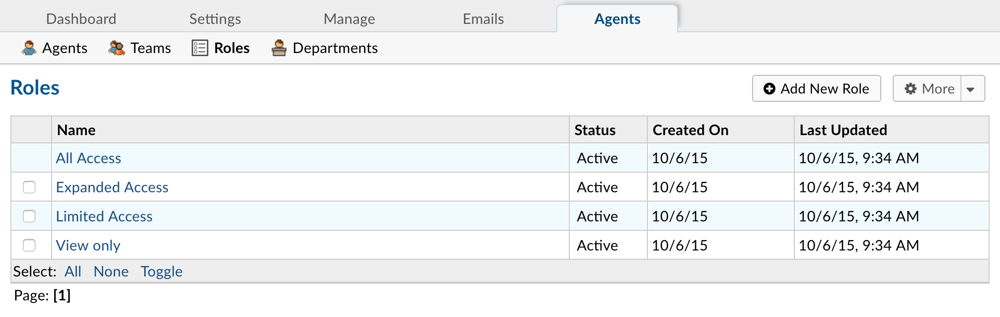

Roles
=====

**Admin Panel > Agents > Roles**

Roles are the permissions granted to Agents per Department that they have access to. Each Role has a set of permissions that can be checked/unchecked for agents given that Role in association with a Department they have access to. An unlimited number of roles can be created and assigned to Agents with access to various departments.

**Role Permissions for Tickets include:**

  **Create:** Ability to open tickets on behalf of users

  **Edit:** Ability to edit tickets

  **Assign:** Ability to assign tickets to agents or teams

  **Transfer:** Ability to transfer tickets between departments

  **Post Reply:** Ability to post a ticket reply

  **Close:** Ability to close tickets

  **Delete:** Ability to delete tickets

  **Edit Thread:** Ability to edit thread items of other agents

**Role Permissions for Tasks include:**

  **Create:** Ability to create tasks

  **Edit:** Ability to edit tasks

  **Assign:** Ability to assign tasks to agents or teams

  **Transfer:** Ability to transfer tasks between departments

  **Post Reply:** Ability to post task update

  **Close:** Ability to close tasks

  **Delete:** Ability to delete tasks

**Role Permissions for the Knowledge Base include:**

  **Premade:** Ability to add/update/disable/delete canned responses

If granted access to the Admin Panel, that Agent will have the ability to make changes in the configurations of the help desk. From the Agent tab of the Admin Panel, the configurations of each Agent of the help desk can be modified, including the ability to Limit an Agent’s access to only tickets that are specifically assigned to them.

The Permissions tab of the Agent profile allows the Agent functionality within the help desk which are not Department specific access items. Areas such as the User Directory, Organization, and Knowledge Base can be limited per Agent. This includes the ability to search for and see the ticket metadata for tickets the Agent does not have access to, the email ban list, and other staff statistics on the dashboard.

**Permissions include:**

  **Users:**

    **Create:** Ability to add new users

    **Edit:** Ability to manage user information

    **Delete:** Ability to delete users

    **Manage Account:** Ability to manage active user accounts

    **User Directory:** Ability to access the user directory

  **Organizations:**

    **Create:** Ability to create new organizations

    **Edit:** Ability to manage organizations

    **Delete:** Ability to delete organizations

  **Knowledge Base:**

    **FAQ:** Ability to add/update/disable/delete knowledgebase categories and FAQs

  **Miscellaneous:**

    **Banlist:** Ability to add/remove emails from banlist via ticket interface

    **Search:** See all tickets in search results, regardless of access

    **Stats:** Ability to view stats of other agents in allowed departments
