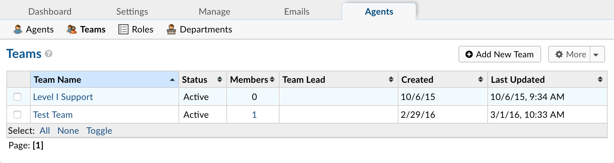

Teams
=====

**Admin Panel > Agents > Teams**

**How to Create Teams In Your Help Desk**

  Teams allow you to pull Agents from different Departments and organize them to handle a specific issue or user via a Help Topic or Ticket Filter.

  Having Agents from different Departments assigned to a Team will supersede the parameters of the Agents’ Department rules. For example, you can create a Help Topic associated with a particular product you produce, and assign it to a Team of specialist Agents from different Departments.

  To create a Team in your Admin Panel, locate the Agents tab, and click on Teams. Then click Add New Team on the right, and fill out the appropriate information. Then you will be able to add Agents to the team by clicking on their name from your list of Agents and checking the corresponding box next to the Team name you wish to add them at the bottom of the page.

  A Team can have an appointed leader who can receive Alerts & Notices separate from other team members. In order to set a Team Leader you can choose an Agent from the Team Lead dropdown when creating a Team or Editing an existing Team.
