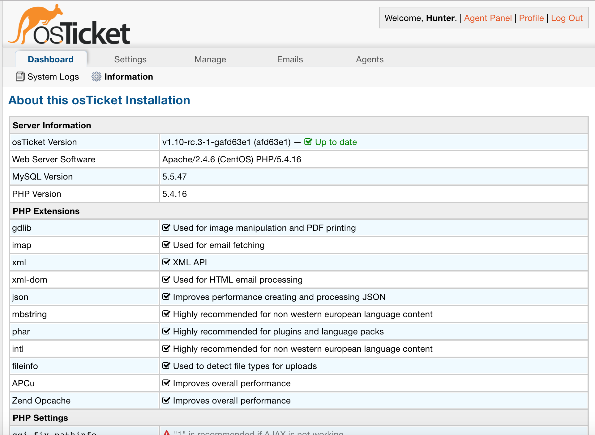

Information
===========

**Admin Panel > Dashboard > Information**

This section of the Admin Panel describes the system that osTicket is installed on. This section displays the system’s Server Information, PHP Extensions, PHP Settings (which have to do with the php.ini file), Database Information and Usage, and Installed Language Packs associated with osTicket.

Basically, this page provides all the technical information of the server and the installed packages necessary to the installation and/or quality performance of osTicket. This page is also very useful for determining how to best troubleshoot any problems or concerns by detailing the system version numbers.

