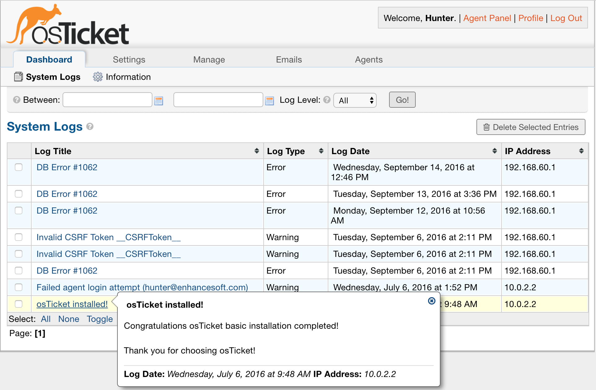

System Logs
===========

**Admin Panel > Dashboard > System Logs**

The System Logs section of the Dashboard Tab is where you will find any troubleshooting-related logging activity (e.g., Errors, Warnings, or Bugs). As seen below, this can relate to various issues, and when the cursor is above any Log, the specific details of the Log are shown.

To delete any Log entries, simply mark the checkbox next to the Log and press the ‘Delete Selected Entries’ button at the top right.

Also, the Default Log Level (e.g., Error, Warn, Debug, or None) can be selected from the **Admin Panel > Settings > System** tab.

