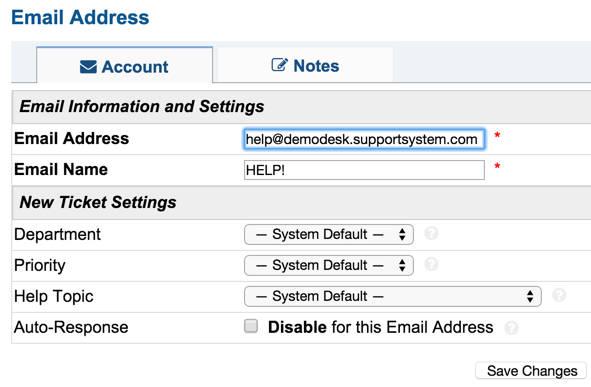

Emails
======

**Admin Panel > Emails > Emails**

Adding Email Addresses
----------------------

An unlimited number of email addresses can be routed through the help desk. With osTicket, an external email inbox can be forwarded to an osTicket subdomain email addresses within the help desk (@yourcompany.osticket.com). There are 3 examples of email addresses in the system, but they can be edited/deleted if necessary. With the osTicket subdomain, an unlimited number of addresses can be added by adding a new email address and typing anything before the "@" symbol of the subdomain.

.. image:: ../../_static/images/admin_emails_emails_account.png
  :alt: Adding Emails

When adding any email address (external mailbox or osTicket subdomain email), the New Ticket Settings can be configured to be different than the System Default. These settings help determine the workflow for tickets that are created from a User emailing this email address.

An external email address can also be added to the help desk and configured to have the mail in the inbox fetched into the Help Desk to create tickets. The SMTP settings for this same email or any other can be enabled for outgoing emails as well. You can easily do this by adding the preferred email address to the system and setting up the SMTP for that email.

Fetching with IMAP/POP can be configured by clicking "Enable" and filling in the information for the email address; the same goes for SMTP for outgoing email. Once the information has been entered, click “Save Changes” at the bottom of the configurations page. If configured correctly, a green banner will appear stating that the address has been successfully added and configured. If a red banner appears, please review the error and make configuration adjustments.

After the email address has been configured in the Email Tab, be sure to enable fetching for the system at Admin Panel > Settings > Emails. On this tab, the System Default Outgoing email address can also be set from any emails in the Help Desk configured with SMTP.

Email Addresses can be set for each Department for routing, Outgoing Emails (Agent Responses to tickets routed to that Department), and/or Auto Responses for tickets assigned to that Department. All of these configurations can be done at the Department configurations located in Admin Panel > Agents.
