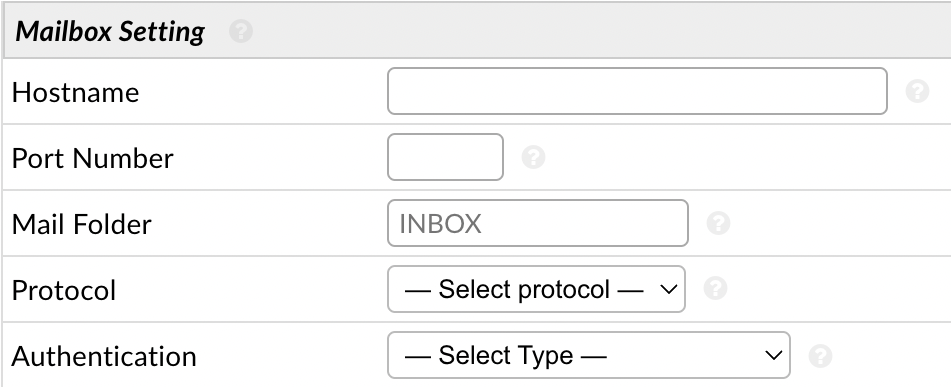
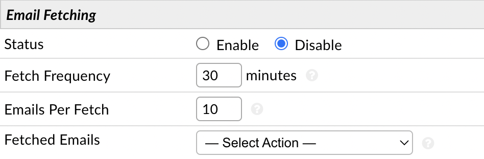
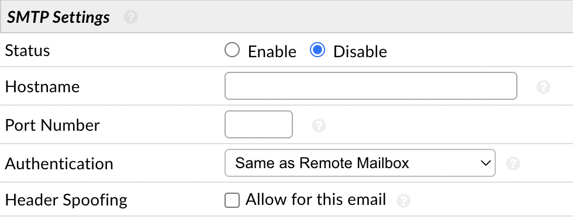

Email
=====

An unlimited number of email addresses can be routed through the help desk. You can configure IMAP or POP3 settings for an email so the system can fetch mail from the mailbox and create tickets. You can also configure SMTP settings for an email so the system can send mail from the address. Additional settings can be configured to change certain things on New Tickets that are fetched from the address.

Add New Email
-------------

**Admin Panel > Emails > Emails > Add New Email**

First, click the **Add New Email** button on the right-hand side of the screen. Once on the Add New Email page you can start by inputting the email address and the name you want the end Users to see as to whom the email is from.

.. image:: ../../_static/images/admin_emails_emails_address.png
  :alt: Email Address and Name

Optionally, configurations such as the Department the ticket will be routed to as well as assigning a Help Topic can be determined for this email address.

.. image:: ../../_static/images/admin_emails_emails_ticket_settings.png
  :alt: New Ticket Settings

Once you fill out this page with the needed information you will click **Submit** to finish creating the new email. After submission you will see two new tabs **Remote Mailbox** and **Outgoing (SMTP)**.

To configure email fetching click the **Remote Mailbox** tab. Here you can fill in the information for the email address.

**Hostname:** The IMAP/POP3 hostname for your mail server. You can check your provider's documentation for the specific hostname to use.

**Port Number:** The IMAP/POP3 port number for your mail server. This may be available in the documentation for your hosting account or from your email administrator. If using non standard Port number with SSL enabled then prefix the hostname with :code:`ssl://` or :code:`tls://` scheme to hint to supported encryption.

**Mail Folder:** Enter the Folder name that you wish to fetch mail from. If left empty the system will fetch from the INBOX.

**Protocol:** Select the mailbox protocol supported by your remote mail server. IMAP on a secure port is highly recommended.

**Authentication:** The authentication method you want to use for the IMAP/POP3 connection. By default you have the option of **Basic Authentication**. If you want to use OAuth2 you must install [the auth-oauth2 plugin](link to oauth2 guide).

    **Basic Authentication (Legacy):** This is your run of the mill Username + Password authentication. Most major providers are phasing this out for Modern Authentication (OAuth2) but if you run your own mail server you may still need to use this option.

    :doc:`OAuth2 - Google: <../../OAuth2/Google Authorization Guide>` This provides a template with pre-filled information for Google OAuth2; making setup a little easier.

    :doc:`OAuth2 - Microsoft: <../../OAuth2/Microsoft Authorization Guide>` This provides a template with pre-filled information for Microsoft OAuth2; making setup a little easier.

    **OAuth2 - Other Provider:** This provides a blank template for a 3rd party OAuth2 provider.

Once you configure **Authentication** you can then finish the remaining **Email Fetching** section.

**Status:** Enable or Disable Email Fetching.

**Fetch Frequency:** Enter how often, in minutes, the system will poll the mail box. This will define the average delay in receiving an Auto-Response after a User sends an email to this mail box.

**Emails Per Fetch:** Enter the number of emails processed at one time.

**Fetched Emails:** Decide what to do with processed emails:

    **Move to Folder:** This will backup your email from the INBOX to a folder you specify. If the folder does not yet exist on the server, the system will attempt to automatically create it. (Recommended)

    **Delete Emails:** This will delete your email from the INBOX once it is processed.

    **Do Nothing:** This will leave emails in your INBOX. The system will record the message ids of your email and attempt not to refetch it. However, this option may cause duplicate tickets to be created. (Not Recommended)

After you have configured the Mail Account Settings, be sure to enable fetching for the system at **Admin Panel > Emails > Settings**.

.. image:: ../../_static/images/admin_emails_emails_enable_fetching.png
  :alt: Enable Fetching

Next, you will need to setup the SMTP configurations for the email address in the last section. Click **Enable** and fill in the information for the email address.

**Status:** Enable or Disable Outgoing Email.

**Hostname:** The SMTP hostname for your mail server. You can check your provider's documentation for the specific hostname to use.

**Port Number:** The SMTP port number for your mail server. This may be available in the documentation for your hosting account or from your email administrator. If using non standard Port number with SSL enabled then prefix the hostname with :code:`ssl://` or :code:`tls://` scheme to hint to supported encryption.

**Authentication:** The authentication method you want to use for the SMTP connection. By default you have the options of **Same As Remote Mailbox**, **Basic Authentication**, or **None (No Authentication Required)**. If you want to use OAuth2 you must install [the auth-oauth2 plugin](link to oauth2 guide).

    **Same As Remote Mailbox:** This will utilize the Authentication method configured in the Remote Mailbox tab if they use the same authentication method and information.

    **None - No Authentication Required:** This option will not use Authentication for the SMTP connection. In some instances (especially when using Relay Ports) no authentication is required to send mail.

    :doc:`OAuth2 - Google: <../../OAuth2/Google Authorization Guide>` This provides a template with pre-filled information for Google OAuth2; making setup a little easier.

    :doc:`OAuth2 - Microsoft: <../../OAuth2/Microsoft Authorization Guide>` This provides a template with pre-filled information for Microsoft OAuth2; making setup a little easier.

    **OAuth2 - Other Provider:** This provides a blank template for a 3rd party OAuth2 provider.

    **Basic Authentication (Legacy):** This is your run of the mill Username + Password authentication. Most major providers are phasing this out for Modern Authentication (OAuth2) but if you run your own mail server you may still need to use this option.

**Header Spoofing:** Enable this to allow sending emails via this mailbox from an address other than the one given in the **Email Address** setting. This advanced setting is generally used when sending mail from aliases of this mailbox.

Once you have the email's SMTP setup, you will need to make it your System Default Outgoing email address by going to **Admin Panel > Emails > Settings** and changing the second to last box to the email address you just configured SMTP for.

.. image:: ../../_static/images/admin_emails_emails_enable_outgoing.png
  :alt: Set Default Mail Transfer Agent (MTA)

If you would like this same address used for each department, you will need to assign the email address as the outgoing email address for each department individually. You can do this by going to **Admin Panel > Staff > Department > (click on department name)**, go to the **Autoresponder Settings** section, and change the **Auto-Response Email**.

.. image:: ../../_static/images/admin_emails_emails_autoresponse_email.png
  :alt: Set Department’s Autoresponse Email
