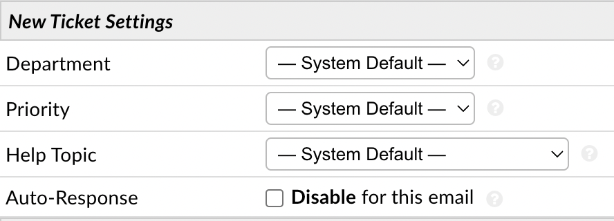

Email
=====

An unlimited number of email addresses can be routed through the help desk. You can configure IMAP or POP settings for an email so the system can fetch mail from the mailbox and create tickets. You can also configure SMTP settings for an email so the system can send mail from the address. Additional settings can be configured to change certain things on New Tickets that are fetched from the address.

Add New Email
-------------

**Admin Panel > Emails > Emails > Add New Email**

First, click the **Add New Email** button on the right-hand side of the screen. Once on the Add New Email page you can start by inputting the email address and the name you want the end Users to see as whom the email is from.

.. image:: ../../_static/images/admin_emails_emails_address.png
  :alt: Email Address and Name

Optionally, configurations such as the Department the ticket will be routed to as well as assigning a Help Topic can be determined for this email address.

Next fill out the Login Information for the email address. The Username is utilized in the email authentication process. In most cases you will have only one username for an email address (which is the email address itself). In the case of shared mailboxes however, you specify the authenticating user address first then the shared user address separated by a backwards/forwards slash (eg. :code:`user@domain.tld\shared@domain.tld`). In some email setups you might need to specify a servername/hostname before the username (eg. :code:`Servername\user@domain.tld`). In rare cases you might need a combination of all (eg. :code:`Servername\user@domain.tld\shared@domain.tld`). We accept all the aforementioned formats; below are some examples:

+-------------------------------------------------+-------------------------------+-------------------------------+
| String                                          | authname                      | username                      |
+=================================================+===============================+===============================+
|``user@domain.tld``                              |                               |``user@domain.tld``            |
+-------------------------------------------------+-------------------------------+-------------------------------+
|``user@domain.tld\shared@domain.tld``            |``user@domain.tld``            |``shared@domain.tld``          |
+-------------------------------------------------+-------------------------------+-------------------------------+
|``Servername\user@domain.tld``                   |                               |``Servername\user@domain.tld`` |
+-------------------------------------------------+-------------------------------+-------------------------------+
|``Servername\user@domain.tld\shared@domain.tld`` |``Servername\user@domain.tld`` |``shared@domain.tld``          |
+-------------------------------------------------+-------------------------------+-------------------------------+

.. image:: ../../_static/images/admin_emails_emails_login_info.png
  :alt: Login Infromation

You can setup IMAP/POP by clicking **Enable** and filling in the information for the email address.

.. image:: ../../_static/images/email_fetching.png
  :alt: IMAP/POP Settings

After you have configured the Mail Account Settings, be sure to enable fetching for the system at **Admin Panel > Emails > Settings**.

.. image:: ../../_static/images/admin_emails_emails_enable_fetching.png
  :alt: Enable Fetching

**Fetch From Mail Folder:** This feature adds a textbox in the Email configurations that allows you to configure a specific Folder to fetch from. If no folder is provided the system will fetch from the INBOX as usual.

Next, you will need to setup the SMTP configurations for the email address in the last section. Click **Enable** and fill in the information for the email address.

Once you have the email's SMTP setup, you will need to make it your System Default Outgoing email address by going to **Admin Panel > Emails > Settings** and changing the second to last box to the email address you just configured SMTP for.

.. image:: ../../_static/images/admin_emails_emails_enable_outgoing.png
  :alt: Set Default Mail Transfer Agent (MTA)

If you would like this same address used for each department, you will need to assign the email address as the outgoing email address for each department individually. You can do this by going to **Admin Panel > Staff > Department > (click on department name)**, go to the **Autoresponder Settings** section, and change the **Auto-Response Email**.

.. image:: ../../_static/images/admin_emails_emails_autoresponse_email.png
  :alt: Set Department’s Autoresponse Email

**Separate SMTP Credentials:** This feature adds the ability to separate the IMAP/POP and SMTP credentials for a System Email. This adds a checkbox next to the Authentication Required setting where, if Enabled, will show two additional inputs for the SMTP Username and Password. If Authentication Required is set to No the SMTP Username and Password inputs will disappear as they are not needed. If the checkbox is Disabled the system will use the IMAP/POP credentials for SMTP.
