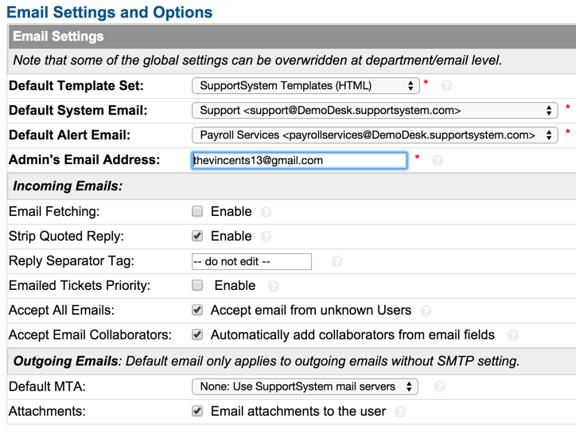

Settings
========

**Admin Panel > Emails > Settings**

Settings & Options
------------------

The system default email settings can be determined at the Admin Panel > Emails > Settings tab. This includes the Incoming Email global settings, default Outgoing Email address, and enabling Email Fetching.

It can be determined on this sub-tab if Collaborators can be added to tickets via email, if tickets from unregistered (unknown) Users will be accepted, and if Attachments can be emailed to Users from Agents. Please note: Users are considered unknown to your help desk if they are not currently in the User Directory. Users can be added by agents or auto added.
