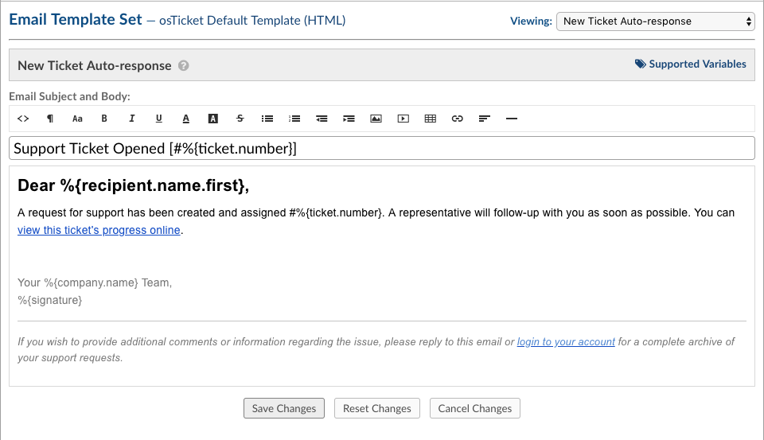
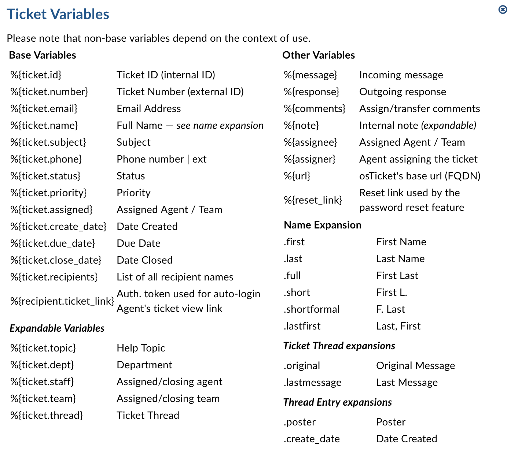
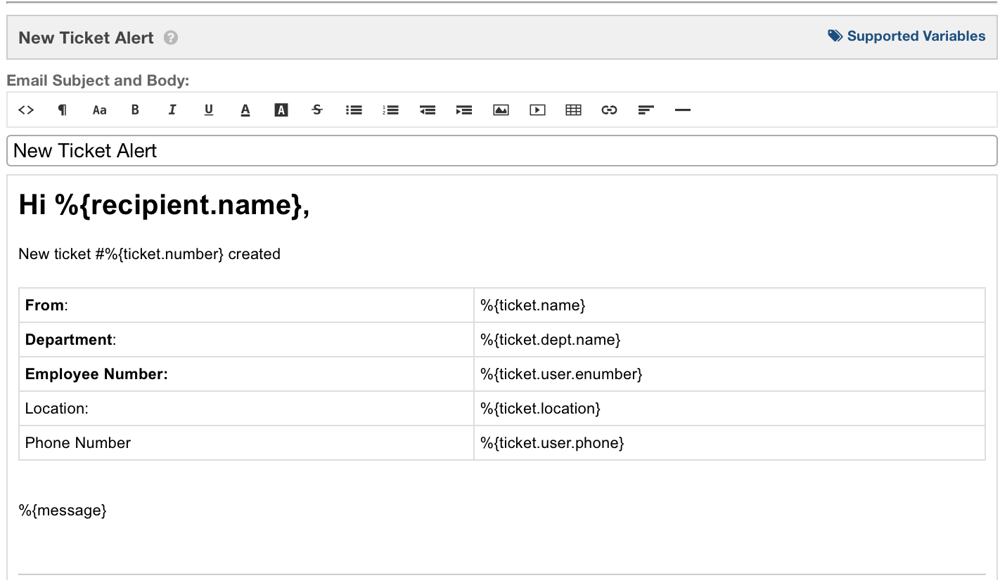

Templates
=========

**Admin Panel > Emails > Templates**

OsTicket contains stock messages that are sent out to both Agents and End Users during specific events of a ticket’s life cycle. These email message templates can be edited, disabled globally or locally, as well as cloned and assigned to different Departments. When editing, the messages in the templates each have an HTML/Rich Text toolbar for design and brand flexibility.

All templates can include variables which will automatically pull that information (if available) from a submitted ticket.

The entire set of email templates can be cloned for use and assigned to a specific Department of the Help Desk. This is especially useful if the messages need to be different for tickets assigned to the Department.

**Supported variables**

An unlimited number of Forms can be built with an unlimited number of fields. You can add a variable name to all fields so that you can use them in Canned Responses and Email Templates. Template Variables utilize the typeahead feature so to populate the available, relevant variables simply type :code:`%{` to initiate the Variable Typeahead and then select the variable name.

Various areas of the helpdesk can contain custom fields such as the Contact/User Information form, Ticket Details form, Organization form, Company Information form, and Task Details form. To use custom form fields in Canned Responses and Email Templates, each variable must be unique.

When editing email templates, only the available variables for use in the message will appear in the drop down. You can further expand the templates where applicable by entering a period after the last character in the variable. This will produce all available extensions for that variable.

Fields on the Organization Information built-in form can be built with this format:

  :code:`%{ticket.user.organization.field_variable}`

Fields on the User Information built-in form can be built with this format:

  :code:`%{ticket.user.field_variable}`

Fields on the Ticket Details built-in form or a custom form with defined variables can be built with this format:

  :code:`%{ticket.field_variable}`

Fields on the Ticket Details built-in form or a custom form involving a Custom List with defined Properties can be built with this format:

  :code:`%{ticket.field_variable.property_variable}`

Within each email template there is a Supported Variables option in the upper right corner that will provide a partial list of the variables available. As the forms are built out to contain additional fields there will be more variables available to be used in the email templates and canned responses.

Using both built in form fields and any custom form fields, email templates can be edited to contain the information provided by the End-User if there information in those fields on the forms otherwise the variable name will appear in the email template.

