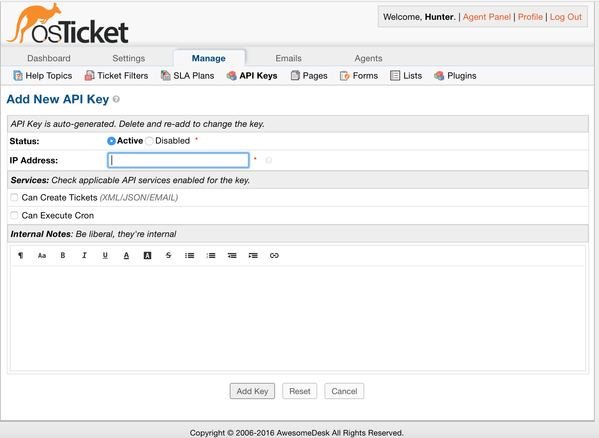

API Keys
========

**Admin Panel > Manage > API Keys**

Adding/Enabling/Disabling/Deleting an API Key
---------------------------------------------

The osTicket API built into osTicket allows you to write your own html forms and push the data into osTicket to open tickets.

In this section, API keys can be added with the ‘Add New API Key’ button, and they can be enabled/disabled/deleted by clicking on the checkbox next to the key, then clicking on the top right drop-down menu.

The following image is the information page where an API Key can be entered and Added. At this page, the API Key can be set to Active or Disabled, the IP address of the server that hosts the software. Then, Ticket Creation and Cron services can be enabled for the key. Finally, an internal note can be inserted to note the reason for this key.

