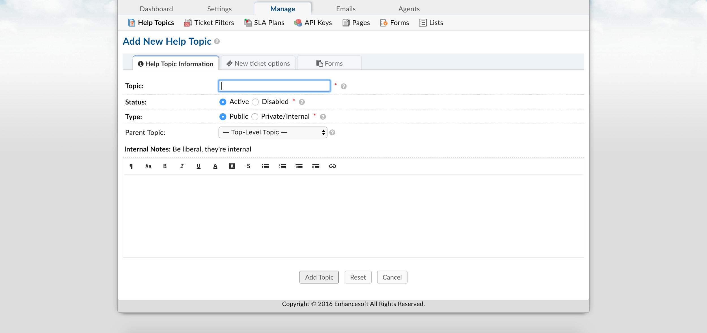
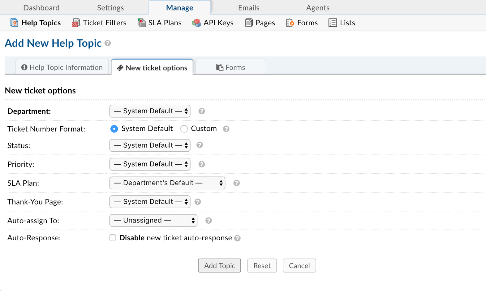
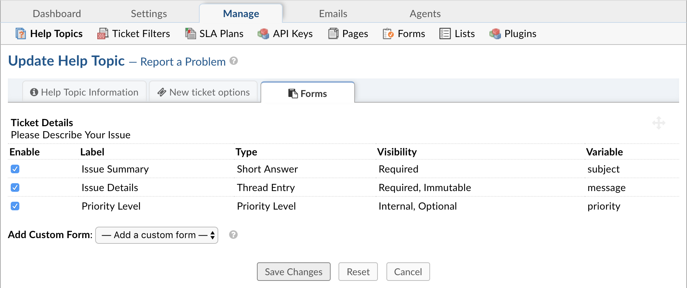

Help Topics
===========

**Admin Panel > Manage > Help Topics:**

Create and Assign Help Topics
-----------------------------

Help Topics will help streamline your end-user’s help desk experience to ensure proper assignment and prompt response to the ticket. Create as many Help Topics as needed and can even nest Help Topics within each other for further breakdown (For example, Human Resources and Human Resources/Payroll.)

Help Topics will determine what Department the ticket is routed to which will determine which Agents have access to the ticket. The Help Topic also can determine other configurations of the ticket, such as the ticket’s SLA (or Service Level Agreement) and priority of a ticket, i.e. Emergency to Low.

There are two places where the Help Topic must be selected on New Tickets; the client portal and new tickets created internally by staff. When Users select the Help Topic, they are not aware of the configurations in place for that Help Topic.

**Admin Panel > Manage > Help Topics > Add New Help Topic** or click on existing topic to edit the following:

**Help Topic Information Tab:**

**Topic:** This is the name of the Help Topic as it will appear to the end-user.

**Status:** Must be set to “Active” to be utilized; if disabled, the topic will not appear in the drop down.

**Type:** If topic is selected as “Private,” it will only be visible when a ticket is created internally by an Agent from the Staff Control Panel (Agent Panel > Tickets > New Ticket).

**Parent Topic:** Topics can be nested together to further streamline the client’s selection of topics. The Parent Topic will show up first in the drop down followed by the topic name. Even though it is nested, the child topic’s settings will override the Parent Topic’s settings.

**New Ticket Options Tab:**

**Department:** Tickets with this help topic will be assigned to specified department. Department defaults will be associated with this ticket unless otherwise specified. You can choose the templates that will be used for autoresponse and staff alerts (which will have the department signature if the signature variable is included.)

**Ticket Number Format:** Custom ticket number formats can be created and associated to tickets opened under this help topic.

**Status:** Tickets can assigned to a status automatically.

**Ticket Priority:** This will determine the tickets sort order in the Open Tickets queue of the Agent Panel. By default, tickets will sort in descending order.

**SLA Plan:** If the specific help topic requires a different SLA Plan than the assigned department, you can assign an SLA Plan to override the department SLA auto-assigned to the department. SLA’s can be created at Admin Panel > Manage > SLA Plans.

**Thank You Page:** Once the client creates a ticket, you can create/edit the Thank You Page they are directed to. Pages can be created and/or edited at Admin Panel > Manage > Site Pages.

**Auto-Assign:** Tickets can be Auto-Assigned to an agent or a team when this help topic is chosen.

**Ticket Auto-Response:** When disabled, no auto-response will be sent to client if this help topic is chosen. If ticket is created internally, no response will be sent UNLESS the agent creating the ticket selects for an Auto Response to be sent to the email address of the ticket.

**Forms Tab:**

**Custom Form:** Extra information for tickets associated with this help topic. Custom Forms can be created at Admin Panel > Manage > Forms. The fields of the form will appear once the Help Topic is selected.

Fields can be individually disabled by help topic. These fields would not appear on the new ticket form if disabled.
