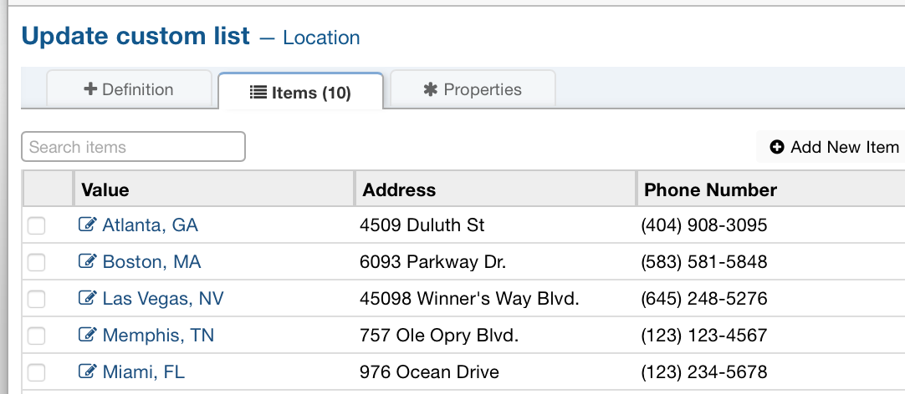
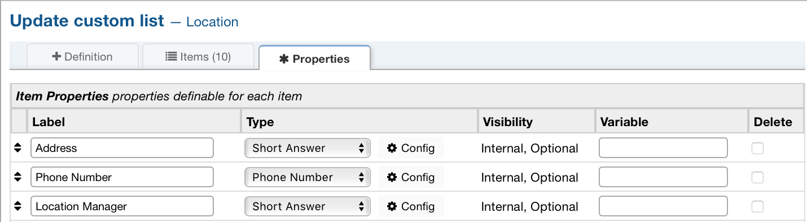
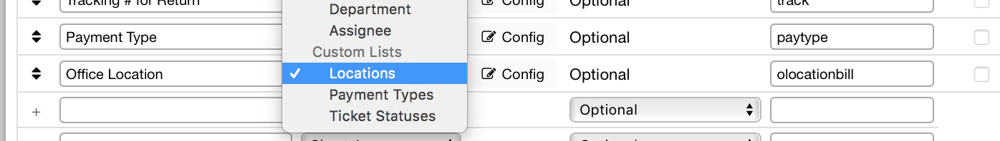
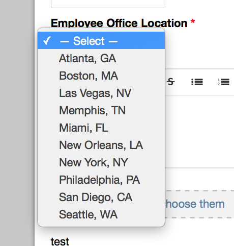

Lists
=====

**Admin Panel > Manage > Lists**

Create New Custom List
----------------------

.. image:: ../../_static/images/admin_manage_lists_customLists.png
  :alt: Custom Lists

Custom Lists permit the creation of dropdown boxes with predefined options from which an End-User can select on a form. Create a Custom List by going to **Admin Panel > Manage > Lists> Add New Custom List**. The list will show up as a Field Type when creating a field on either a Built-In or Custom Form. Abbreviations are encouraged where applicable as these will be used in association with a list configured as a Type Ahead instead of Drop Down. This Type of List is recommended when you have more than 3 choices.

Additional information can be associated with each List item which will be available for Agents to view.

Item Properties help define additional information for which is unique for each List item. The properties will need to be determined when creating the List and then defined per List item.

Custom Lists can then be added to a Custom Form which will allow the specific information to be captured from the End-Users and Agents when creating tickets.

Once an End-User selects a Help Topic that has a Custom Form with the List you've created they will be able to see the List and select a value.

**Definition**

  **Name:** Name of the custom list. (required)

  **Plural Name:** Plural version of the custom list Name. (not required)

  **Sort Order:** Order you would like the list to be sorted.

  **Internal Notes:** Section for any notes you would like to add.

**Properties**

  **Label:** Name of the list item.

  **Type:** The type you would like the list item to be.

  **Visibility:** Wether or not you want the item to be seen.

  **Variable:** Variable name for the list item.

  **Delete:** Wether of not you want to delete the list item.
