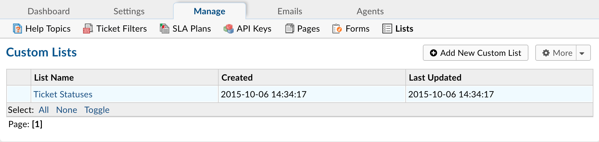

Lists
=====

**Admin Panel > Manage > Lists**

Create New Custom List
----------------------

Custom Lists will permit you to create dropdown boxes with predefined options from which a Client can select in your Custom Forms.

You can create one by clicking Add New Custom List.

**Definition**

  **Name:** Name of the custom list. (required)

  **Plural Name:** Plural version of the custom list Name. (not required)

  **Sort Order:** Order you would like the list to be sorted.

  **Internal Notes:** Section for any notes you would like to add.

**Properties**

  **Label:** Name of the list item.

  **Type:** The type you would like the list item to be.

  **Visibility:** Wether or not you want the item to be seen.

  **Variable:** Variable name for the list item.

  **Delete:** Wether of not you want to delete the list item.
