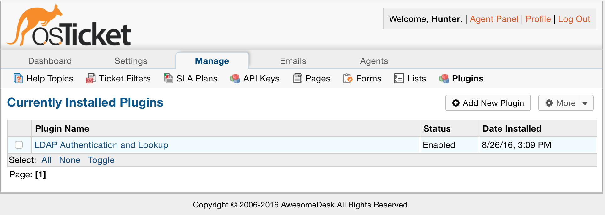
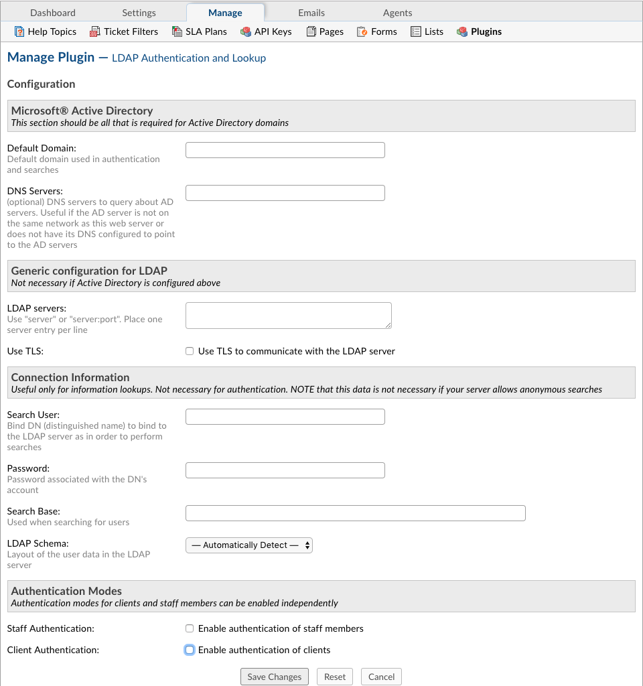

Plugins
=======

**Video Tutorial:**

.. raw:: html

    

        <iframe width="560" height="315" src="https://www.youtube.com/embed/Olh1z-RNEhQ" frameborder="0" allow="accelerometer; autoplay; encrypted-media; gyroscope; picture-in-picture" allowfullscreen></iframe>
    

**Admin Panel > Manage > Plugins**

Add New Plugin
--------------

To add a plugin into the system, download and place the plugin into the include/plugins folder. Once in the plugin is in the plugins/ folder, it will be shown in the list.

For each plugin the configurations will vary; access and customize them by clicking on the plugin name.
