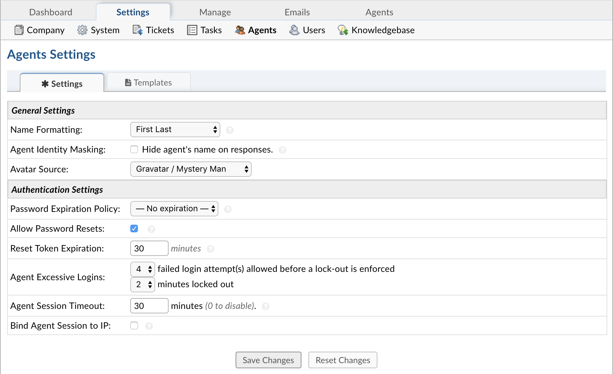

Agents Settings
===============

**Admin Panel > Settings > Agents**

Settings
--------

Set system configurations for the Agents of the help desk including the Password Expiration Policy, the max number of failed login attempts before prompting the “forget password” link, or if they need to be locked out. Agents can also be bound to their IP address for log-in.

**Name Formatting:** Format for Agents names throughout the system.

**Agent Identity Masking:** If enabled, this will hide the Agent’s name from the Client during any communication.

**Avatar Source:** Choice of where you want your Avatars to come from.

**Password Expiration Policy:** Choose how often Agents will be required to change their password. If disabled, passwords will not expire.

**Allow Password Resets:** If enabled, displays the Forgot My Password link on the Staff Log-In Page after a failed log in attempt.

**Reset Token Expiration:** Choose the duration (in minutes) for which the Password Reset Tokens will be valid. When an Agent requests a Password Reset, they are emailed a token that will permit the reset to take place.

**Agent Excessive Logins:** Choose how many failed login attempt(s) allowed before a lock-out is enforced as well as how long the lock will be.

**Agent Session Timeout:** Choose the maximum idle time (in minutes) before an Agent is required to log in again.

**Bind Agent Session to IP:** Enable this if you want Agent to be remembered by their current IP upon Log In.

Templates
---------

**Agent Welcome Email:** Initial (optional) email sent to staff members when accounts are created for them in the staff control panel

**Sign-in Login Banner:** This is the initial message and banner shown on the staff login page.

**Password Reset Email:** Template of the email sent to staff members when using the Forgot My Password link.
