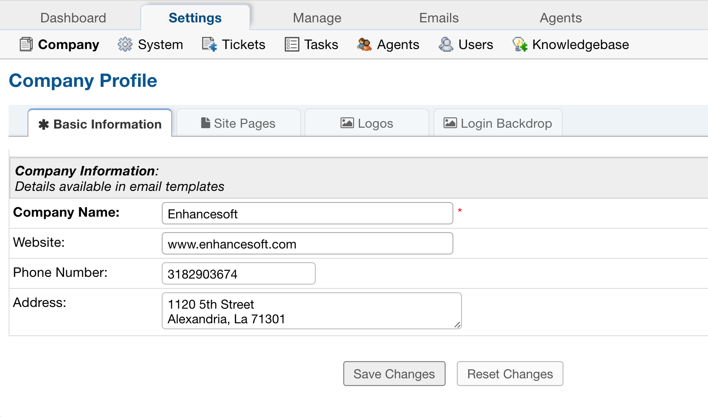

Company Settings
================

**Admin Panel > Settings > Company**

Basic Information
-----------------

This tab contains the information that will be pulled into the email templates for the help desk company information, including Company Name, address, etc. Custom Fields can be added to the Company Information built-in form located at Admin Panel > Manage  > Forms.

Site Pages
----------

.. image: ../../_static/images/admin_settings_comp_sitePages.png
  :alt: Site Pages

Logos
-----

.. image: ../../_static/images/admin_settings_comp_logos.png
  :alt: Logos

The help desk can be branded with a company logo by uploading a company logo at Admin Panel > Settings > Company.

The logo may be an image in a .gif, .jpg, or .png format. To speed up load times, it is recommended that the image be sized close to the default image size (817px x 170px). Once the logo has been selected, click on "Save Changes" at the bottom of the page to start the upload process.

After the logo is uploaded, be sure to select it to be visible on the Landing, Thank You, and Offline pages. Numerous logos can be uploaded and added to email templates; however, only one logo can be visible at a time on all Site Pages.To edit the text for these pages, simply go to Admin Panel > Manage > Site Pages and select the page to be edited.

Login-Backdrop
--------------

Upload an image to customize the **Backdrop** that will be displayed on the staff login page. Choose an image in the .gif, .jpg, or .png formats. We will proportionally resize the display of your image. We will not, however, resize the image’s data. Therefore, to speed load times, it is recommended that you keep your image relatively small (under a megabyte). Note also that the PHP max upload settings apply.
