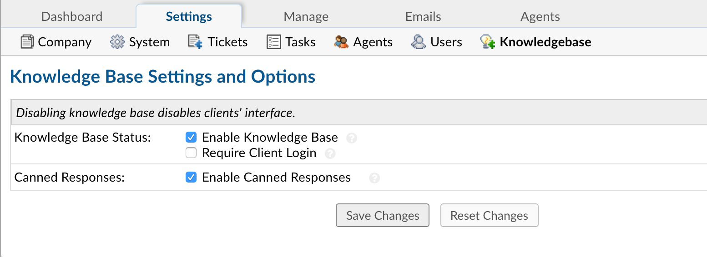

Knowledgebase Settings
======================

**Admin Panel > Settings > Knowledgebase**

Options & Settings
------------------

**Knowledgebase Status:**

  **Enable Knowledge Base:** Allows your Users self-service access to your public knowledgebase articles.

  **Require Client Login:** Requires all Users to log in before they can view knowledgebase articles.

**Canned Responses:** Enable this setting to allow Agents to use Canned Responses when replying to tickets. 
