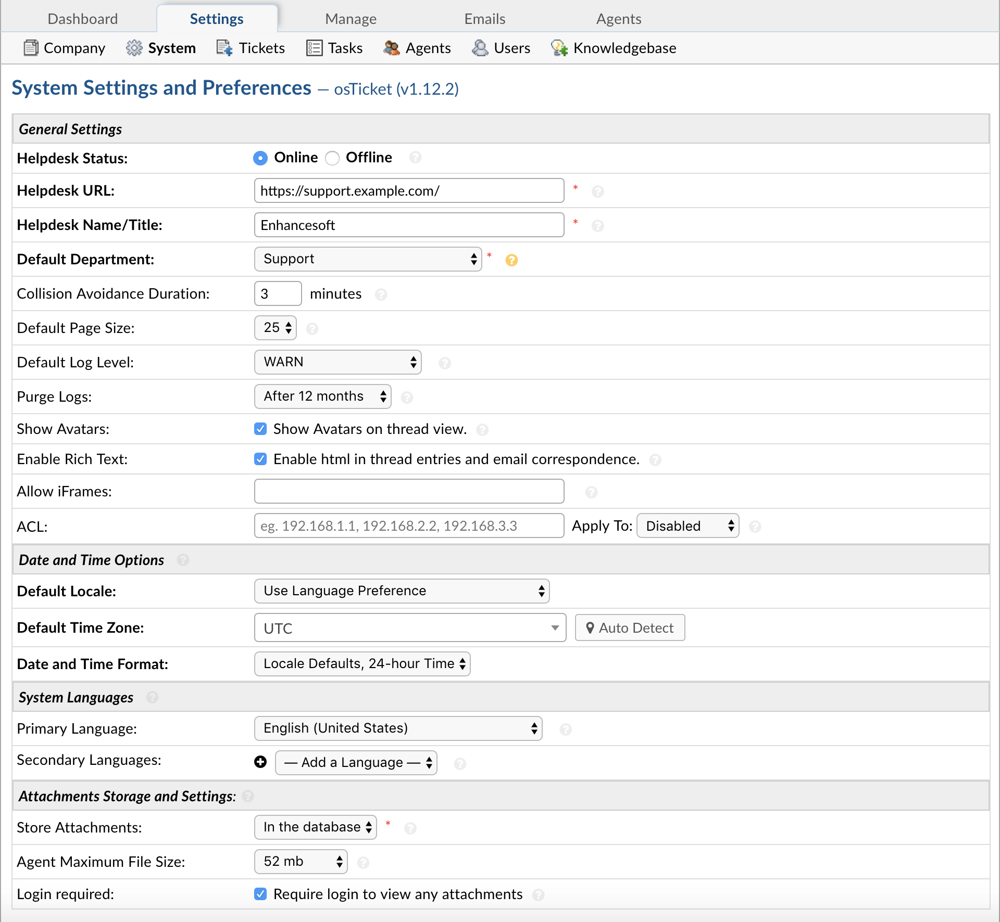

System Settings
===============

**Admin Panel > Settings > System**

General Settings
----------------

**Helpdesk Status:** If the status is changed to Offline, the client interface will be disabled. This does not, however, affect any normal Agent interaction with the Agent Panel.

**Helpdesk URL:** This URL is the base of your osTicket installation. It is used in email communication to direct Users back to your helpdesk.

**Helpdesk Name/Title:** This is the title that appears in the browser tab. Also, if your help desk page is bookmarked, this will be the title/name of the site page.

**Default Department:** Choose a default Department for tickets that are not otherwise routed to a specific department. Tickets can be routed-based on help topics, incoming emails, and ticket filter settings.

**Collision Avoidance Duration:** Enter the maximum length of time an Agent is allowed to hold a lock on a ticket or task without any activity. Enter 0 to disable the lockout feature.

**Default Page Size:** Choose the number of items shown per page in the Ticket Queues of the Agent Panel. Each Agent can also customize this number for their own account under My Preferences.

**Default Log Level:**  Determine the minimum level of issues which will be recorded in the System Log. Debug represents the least severity, and Error represents the greatest severity. For example, if you want to see all issues in the System Logs, choose Debug.

**Purge Logs:** Determine how long you would like to keep System Logs before they are deleted. System logs are located at Admin Panel > Dashboard and include Error Messages, Warnings, or Debug events of the help desk.

**Show Avatars:** Enable this to show Avatars on thread correspondence. The Avatar Source can be set in Agents' and Users' settings pages.

**Enable HTML/Rich Text:** If enabled, this will permit the use of rich text formatting between Clients and Agents.

**ACL:** ACL (or Access Control List) is a feature allowing you to limit access to your entire helpdesk (or specific panels) to a list of IP addresses. See full documentation :doc:`here <../../Features/ACL (Access Control List)>`.

**Allow iFrames:** This is a setting to allow specified domains to use your helpdesk in an iFrame. By default no one is allowed to use your helpdesk in an iFrame for security purposes. If however you'd like to use your helpdesk in an iFrame on your company website/forum/etc you can enter the site domain in the Allow iFrames textbox and the site will be able to use your helpdesk in an iFrame. This option accepts domain wildcards, HTTP/HTTPS URL scheme, and port numbers. For more information on these formats view the :code:`<host-source>` options in `this link <https://developer.mozilla.org/en-US/docs/Web/HTTP/Headers/Content-Security-Policy/frame-ancestors#Sources>`__. *Example:* :code:`https://domain.tld, sub.domain.tld:443, http://*.domain.tld`

Date & Time Settings
--------------------

**Date & Time Options Section:**

The following settings define the default settings for Date and Time settings for the help desk. You can choose to use the locale defaults for the selected locale or use customize the formats to meet your unique requirements. Refer to the ICU format strings as a reference for customization. The dates shown below simply illustrate the result of their corresponding values.

  **Default Locale:** Can be based on Language Preference or select other available options from the drop down. Please note, any included language packs will expand the local options available.

  **Default Time Zone:** Can be auto detected or selected from available options in the drop down.

  **Date & Time Format:** Can choose from Locale Default, Locale Defaults with 24-hour time or Advanced for specific time/date formatting options of the the ICU Date Formatting Table

    **ADVANCED:**

    **Time Format:** Format of the time as seen throughout the help desk.

    **Date Format:** Date format preference for the Help Desk.

    **Date and Time Format:** Format of the Date and Time of the Help Desk.

    **Day, Date, and Time Format:** Where applicable, format of the Day, Date, and Time stamp of the Help Desk.

**System Languages:** Choose a system primary language and optionally secondary languages to make your interface feel localized for your agents and Users.

  **Primary Language:** Content of this language is displayed to agents and Users if their respective language preference is not currently available. This includes the content of the interface as well as custom content, such as thank-you pages and email messages. This is the language in which the untranslated versions of your content should be written.

  **Secondary Language:** Select language preference options for your agents and Users. The interface will be available in these languages, and custom content, such as thank-you pages and help topic names, will be translatable to these languages.

**Attachment Settings and Storage:** Configure how attachments are stored.

  **Store Attachments:** Choose how attachments are stored; in the database or in additional storage backends which can be added by installing storage plugins.

  **Agent Maximum File Size:** Choose a maximum file size for attachments uploaded by agents. This includes canned attachments, knowledge base articles, and attachments to ticket and task replies. The upper limit is controlled by PHP's upload_max_filesize setting.

  **Login Required:** Enable this setting to forbid serving attachments to unauthenticated users. That is, users must sign into the system (both end users and agents), in order to view attachments. From a security perspective, be aware that the user's browser may retain previously-viewed files in its cache. Furthermore, all file links on your helpdesk automatically expire after about 24 hours.
