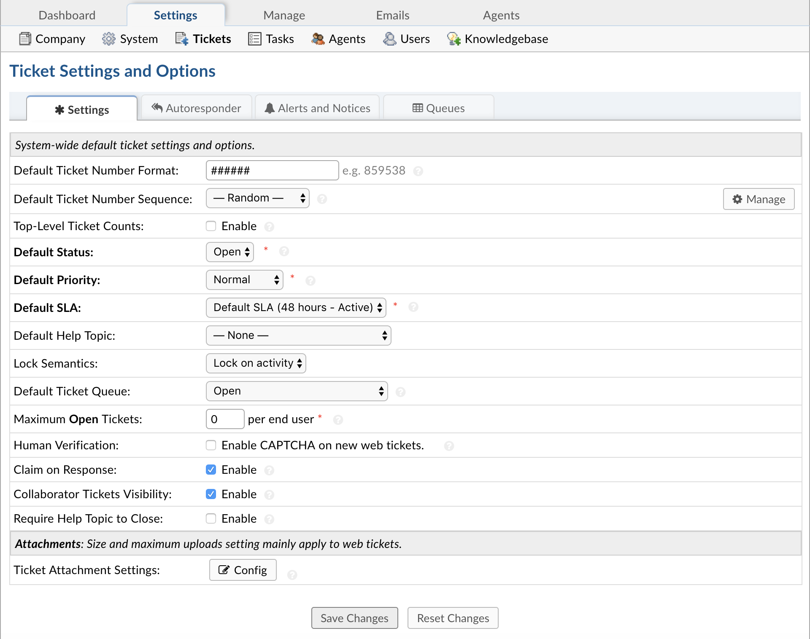
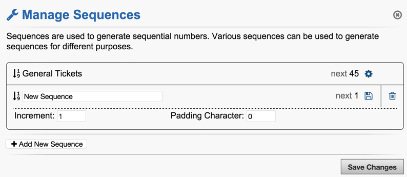
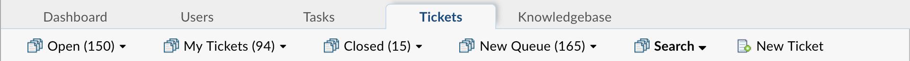

Tickets Settings
================

**Admin Panel > Settings > Tickets**

Settings
--------

In this section, you can create standards and rules for each ticket that is created. Review each setting in this tab and determine the best settings for your organization. You can also enable attachments on this tab. All default settings can be overridden at various locations in the help desk.

**Default Ticket Number Format:** This setting is used to generate ticket numbers. Use hash signs (`#`) where digits are to be placed. Any other text in the number format will be preserved. For example, for six-digit numbers, use ######.

**Default Ticket Number Sequence:** Choose between Random or Sequential numbers for tickets. To create new sequences, click on the Manage button to the far right of the field.

**Top-Level Queue Counts:** If enabled, this will show the Ticket Counts for Top-Level Queues. By default Top-Level Queues do not show their counts. For now, counts will not appear until you hover over one of the Queue names.

**Default Status:** Choose a status as the default for new tickets. This can be defined for each help topic, if desired. It can also be overridden by a ticket filter.

**Default Priority:** Choose between Low, Normal, High, and Emergency for all tickets not auto-assigned to priority based on the Help Topic, Email Address, or Department configurations if set different than System Default.

**Default SLA:**  Default Service Level Agreement to close ticket (in hours) To create SLA levels, go to Admin Panel > Manage > SLA Plans.

**Default Help Topic:** Select a Help Topic that will be automatically selected when an Agent or end-user opens a new ticket on the help desk or if a ticket is emailed in to the Help Desk.

**Lock Semantics:** Determine what actions taken by Agents on tickets will create a lock on the tickets. Options include: Disable, Lock on View,  and Lock on Activity.

**Default Ticket Queue:** Setting to determine the default queue for agents upon log-in. Agents can also set their default queue in their Profile tab to override this setting.

**Maximum Open Tickets:**  Maximum number of open tickets allowed per email/user; helps with spam and email flood control - You can enter 0 for unlimited.

**Human Verification:** Enable CAPTCHA on the Client Portal to verify an incoming ticket is the result of human activity. Requires GDLib library.

**Collaborator Ticket Visibility:** If Enabled, Users will have visibility to ALL Tickets they participate in when signing into the Web Portal. If Disabled, Users will only be able to see their own Tickets when signing into the Web Portal.

**Claim on Response:** Enable this to auto-assign unassigned tickets to the responding Agent. Reopened tickets are always assigned to the last respondent.

**Auto-refer on Close:** Enable this to auto-refer tickets to the assigned or closing Agent when a ticket is closed. This is necessary when you want to give agents with limited access continued access to assigned tickets after they're closed.

**Require Help Topic:** If Enabled, a Ticket must have a Help Topic in order to be Closed by an Agent. This setting is useful if tickets are being created via email and you would like email tickets to have a Help Topic assigned to them.

**Attachments:**
The configurations for this field is specific to the User attachment settings when opening a ticket on the help desk. Attachments are included by default to the Issue Details field of the built-in Ticket Details Form.

With the User Attachment Settings, click the grey “Config” button to configure the settings for the attachment field included in the Ticket Details Built-in Form. This field is available for each ticket opened on the client portal and also allows attachment from any channel a ticket comes into in the help desk. If disabled, this will not allow attachments included in an email sent to the help desk to be included in the ticket. **(Attachments can still be submitted to the ticket if an Attachment field is added to the Ticket Details form or any custom form with attachments disabled globally.)**

.. image:: ../../_static/images/admin_settings_tickets_attachments.png
  :alt: Attachments

**Included in the configurations box:**

  **Enabling of Attachments:** This is a global setting pertaining to new tickets created on the client portal or emailed into the help desk. If disabled, tickets will be created, but no attachments will be included if sent via email. If the ticket is created on the client portal and attachments are disabled, there will be no attachment field within the Ticket Details unless a custom field is added to the ticket (either on the Ticket Details built in form or a custom form associated with a help topic) to accept attachments.

  **Maximum File Size:** This is the size per attachment that is acceptable when tickets are created or responses are posted. If an attachment exceeds this limit, an internal note will be posted letting the agent know an attachment was not accepted.

  **Attachment File Limitations:** Allows the configuration of specific types of attachments if necessary.

  **Maximum Attachments Allowed by the end-user:** If necessary, the number of files can be limited per upload of attachments.

  **Help Text:**
  Text that will appear under the field to help users and agents creating tickets get a better understanding of the information being gathered.

Autoresponder
-------------

Global setting for the Auto Responses which are sent to end users; can be disabled by departments, Help Topic, Ticket Filter, or email address. These message templates can be reviewed and edited in the Admin Panel > Emails > Templates and include:

  **New Ticket:** Enable this to send an autoresponse to the User on new ticket creation.

  **New Ticket By Agent:** Notice sent when an Agent creates a ticket on behalf of the User. Agent can override this when creating new tickets.

  **New Message:**

    **Submitter:** Confirmation notice sent when a new message is appended to an existing ticket.

    **Participant:** Broadcast messages received from message submitter to all other participants on the ticket.

  **Overlimit Notice:** Ticket denied notice sent to User on Maximum Open Tickets violation.

Alerts & Notices
----------------

There are messages which can be enabled to alert agents of the events in a Ticket’s lifecycle. These messages templates can be edited in the Admin Panel > Emails > Templates and include:

  **New Ticket Alert:** Alert sent out to Agents when a new ticket is created.

  **New Message Alert:** Alert sent out to Agents when a new message from the User is appended to an existing ticket.

  **New Internal Activity Alert:** Alert sent out to Agents when internal activity such as an internal note or an agent reply is appended to a ticket.

  **Ticket Assignment Alert:** Alert sent out to Agents on ticket assignment.

  **Ticket Transfer Alert:** Alert sent out to Agents on ticket transfer between Departments.

  **Overdue Ticket Alert:** Alert sent out to Agents when a ticket becomes overdue based on SLA or Due Date.

  **System Alerts:** Significant system events that are sent out to the Administrator. Depending on the configured Log Level, the events are also made available in the System Logs
