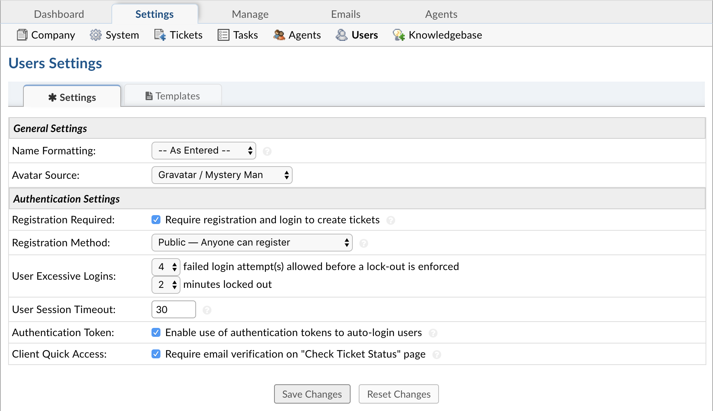

User Settings
=============

**Admin Panel > Settings > Users**

Settings
--------

Registration can be required for Users to create tickets on the Help Desk to prevent random tickets or to limit Users’ accessibility to the help desk.

If Registration is required, there are a few options of registration methods for end-users.

.. image:: ../../_static/images/admin_settings_user_userReg.png
  :alt: User Registration

Registration is an important feature for Users to check ticket statuses or see all of their tickets in the help desk. A User can follow the link in the auto response to check the status of a ticket, or they can Login to the client portal to a ticket with the ticket number and their email address. This will then send a link to their email for them to follow back to that one, singular ticket. A User must be registered to Login to view all tickets associated with their name.

Users can easily check the status of a ticket with their email address and a ticket number if the Click Quick Access box is unchecked.

Templates
---------

All Email Templates for Authentication and Access are editable and located in the Access sub-tab. Also located in this sub-tab is where the Sign-In Pages for both agents and Users can be edited. All templates contain an HTML/Rich Text toolbar when text is highlighted.

**Guest Ticket Access:** Ticket access link sent to clients for guest-only systems where the ticket number and email address will trigger an access link sent via email .

**Sign-In Page:** This forms the header on the staff login page.

**Password Reset Email:** Template of the email sent to clients when using the Forgot My Password link on the login page.

**Please Confirm Email Address Page:** Template of the page shown to the user after registering for an account.

**Account Confirmation Email:** Confirmation email sent to clients when accounts are created for them by staff or via the client portal.

**Account Confirmed Page:** Page shown to the user after successfully registering and confirming their account.
