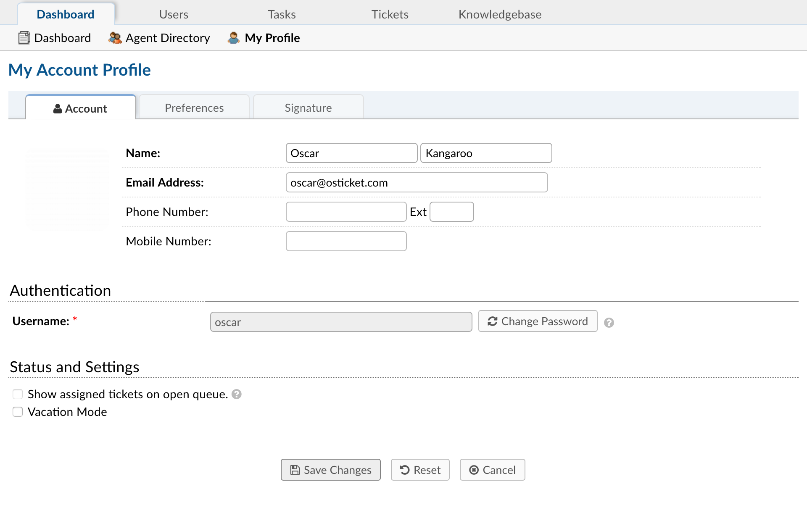

My Profile
==========

**Agent Panel > Dashboard > My Profile**

Account
-------

**General**

  **Name:** Agent's First and Last name.

  **Email Address:** Agent's email address.

  **Phone Number:** Phone number for Agent.

  **Extension:** Phone number extension (if applicable)

  **Mobile Number:** Agent's Mobile phone number.

**Authentication**

  **Username:** Agent's username.

**Status & Settings**

  **Show assigned tickets on open queue:** Shows assigned tickets on open queue.

  **Vacation Mode:** Agent will not receive ticket notifications or emails until disabled.

Preferences
-----------

**Profile Preferences & Settings**

  **Maximum Page Size:** Maximum number of tickets per page.

  **Auto Refresh Rate:** Tickets page refresh rate in minutes.

  **Default From Name:** From name to use when replying to a thread.

  **Thread View Order:** The order of thread entries.

  **Default Signature:** Default signature used when replying to a thread.

  **Default Paper Size:** Paper size used when printing tickets to PDF.

**Localization**

  **Time Zone:** The time zone for Agent.

  **Time Format:** Time format preferred.

  **Preferred Locale:** Language preference.

Signature
---------

The signature for the Agent.
