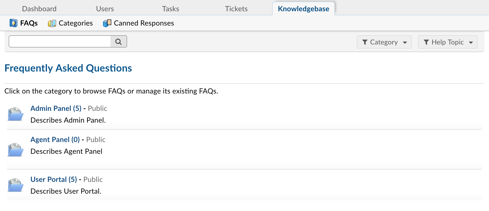
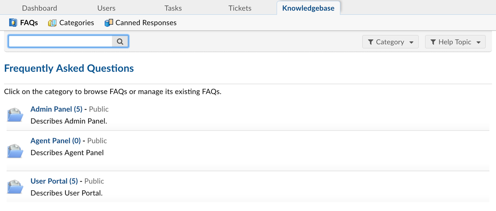
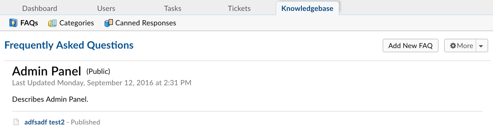

Knowledgebase
=============

**Agent Panel > Knowledgebase**

Add Canned Response
-------------------

To create a canned response for quick answers to common questions or a specific phrasing of a response for agents, go to Agent Panel > Knowledgebase > Canned Response.

Canned responses can be open to all departments or limited to only one department. (The department availability is determined by the department the ticket is assigned to, not the agent.) Simply choose the department from the drop down above the text area when creating the canned response.

Also available with canned responses is the availability of the HTML/Rich Text toolbar. This enables the addition of pictures, graphs and links to the response. Emphasis can be placed on specific words or phrases with the tool bar.

Variables can be added to the body of the responses to allow the data of the correlating fields to be pulled automatically in place of the variable. If there is no information in the field, the space will be left blank where the variable is located.

Attachments can also be added to Canned Responses which will attach to the response/ticket when populated. Attachments can be removed prior to sending the response if necessary.

Add FAQ to Category of the Knowledge Base
-----------------------------------------

An unlimited number of FAQ’s can be added to the Knowledge Base. These FAQs can be marked as private if it is for internal view only or public if it is to be visible on the Client Portal of the help desk. Please note, if it is to be visible for public use, both the Category and the FAQ must be marked Public.

First, the Knowledge Base will need to be enabled for the client interface by going to Admin Panel > Settings > Knowledgebase.

.. image:: ../../_static/images/agent_knowledgebase_knowledgebase_settings.png
  :alt: Knowledgebase Settings

Once enabled, the Knowledge Base can be built by agents in the Agent Panel > Knowledge Base. To built the knowledge base, the agent will have to first, Add a Category and then add Frequently Asked Questions to the Category.

To add FAQ's to the Category, the agent will need to click on the Category name on the FAQ tab:

Then click on Add a New FAQ:

FAQs can have attachments, HTML/RIch Text and also be associated with specific Help Topics of the Help Desk. This is useful when the clients are searching through the Knowledge Base from the Client Portal; they can select the Help Topic and then only see the FAQs that have been associated with that topic.
