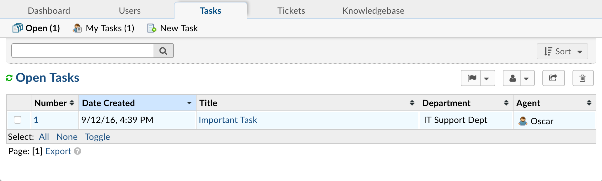

Tasks
=====

**Agent Panel > Tasks**

Considered an internal to-do list of sorts, **tasks** are only visible to Agents of the help desk with access to the Department the task is assigned to. Tasks can be associated with Tickets of the help desk or created and assigned independent of Tickets.

If a task is created in association with a ticket, the ticket can not be closed until all tasks are marked as complete. Tasks can be created in association with a ticket from the top of the Ticket thread; directly below the ticket header. An unlimited number of tasks can be created for the ticket and assigned to any department or agent of the help desk. Note: if the agent assigned to a task associated with a ticket does not have Department Access to the ticket’s department, they will not see the thread of the ticket; only the ticket meta data and the task to which they are assigned.

Tasks that are dependent on a ticket as well as those independent of a ticket will appear in an agent’s Task tab of the Agent Panel. Only those tasks assigned to the Department(s) the agent has access to will show in the agent’s task tab. If the task is associated with a ticket, the task header will contain a linked reference to the ticket for the agent.

Fields required to create a task include the Task Summary, Task Detail, and the Department to which the task is assigned. Other optional fields when creating a task include the Assigned Agent or Due Date. Fields of the Task Form can be expanded in the Admin Panel > Manage > Forms > Task Details built-in form.

There are messages which can be enabled to alert agents of the events in a Task’s lifecycle. These messages can be enabled in the Admin Panel > Settings > Tasks and include:

  **New Task Alert:** Alert sent out to Agents when a new task is created.

  **New Activity Alert:** Alert sent out to Agents when a new message is appended to an existing task.

  **Task Assignment Alert:** Alert sent out to Agents on task assignment.

  **Task Transfer Alert:** Alert sent out to Agents on task transfer between Departments.

  **Overdue Task Alert:** Alert sent out to Agents when a task becomes overdue based on SLA or Due Date.

Third Party Collaborators can be added to Tasks by agents to receive updates on the tasks as posted by the Agents of the help desk. Collaborators will not have access to nor see the task when they login to the Client Portal; they will simply receive a New Activity Notice with the updates posted. If the Collaborator responds to the Notice, this will thread back into the task in the help desk.
