Advanced Search
===============

Several improvements have been made to the Advanced Search to make it more user friendly and more efficient

Old Advanced Search:

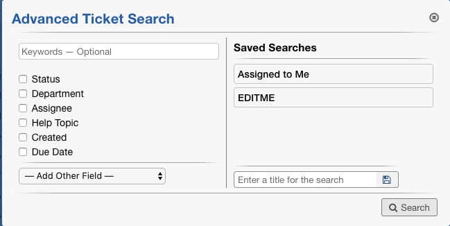

New Advanced Search:

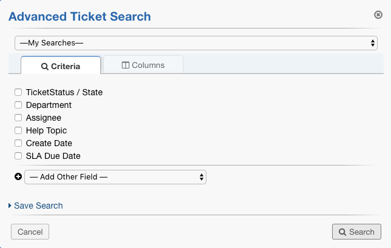

Saving a Search:

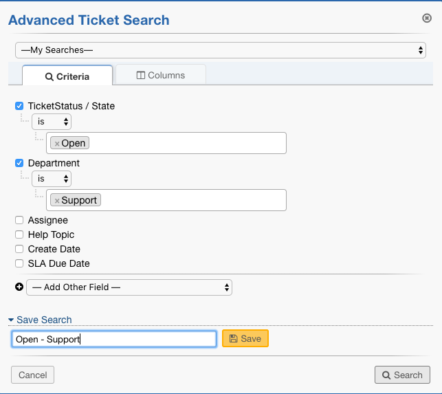

Once Saved:

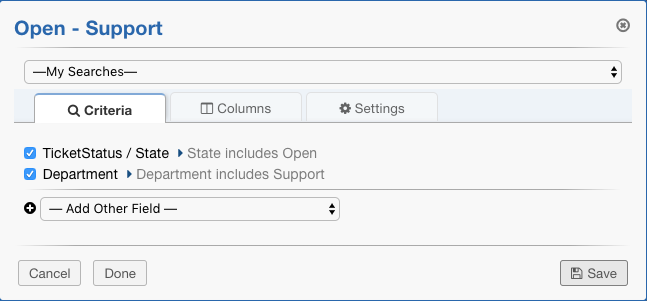

Saved searches are now displayed in the Search column with the title specified:

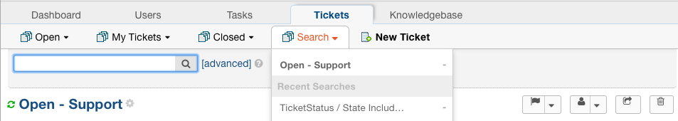

To edit a saved search, click the edit option beside the custom search:

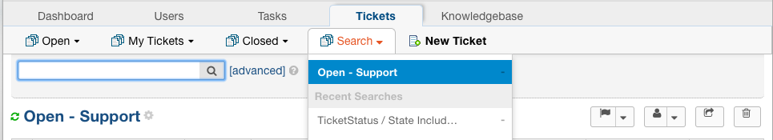

Agents now have the option to customize the columns they see in a custom search as well as adding a quick filter to further narrow down the results shown.

Custom Columns:
---------------

To customize columns, simply uncheck the ‘Use standard columns’ box:

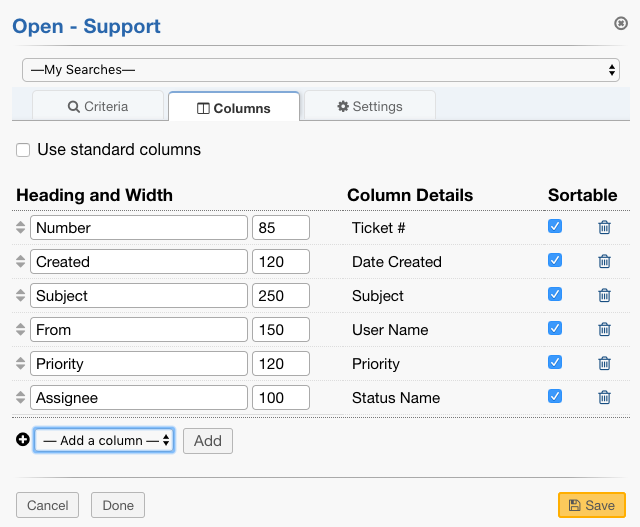

From here, agents can choose to customize headings for their columns, decide which fields should be sortable, and add/remove columns.

***Note:** The columns available to add to searches is configured by the Administrator for individual queues that are available to all Agents. The Administrator can add a field to the columns by going to a specific queue, clicking the Columns tab, and selecting the ‘Add New’ option to configure the new field.

Adding a custom field from Admin Panel:

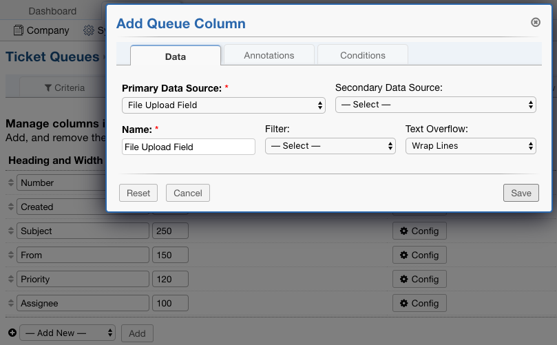

New Custom field in Saved Search columns:

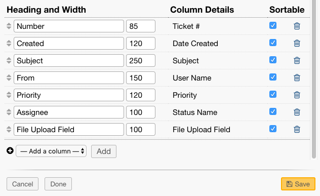

Quick Filters:
--------------

Quick Filters are added to searches using the Settings tab.

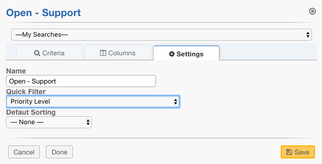

Once saved, the Agent can further filter tickets based on the new filter

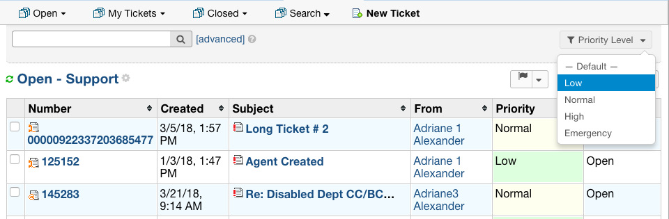

|

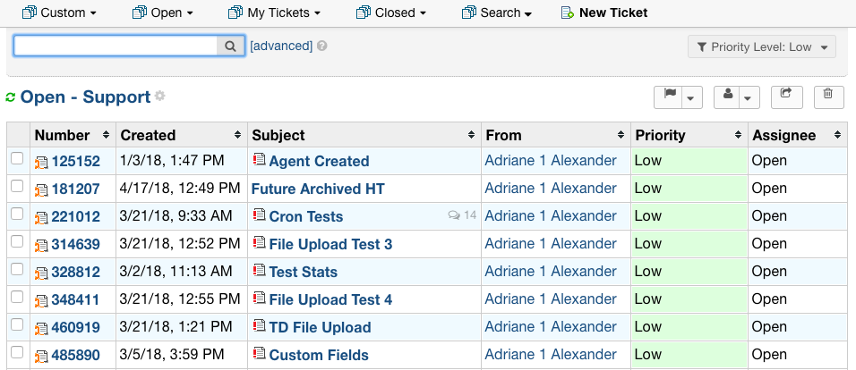
