Tickets
=======

**Agent Panel > Tickets**

When an agent logs in to the help desk, they will be automatically routed to the Open Ticket Queue.

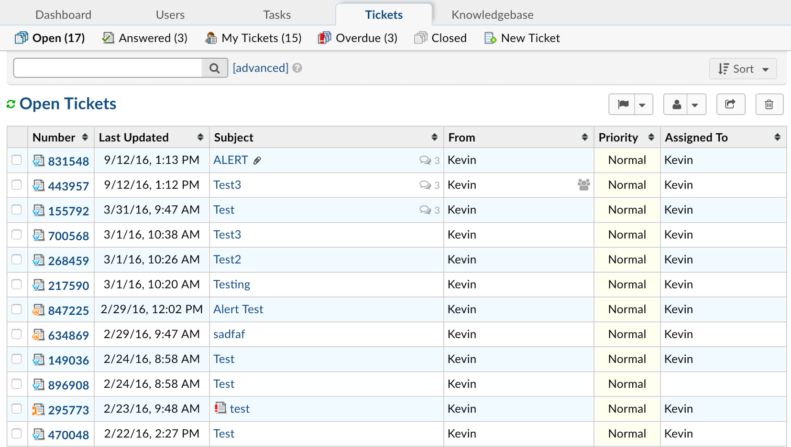

These are tickets the Agent has access to based on their Department and Group assignments as well as tickets that are assigned directly to them or a team they are included.

Tickets are sorted first by the Priority Level and second by the Date- which is the date of last update. Each column of the queue is sortable but the default will return to the Priority/Date sorting each time they log-in.

There are 5 Queues along the sub-tab including:

**Open:** these are tickets Open in the Help Desk including both New Tickets and tickets that the end user is the last respondent on. These will have a BOLD ticket number to give the visual

**Answered:** These are tickets that have been responded to by Agents and are awaiting response back from the ticket owner. This queue can be collapsed into the Open ticket queue. Tickets that have been answered will not have a bold ticket number to visually represent the last action was by the Agent.

**My Tickets:** These are ticket that are assigned directly to the Agent or a team the Agent is assigned.

**Overdue:** These tickets have exceeded the assigned SLA Plan or Due Date assigned to the ticket. SLA Plans can be determined by the Department, Help Topic or Ticket Filter configuration. Due Dates are manually assigned to tickets when an Agent creates a ticket from the client portal or when they edit an existing ticket.

**Closed:** Tickets in this queue have been marked closed by the Agent either upon response to the end user or from the quick button of the ticket queue. Tickets that are marked closed can be reopened on response by the end user.

Tickets in these queues are not unique to each queue meaning that there may be some overlaps- For example, a ticket can be Answered and Overdue at the same time and therefore, will appear in both ticket queues.

Agents can preview the metadata of the ticket by hovering over the ticket number. A pop-up box will appear allowing the Agent access to actions along the bottom of the pop-up as well as access to the collaborators of the ticket.

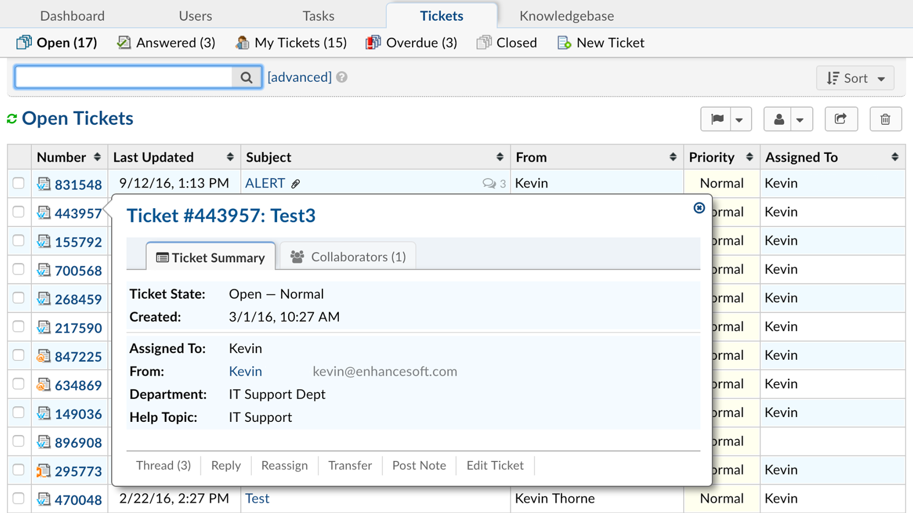

Agents can open up the ticket by clicking on the Ticket Number or the Subject of the ticket. When an agent opens the ticket, the default will be to direct them to the Reply box at the bottom of the ticket.

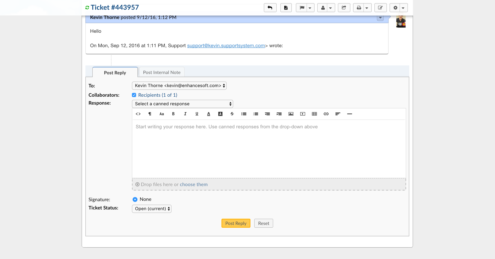

Based on their Role permissions, Agents can reply back to the end user by typing their response into the box- including adding attachments, links and embedding YouTube videos. Agents can select a canned response from the drop down in the reply box even if typing some of the response. All canned responses can also be edited by the Agents in the reply box prior to being sent. Collaborators can be added here to have access to the ticket. If necessary, the status of the ticket can be changed from the drop down prior to posting the response.

If a response is required yet the Agent does not want to send the response to the user but still post the response to the ticket thread, they can select the “Do Not Email Reply” from the drop down above the reply box for the user. This will also not send email replies to any collaborators on the ticket.

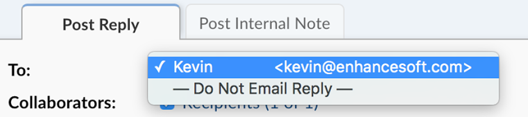

This response will be in the thread and visible to the ticket owner and any collaborators when they check the status of the ticket from the Client Portal of the help desk.

Ticket Header
-------------

From the top of the ticket or the Ticket Header, Agents will see any data associated with the ticket from the built in Ticket Details form as well as any custom form associated with the Help Topic.

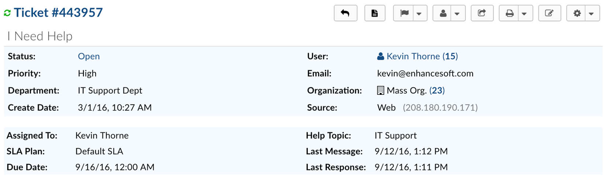

From the quick action buttons on the top right of the Ticket Header, Agents can perform a few different actions if granted these permissions in their assigned Group.

**Print:** Allows Agents to print a specific Ticket.

  **Ticket Thread:** Prints the entire Ticket Thread (excluding Internal Notes and Thread Events).

  **Thread + Internal Notes:** Prints the entire Ticket Thread including Internal Notes (excluding Thread Events).

  **Thread + Internal Notes + Events:** Prints the entire Ticket Thread including Internal Notes and Thread Events.

**Edit:** This action allows agents to edit the fields of the ticket- including any custom forms that are added to the ticket once it is created.

**Change Status:** Agents can change the status of the ticket with no response required. If changed, a pop up box will appear allowing agents to include notes with the status change.

**More:**  Depending on the Agent’s Role permissions, they can see these functions.

.. image:: ../../_static/images/agent_tickets_ticket_moreOptions.png
  :alt: More Options

**Change Owner:** this allows the Agent to change the owner of the ticket. If the owner is changed, the previous owner will no longer have access to the ticket.

**Mark as Answered/Unanswered:** This allows the Agent to mark the ticket as Answered or Unanswered (depending on it's current state). The Agent has to have the Post Reply permission for the Ticket's Department in order to utilize this feature. When marking a ticket as Answered/Unanswered the Agent gets a popup to optionally put a reason why they marked it as such. If a reason is provided it will be added as an Internal Note with the title :code:`Ticket Marked (Un)Answered` (depending on what it was marked as). Regardless of if they put a reason or not the system will always put a SYSTEM Note saying the ticket was flagged as (Un)Answered by the Agent along with a timestamp.

**Manage Forms:** This will allow the agent to attach any Custom Forms of the help desk to the ticket. Fields of the form can be edited once added by clicking on the “Edit” quick button. The fields of the form will not show up on the ticket header until there is information in the fields. If enabled, either the Agent or the ticket owner can edit the fields of the added forms.

Forms currently on the ticket can be removed from the Manage Form quick button. Any data in the form fields will also be deleted.

**Ban Email:** A email address can be ban from created tickets in the help desk by added them to the ban list. This action can be undone by the help desk administrator if necessary.  Banning an email address will not delete tickets of that user; this action will have to be done separately if necessary.

**Delete Ticket:** When selected, a pop-up box will appear allowing the agent to give an optional reason for deletion. Once a ticket is deleted, it is not recoverable! If the agent types a reason in the pop-up box, that note will appear in the System Logs for the Administrator.

**User Information on the Ticket Header**

Information about the ticket owner can also be edited from the ticket header.

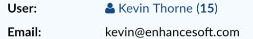

The number in parenthesis next to the User’s name is the number of tickets they currently have in your help desk. If you click on the number - this will allow the agent a few options:

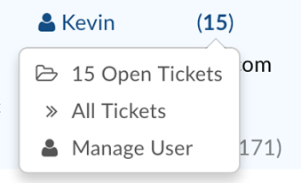

They will be able to view tickets of this user that are either Open or Closed in the help desk or the option of viewing both by clicking All Tickets.

If they click “Manage User” this will redirect them to the User’s profile in the User Directory. Same for if they click “Manage Organization”

If you click on the user’s name a pop up box will appear allowing you to edit their information as well as change the ticket owner of this ticket.

**Any actions taken on the User or Collaborators as well as with in the ticket will be noted as an internal note in the Ticket Thread.**

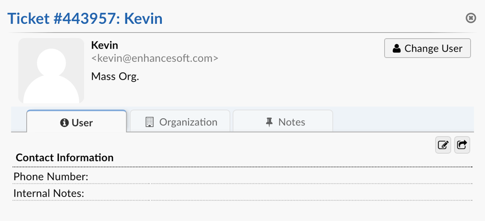

To edit the fields of the Contact Information form for the user, click on the icon that is the pencil in the box located in the middle right of the pop-up box.

Ticket Thread
-------------

Each message of the ticket thread is color coded to give the agents a visual representation of what the thread entry is and/or who performed the action.

Replies from the Ticket Owner or a Collaborator will appear with a Blue banner in the Ticket Thread:

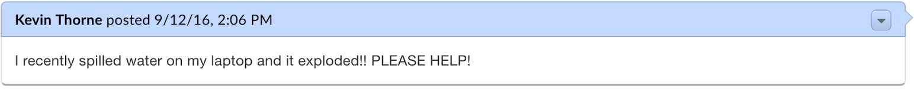

Internal notes will appear with a light Yellow banner. They will also contain any actions taken within the Ticket (transfer, assignment, etc)

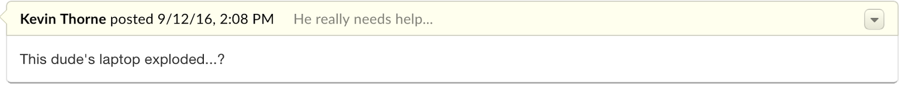

Agent’s response back to the Ticket Owner or Collaborator will appear with an Orange Banner:

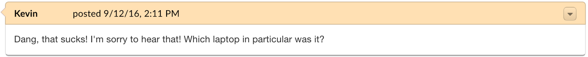

Any items in the Ticket Thread that are with the Blue or Orange banner are also visible to the Ticket Owner as well as any collaborators on the ticket when they check the ticket status from the Client Portal of the help desk.
