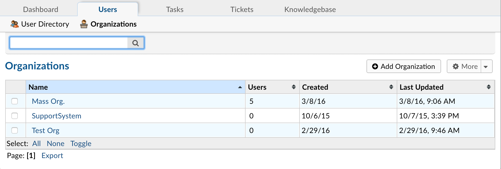
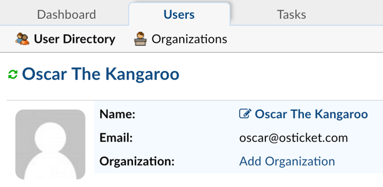
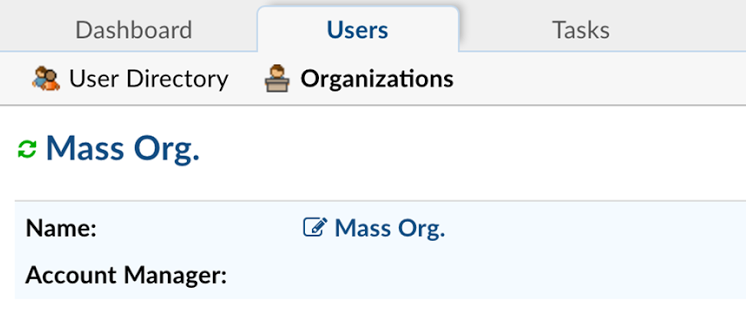
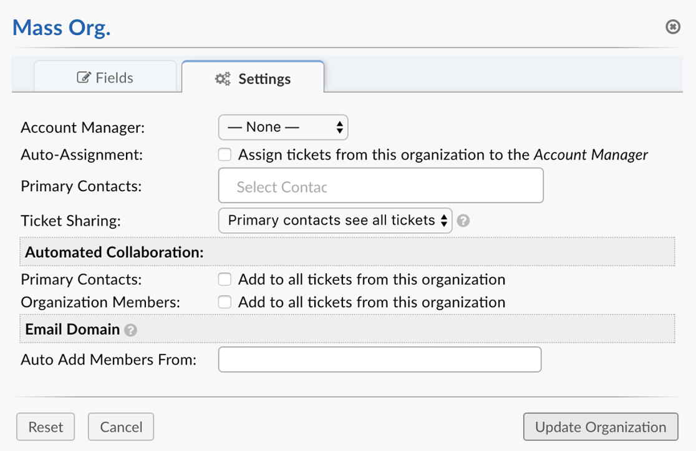

Organizations
=============

**Agent Panel > Users > User Directory**

Organizations can be created to add/associate users in the help desk to the organization. Within the Organization Directory, the settings can be edited to add agents as Account Managers of the Organization which will allow them to be auto-assigned to all tickets created by users of that organization.

Primary Contacts can be selected from the Organization's users to enable them to be added as collaborators for all tickets created in association with the users of the organization.Users can also be select to auto-add all users from the organization to each ticket created by a user of the organization. The same rules apply for sharing tickets of the users of the organization.

Organizations are located in the User Directory of the Agent Panel. Each ticket created in the help desk is associated to a user via their unique email address. Organizations allow a way to manage users and associate them with one Organization in the help desk. Organizations can reflect companies, clients, departments or any group that users can belong to in the help desk. This is useful in determining tickets by organization as well as users of the organization.

Users can be added to an organization by the specific user’s profile by clicking “Add Organization” on the header.

A pop-up box will appear allowing the organization can be searched from the top toolbar of the pop up or created if it does not currently exist.

.. image:: ../../_static/images/agent_users_org_orgSearch.png
  :alt: Search Organization

If the user is not currently in the user directory, they can be imported from the organizations’ tab; these users would automatically be added to the organization they are imported into.
Once the Users are in the Organization, specific users of the organization can be delegated as primary contacts and selected to be auto-collaborated to all ticket open by users of that organization. If configured, these users will be added to any ticket created by users of that organization allowing them access to view these tickets from the client portal.

These settings can be found by clicking on the Organization name with the square and pencil next to it.

When you click on the organization name to configure the settings, a pop-up box will appear; go to the Settings tab of the pop-up.

Settings of the organization include the ability to assign an Agent or Team as the Account Manager of the Organization. By being the Account Manager, these agents can receive specific Alerts and Notices during different events in the ticket’s life cycle for tickets created by users assigned to the Organization. Tickets of this organization and every user assigned to the Organization can be auto-assigned to the Account Manager selected.

Primary contacts are users of the Organization which can be auto-collaborated to all tickets of the organization. All members of the organization can also be added as collaborators to all tickets of the Organization if necessary.

To auto-add members to the organization based on the domain or subdomain of their email, add the email domain to the last section of the Organization settings. More than one email domain can be entered per organization by comma separating the email domains.

Fields of the Organization can be managed by going to the Admin Panel > Manage > Forms > Built in Forms > Organization Information. Fields added here will be collected on all Organizations when created or edited. Custom forms can be added to an individual Organization from the “More” quick button on the right top side of the table when in an  Organization configurations page.
