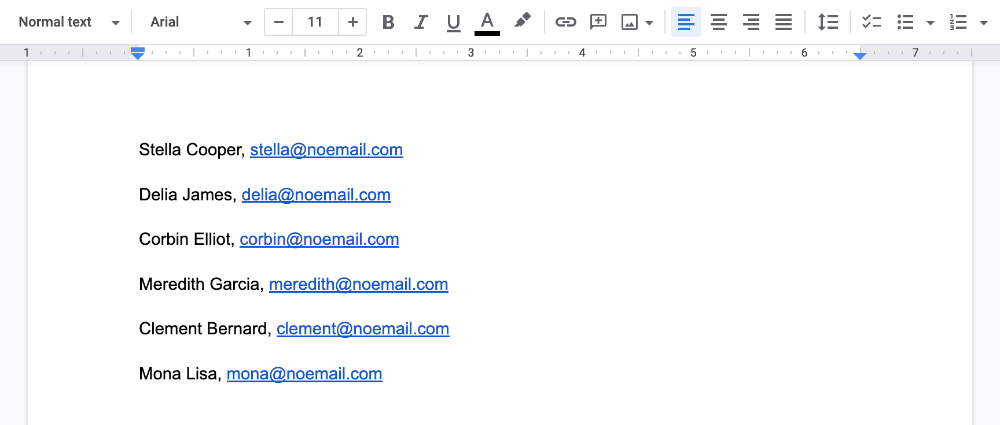
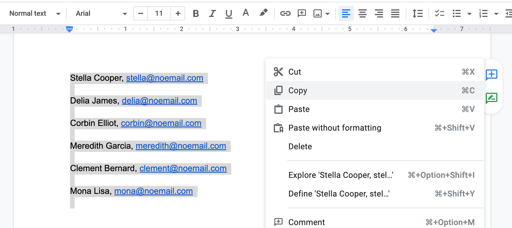
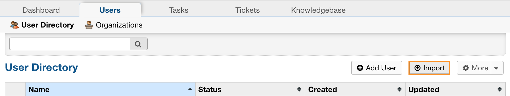
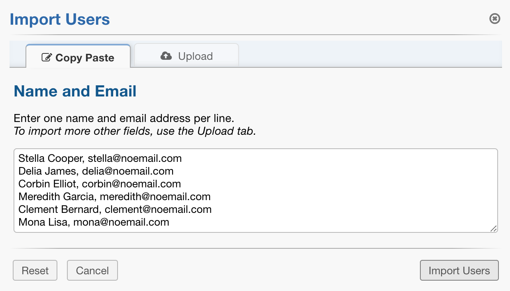
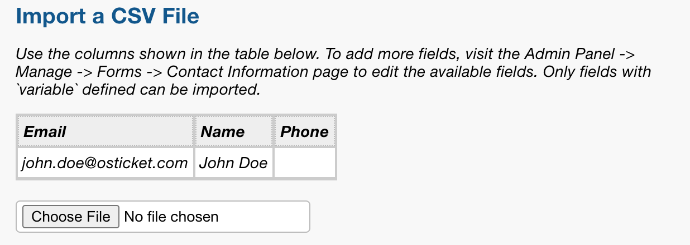
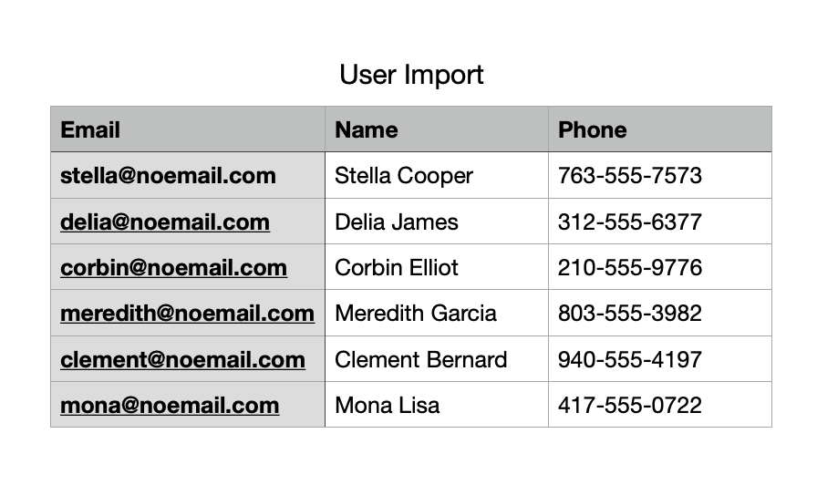
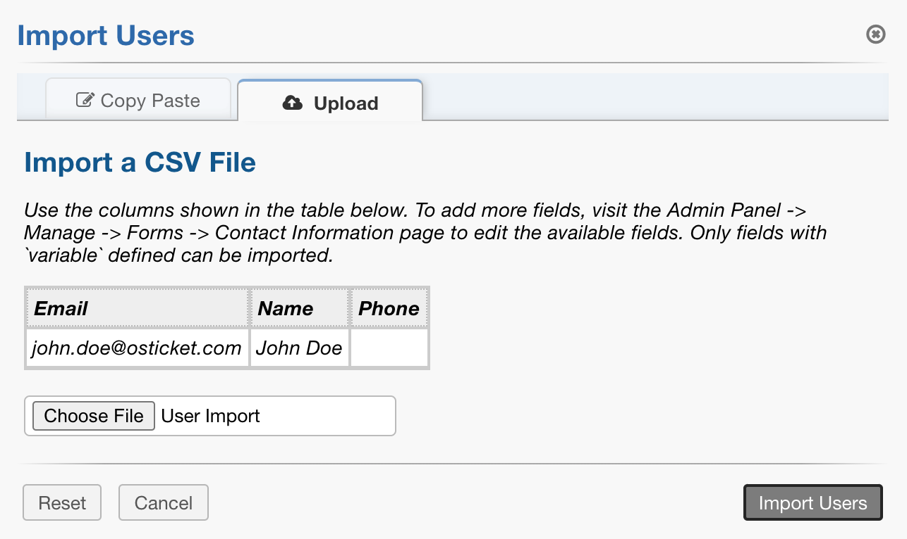

User Directory
==============

**Agent Panel > Users > User Directory**

.. image:: ../../_static/images/agent_users_userDir_dir.png
  :alt: User Directory

Users can now create an account and log-in to create a ticket or check a ticket’s status. As always with osTicket, users or ticket creators are associated with their email address as the unique identifier of each user. The User Directory, located on the Agent Panel, allows agents to  search tickets by user as well as create Organizations to associate the user to. Agents can be configured as internal Account Managers for tickets created by users of an Organization.

What is a User?
---------------

Users are the ticket owners of the tickets in the help desk. When a ticket is created in the help desk, the user is associated with their email address in the User Directory of the help desk. Users can be added or deleted from the User Directory of the help desk at any time. Please note, if the user is deleted the tickets of the user must also be deleted.

Add New Users
-------------

You can add users to the User Directory of the Agent Panel of the help desk either individually or by importing them by uploading a CSV file. If you are uploading, you will need to match the headers of the CSV to the fields in the Contact Information built-in form.  Once you add the user, you can associate the User to an Organization of the help desk.

User Import via Copy/Paste
--------------------------

Importing a list via copy/paste allows you to easily import User’s names and email addresses from a simple list.

Create a list of names and email addresses on any text editor. Separate each name and address by comma, making a new line for each User.

Copy the list, then go to the User Directory and select import.

Paste list then select ‘Import Users’.

User import via CSV file
------------------------

Importing Users via CSV file allows you to import User’s names and email addresses as well as additional details if necessary.

Go to the User Directory and select ‘Import’ then ‘Upload’.

Take note of the Column Headers listed here as your spreadsheet headers will need to match. You can customize these headers as well as add additional fields to import by editing the Contact Information form located at Admin Panel > Manage Tab > Forms.

Create a spreadsheet of names and addresses, as well as any other fields that you would like to import, matching the column headers to the ones shown in osTicket.

Once the spreadsheet is complete, export the document into a CSV file and import the file into osTicket at *Agent Panel > Users > Import > Upload Tab.*

Guest User vs Registered User
-----------------------------

You can choose to have your users register prior to submitting a ticket to your help desk from your Client Portal from Agent Panel > Users > User Directory > More > Regis. If a User is registered, this means they have created an account and verified their email. Once registered, they will be able to access all tickets they have in the help desk. Users can create their own User account or they can be added from the Agent Panel of the help desk. If added internally, the Agent will need to send the registration email for the User to verify their email address prior to becoming a registered user. Guest Users don’t require registration to submit tickets.

Managing Registered Users
-------------------------

Once a user has activated their account with the help desk, Agents can administratively manage their access to the help desk; including requiring a password reset, locking them from the help desk, and even resetting their password. The User management feature is accessible by opening the configurations of that user and clicking the Manage Account quick button at the top right of the header.

.. image:: ../../_static/images/agent_users_userDir_manageUser.png
  :alt: Managing Registered Users

A pop up box will appear; click on the Manage Access tab to configure these features.

.. image:: ../../_static/images/agent_users_userDir_manageAccess.png
  :alt: Manage Access Tab
