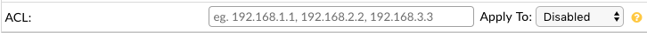
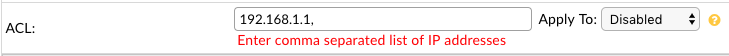
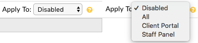

ACL (Access Control List)
=========================

The Access Control List (ACL) feature allows you to enter a single IP address or a comma separated list of IP addresses to allow access to the system. Essentially, this means whatever IP address is in the ACL field will have access to the specified Panels of the software. If the field is left blank your helpdesk is open to the world. This feature is useful for those who wish to lock down their helpdesk to certain clients, to just their internal network or just to list of IP addresses.

ACL List
--------

The ACL List is pretty straightforward as it's just a simple Textbox field in which you can insert a single IP address or a comma separated list of multiple IP addresses. For now, it only accepts the full IP address format of :code:`xxx.xxx.xxx.xxx`. Eventually we plan to accept an IP range format, wildcard format, etc. but for now let's keep it basic. If you insert multiple IP addresses you have to use the Comma Separated List format of :code:`xxx.xxx.xxx.xxx, yyy.yyy.yyy.yyy`.

**Note:**

IPs cannot have a trailing comma otherwise a validation error will be thrown.

Apply To
--------

After the ACL List is populated you can then choose an Apply To option. The Apply To option states which panel(s) the ACL will be applied to. There are four options in the Apply To dropdown that you can choose from. The first option is called "Disabled" which means the ACL feature will be Disabled. The second option is called "All" which means the ACL will be applied to all Panels in the helpdesk. The third option is called "Client Portal" which means the ACL will only be applied to the Client Portal. The last option is called "Staff Panel" which means the ACL will only be applied to the Staff/Admin Panel.

Example Usage
-------------

Let's go through an example together so we can see how this feature works. Let's say we want to lock down our helpdesk and we only want the following IPs to have access to the *entire* system (:code:`192.168.100.100`, :code:`192.168.100.101`, :code:`192.168.100.102`). We would go to :code:`Admin Panel > Settings > System` and scroll down to the **ACL** section. Now, since we have multiple IP addresses we have to use the comma separated list format. In the ACL List textbox we can enter the following :code:`192.168.100.100, 192.168.100.101, 192.168.100.102`. Since we would like to lock down our *entire* helpdesk we can choose the :code:`All` option in the Apply To dropdown. Once complete we can Save Changes and from then on only the specified IP addresses can access the helpdesk. Anyone else trying to visit the site will be denied with :code:`Access Denied` error.
