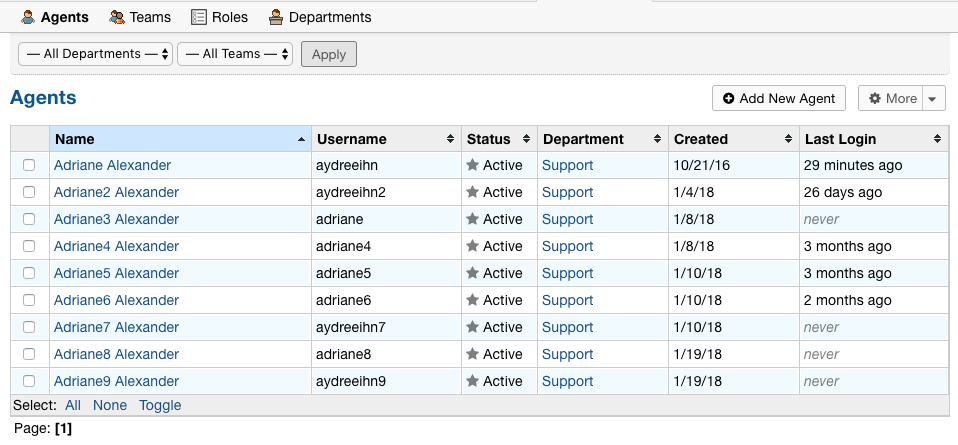
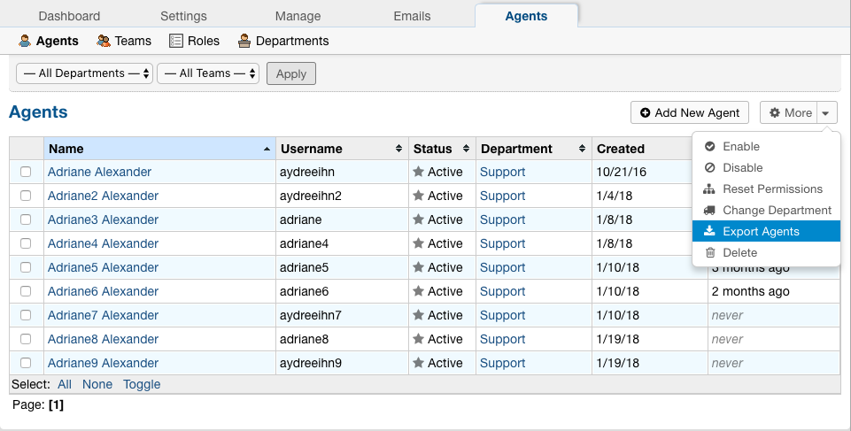
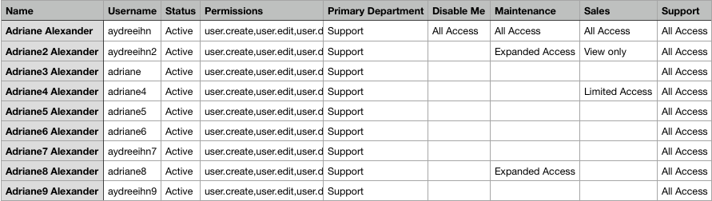

Agent CSV Export
================

Admins are now able to download a CSV export that displays all Agents in the system as well as their access to each Department.

.. raw:: html

    

        <iframe width="560" height="315" src="https://www.youtube.com/embed/5Yxfe85KZGk?start=17&end=82" frameborder="0" allow="accelerometer; autoplay; encrypted-media; gyroscope; picture-in-picture" allowfullscreen></iframe>
    

1. Go to:

Admin Panel | Agents Tab | Agents

2. Click the down arrow beside ‘More’ and choose the ‘Export Agents’ option.

CSV Output:
-----------

The output shows each Agent, their Username, and their Status as well as the Permissions they have. Each additional column shows the Departments in the system as well as each Agent’s role for that Department. If the Agent does not have access to a Department, the Role is left blank.
