.. |br| raw:: html

     

Collaborators
===================

Collaborators are additional participants that may be included in a Ticket’s communications. This document will outline changes that have been made to how this feature works.

New Features:
-------------

#. Add collaborators as well as CC them when opening a ticket from the Agent Panel.
#. Add collaborators as well as CC them when replying to a ticket as an Agent.
#. Manage collaborators (add/remove collaborators).
#. Change the email address where a ticket is sent out from.
#. View recipients that receive a reply from an agent.
#. As an end user, there is now an icon on the ticket list view to determine if you are a collaborator.
#. New Email Template variables.
#. New setting to hide Tickets where the User is a Collaborator in the Web Portal.

Collaborators on Ticket Open:
-----------------------------------

When an Agent creates a Ticket on behalf of a User, they now have the option to add Collaborators. They also have the option to alert all (User and Collaborators), alert only the User, or do not send an email alert.
|br|
***Note:** If the 'New Ticket by Agent' autoresponse is disabled Agents to not have the Ticket Notice options.

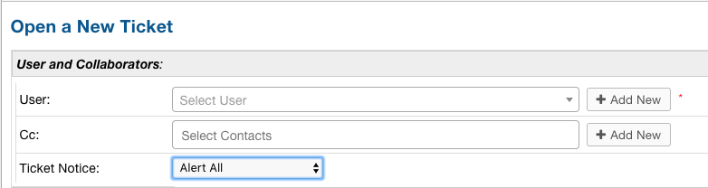

Collaborators on Ticket Reply:
-----------------------------------

Similarly, an Agent can add Collaborators or choose which Collaborators receive an email when replying to a Ticket. Initially upon viewing a Ticket, the Agent can see how many Collaborators
the Ticket has.

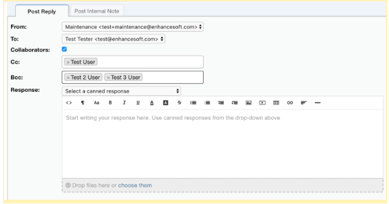

By clicking the arrow beside Collaborators, the Agent is given more options for how to handle Collaborators in their reply like adding new Collaborators or managing existing Collaborators.

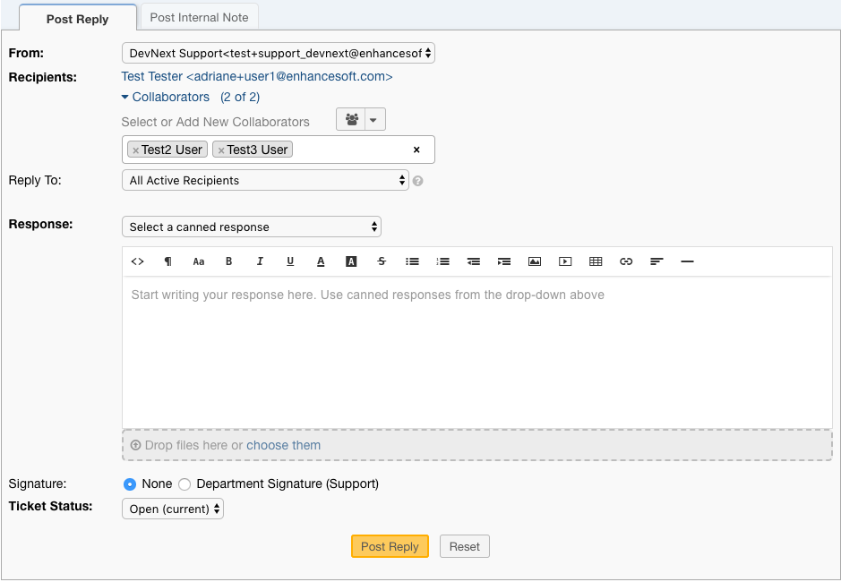

Collaborators that are removed by clicking the ‘x’ in the left corner of the their name will be disabled in the Ticket, meaning they will no longer receive any of the
Agent's responses.

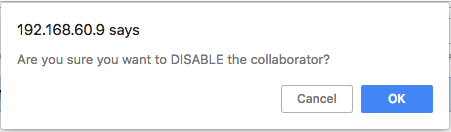

Disabled Collaborators can easily be Enabled again by reselecting and enabling them.

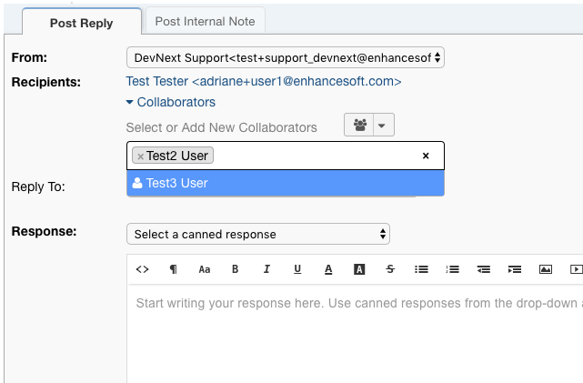

|

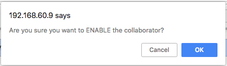

To completely remove a Collaborator, the Agent must go to ‘Manage Collaborators’.

Manage Collaborators:
-----------------------------------

There are several places where an agent can go to manage collaborators. The first is beside the User’s name on the ticket. There is a group icon with the number of collaborators the ticket has.

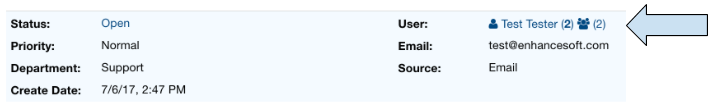

The second place is in the drop down menu next to the ticket settings icon. There is an item to ‘Manage Collaborators’.

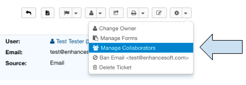

Finally, you can manage collaborators by clicking the Collaborator listing at the bottom of the Ticket or by clicking in the expanded Collaborators menu.

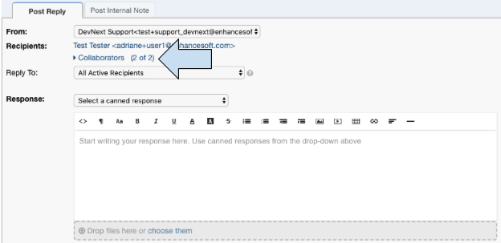

|

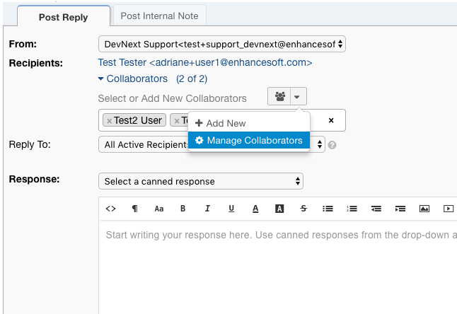

After clicking one of these options, the menu appears to manage the collaborators. The trash can to the far right of the row allows you to remove collaborators from a ticket. You can also add new collaborators.

Standard View:

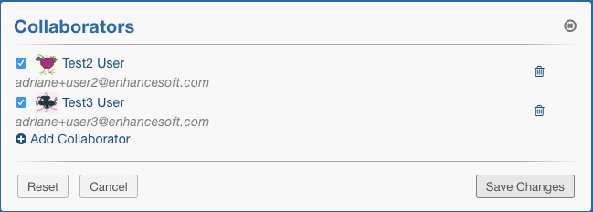

Remove:

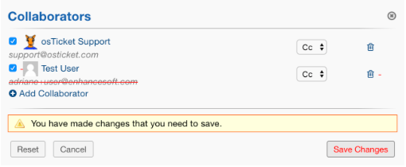

Add:

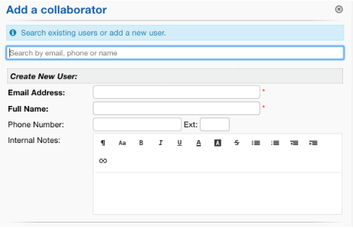

|

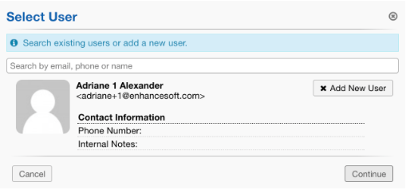

|

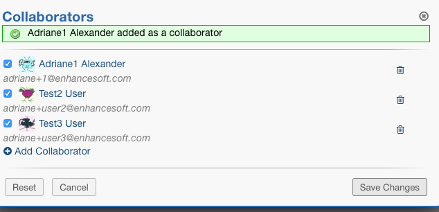

***Note:** The checkbox to the left of the Collaborator’s name indicates if the Collaborator is active or inactive. Inactive Collaborators will not receive Ticket responses.

‘From’ Email:
-----------------------------------

In the past, tickets were always sent out using the email address belonging to the Ticket’s Department. Agents are now able to choose which email address a ticket is sent out from if your system has more than one email configured.

.. image:: ../_static/images/collabs_from_email.png
  :alt: From Email

By default, tickets are sent out from the email address chosen for the department’s Outgoing Email. The department’s default address can be modified by going to:

**Admin Panel | Agents Tab | Departments | Choose a Department | Outgoing Email**

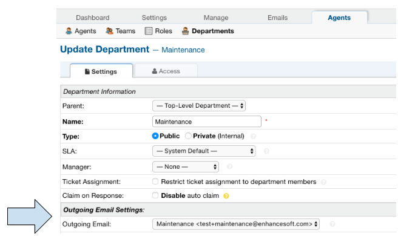

Collaborator Responses:
-----------------------------------

An Agent is able to determine that a Collaborator has responded to the ticket by looking at the label next to each message.

Collaborator Response:

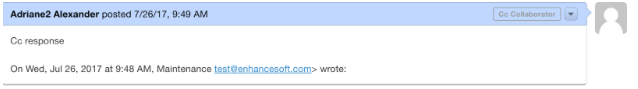

User Response:

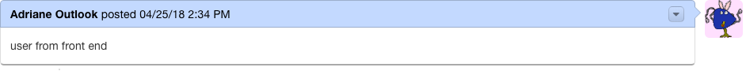

View Email Recipients:
-----------------------------------

Any time an email is sent out whether it is from the Agent or the User, there is now an option to see who the email was sent out to. This can be done by clicking the drop down arrow beside a Ticket thread and selecting ‘View Email Recipients’.

User Response:

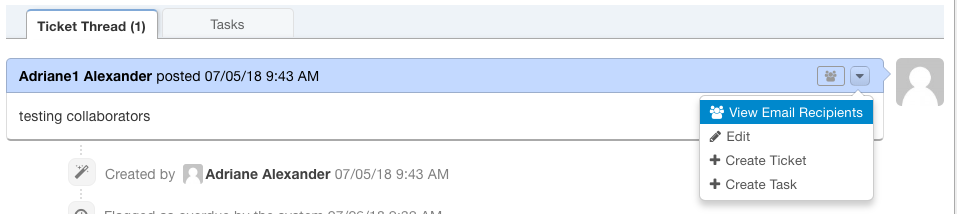

|

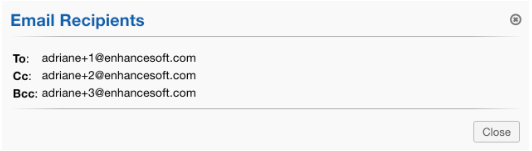

Agent Response:

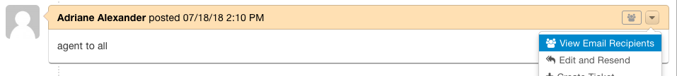

|

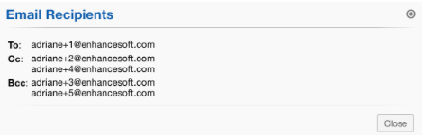

Additionally, an Agent is able to see if a response was a Reply All, Reply to User, or reply to no one by looking at the tag in the corner of the Thread Entry.
|br|
***Note:** When a Ticket is created on behalf of a User, the initial message entered by the Agent will have the appropriate tag as well.

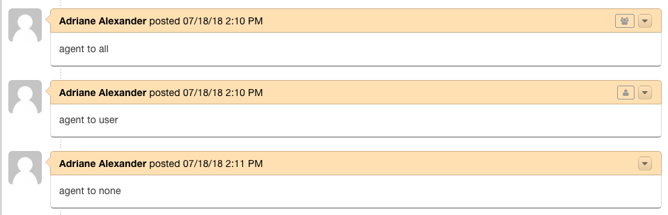

Collaborator Icon:
-----------------------------------

When end users log into the system and view the list of tickets they have access to, they will now see an icon beside the ticket name if they are a Collaborator on the ticket. If there is no icon, they are the ticket owner.

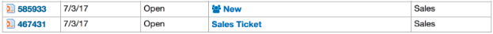

Email Template Variables:
-----------------------------------

**Ticket Recipients:**

**Format:** %{ticket.recipients}
This variable displays a list of visible/active users that are collaborating on a ticket.

Hide Collaborator Tickets:
-----------------------------------

In some instances, Agents may only want their Users to see their own Tickets if they log into the Web Portal rather than every Ticket they participate in.
We now have a setting to control this.

If the Agent would like to disable Users from seeing their Collaborator Tickets, they can configure the setting here:|br|
Admin Panel | Tickets | Settings | Collaborator Tickets Visibility

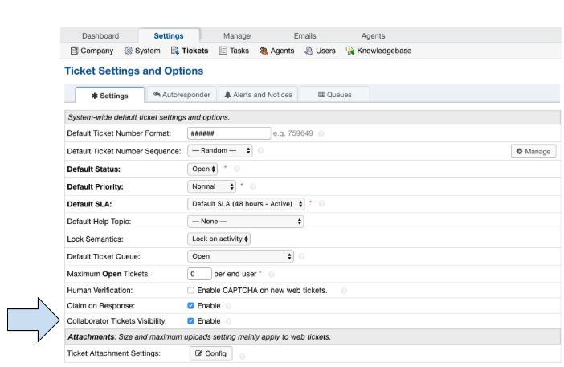

By default, Users are able to see all Tickets they take participate in.

View of All Tickets:

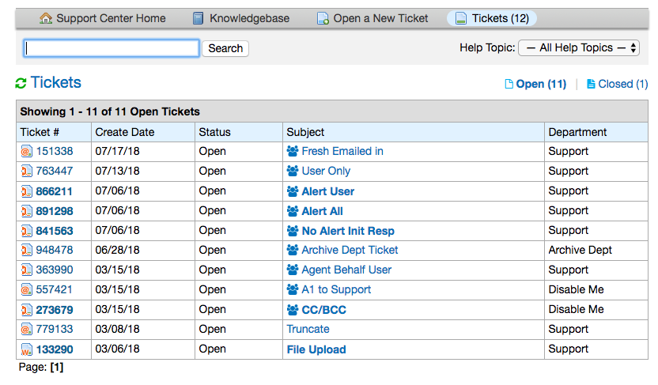

View of only the User's Tickets:

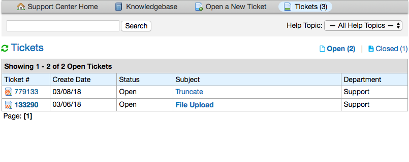
