.. |br| raw:: html

     

Create Ticket or Task from Thread Entry
=======================================

Agents now have the ability to create a Ticket or Task from a Ticket’s thread entry or from a Tasks thread entry.

.. raw:: html

    

        <iframe width="560" height="315" src="https://www.youtube.com/embed/5Yxfe85KZGk?start=123&end=260" frameborder="0" allow="accelerometer; autoplay; encrypted-media; gyroscope; picture-in-picture" allowfullscreen></iframe>
    

Ticket From Ticket Thread Entry
-------------------------------

**Original Ticket:**

.. image:: ../_static/images/ttentry_tickfromtick1.png
  :alt: Ticket From Ticket 1

**Opening the New Ticket from the Ticket Thread Entry:**

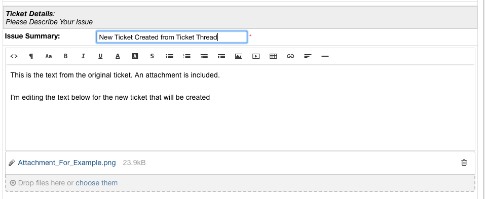

***Notice:** The attachment from the original Ticket is carried over into the new Ticket.

**New Ticket that was created:**

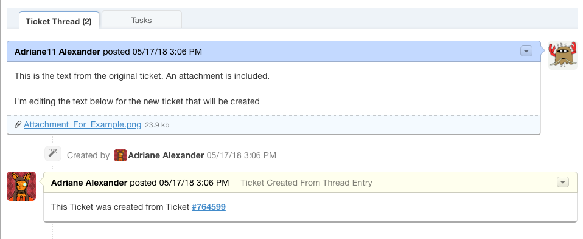

***Notice:** An Internal Note is added to the new Ticket referencing the Ticket Number the new Ticket was created from.
|br|
Clicking on that reference will open the original Ticket.

**Original Ticket After:**

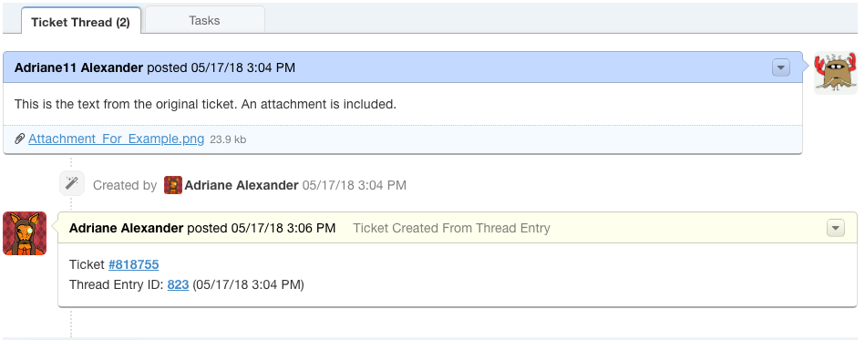

***Notice:** An Internal Note is added to the original Ticket referencing the new Ticket's number as well as the Thread Entry the Ticket was created from.
|br|
Clicking the Ticket Number will open the new Ticket that was created. Clicking the Thread Entry will scroll the Ticket up to the Thread Entry the new Ticket was created from.

Task From Ticket Thread Entry
-------------------------------

**Original Ticket:**

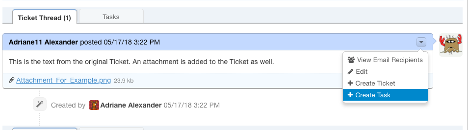

**Task being created from Ticket:**

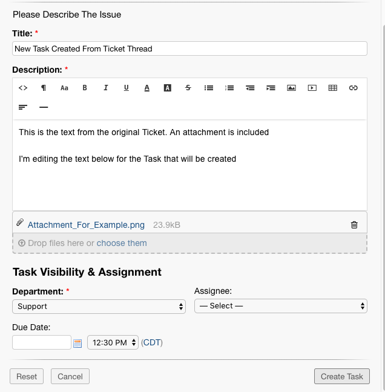

***Notice:** The attachment from the original Ticket is carried over into the new Task.

**Original Ticket After:**

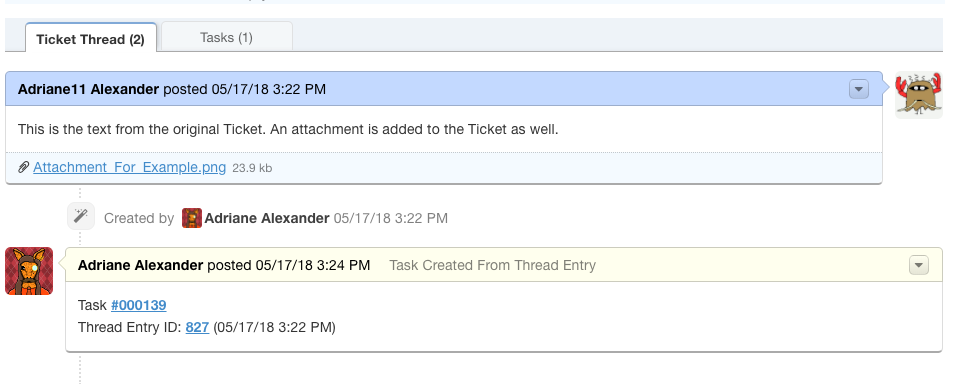

***Notice:** An Internal Note is added to the original Ticket referencing the new Task's number as well as the Thread Entry the Task was created from.
|br|
Clicking the Task Number will open the new Task that was created. Clicking the Thread Entry will scroll the Ticket up to the Thread Entry the new Task was created from.

**New Task that was created:**

.. image:: ../_static/images/ttentry_taskfromtick4.png
  :alt: Task From Ticket 4

***Notice:** An Internal Note is added to the new Task referencing the Ticket Number the new Task was created from.
|br|
Clicking on that reference will open the original Ticket.

Ticket From Task Thread Entry
-------------------------------

**Original Task:**

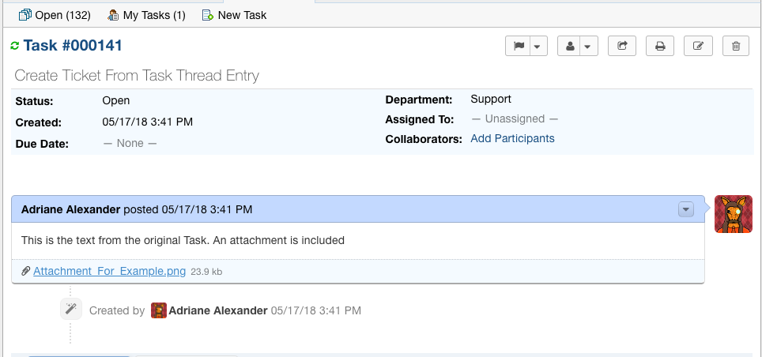

**Opening the New Ticket from the Task Thread Entry:**

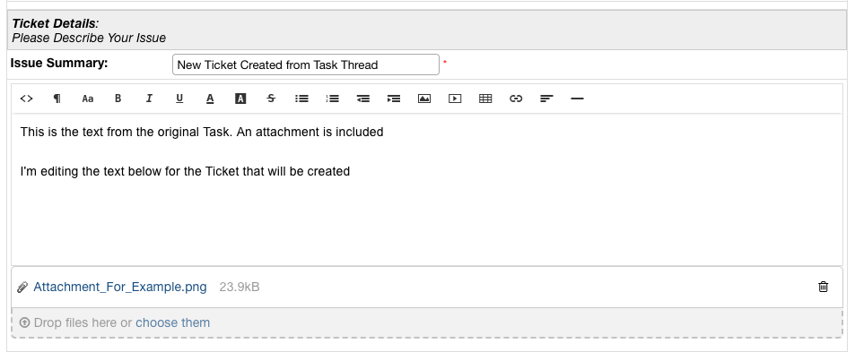

***Notice:** The attachment from the original Task is carried over into the new Ticket.

**New Ticket that was created:**

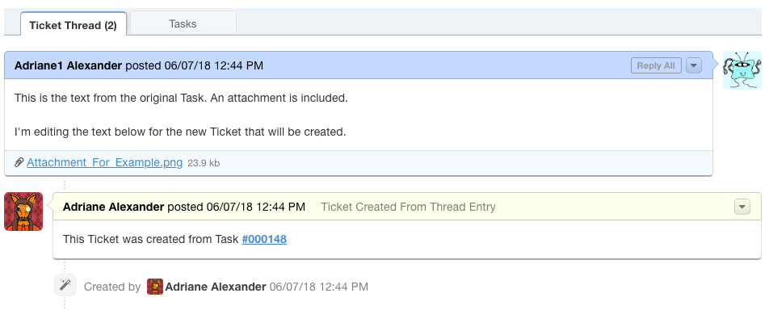

***Notice:** An Internal Note is added to the new Ticket referencing the Task Number the new Ticket was created from.
|br|
Clicking on that reference will open the original Task.

**Original Task After:**

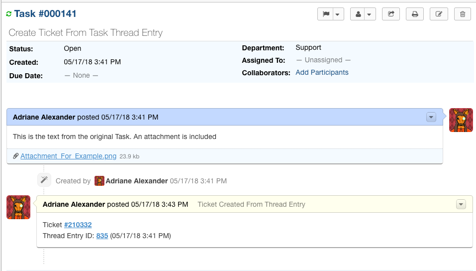

***Notice:** An Internal Note is added to the original Task referencing the new Ticket's number as well as the Thread Entry the Ticket was created from.
|br|
Clicking the Ticket Number will open the new Ticket that was created. Clicking the Thread Entry will scroll the Task up to the Thread Entry the new Ticket was created from.

Task From Task Thread Entry
-------------------------------

**Original Task:**

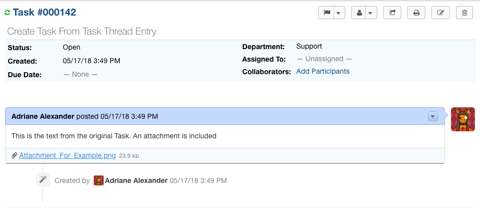

**Opening the New Task from the Task Thread Entry:**

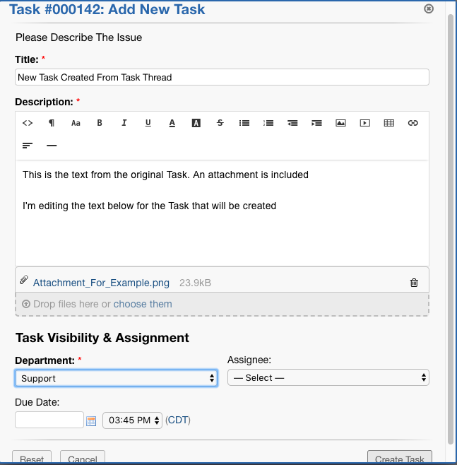

***Notice:** The attachment from the original Task is carried over into the new Task.

**Original Task After:**

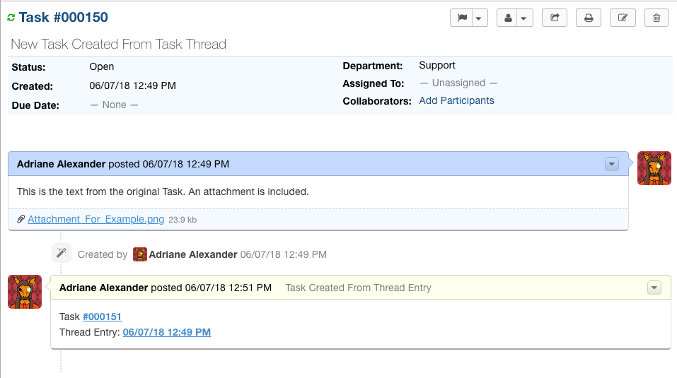

***Notice:** An Internal Note is added to the original Task referencing the new Task's number as well as the Thread Entry the Task was created from.
|br|
Clicking the Task Number will open the new Task that was created. Clicking the Thread Entry will scroll the Task up to the Thread Entry the new Task was created from.

**New Task that was created:**

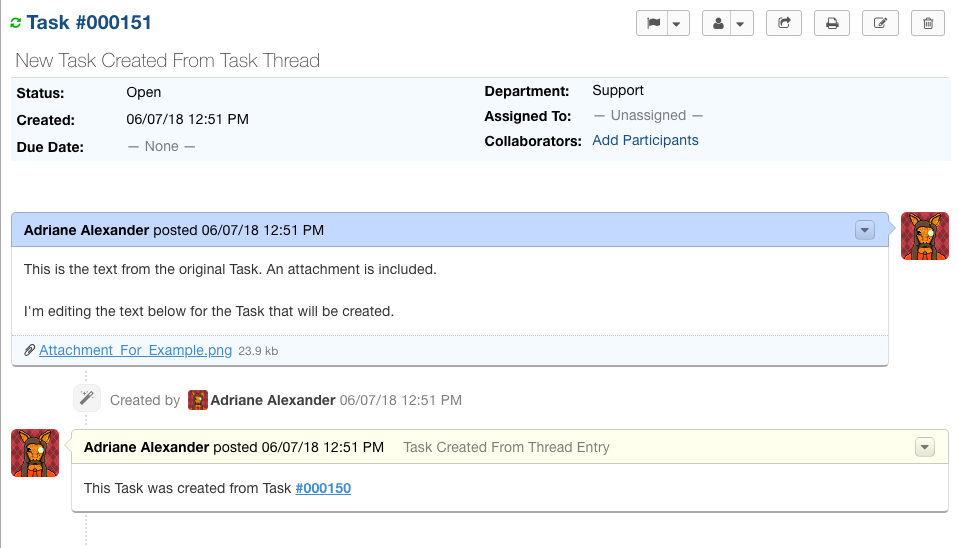

***Notice:** An Internal Note is added to the new Task referencing the Task Number the new Task was created from.
|br|
Clicking on that reference will open the original Task.
