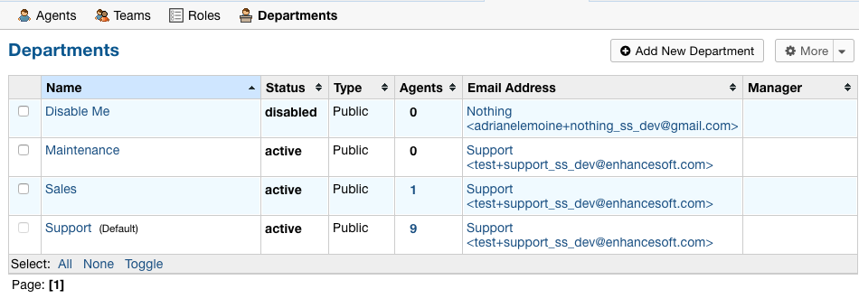
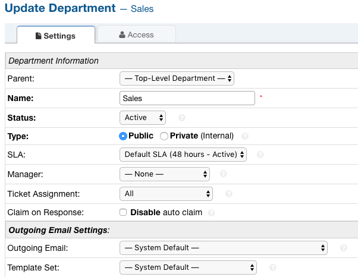
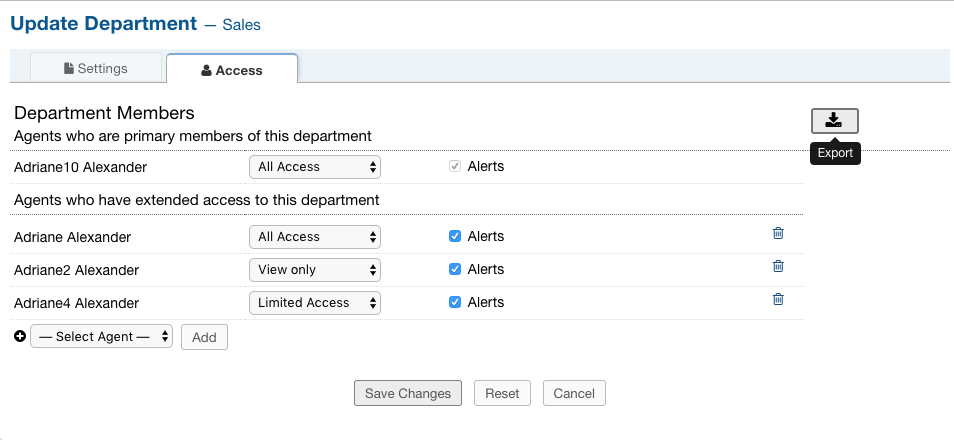
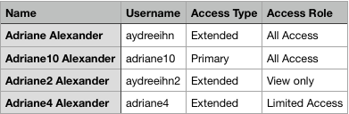

Department CSV Export
=====================

Administrators are now able to download a CSV export of which Agents can access different Departments.

1. Go to:

Admin Panel | Agents Tab | Departments

2. Select a Department

3. Click the ‘Access’ tab

4. In the top right corner of the page, there is a download button. Simply click this button to export the CSV.

CSV Output:
-----------

***Note:** The access type may be Primary or Extended depending on which type of access an Agent has.
