Archiving Departments and Help Topics
=====================================

Occasionally it could become necessary to no longer use certain Departments or Help Topics within a helpdesk. Even though they will no longer be used in the future, there could be some Tickets that are still assigned to the Department or Help Topic. In addition, there are important Dashboard Statistics already stored. To resolve these issues, Admins may now choose to Archive Departments or Help Topics.

Departments:
-------------

Departments can have a status of Active, Archived, or Disabled.

**Active** departments can be selected for new tickets and used throughout the system as usual.

**Archived** departments may not be chosen for any new tickets. If a closed ticket receives a response from a user and has an Archived department, a new ticket will be opened referencing the ticket’s old title and number. It will have the System Default chosen as the Department.

Closed ticket in Archived Department:

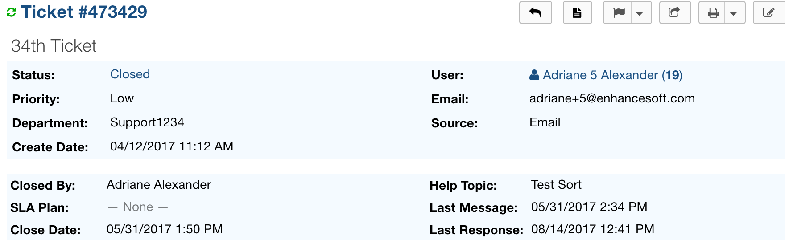

|

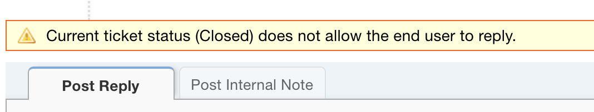

User response to the Closed ticket:

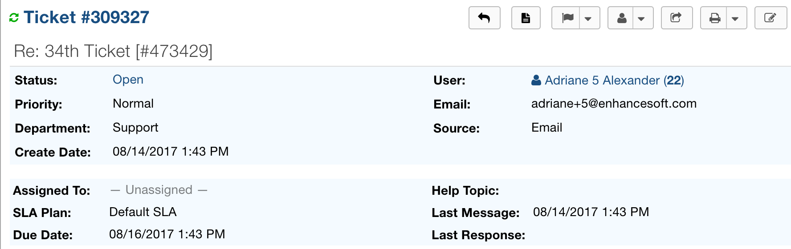

A new ticket is now opened referencing the ticket’s old title and number if a User replies by email to the closed ticket.

**Disabled** departments may not be chosen for any new tickets either, however, if a closed ticket receives a response, the system will reopen the ticket.

Closed ticket in Disabled Department:

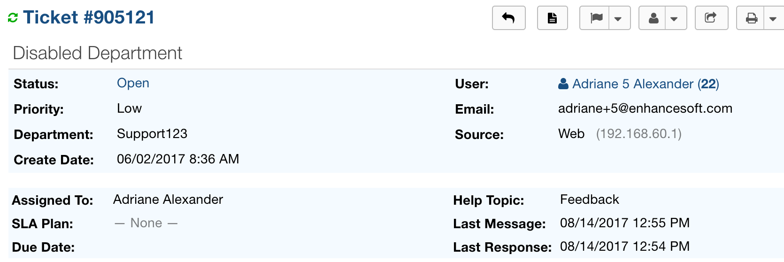

User response to the Closed ticket:

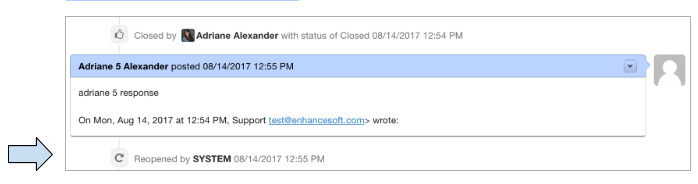

Changing the Department Status:
-------------------------------

1. Go to:
Admin Panel | Agents Tab | Departments

2. Click a Department to modify.

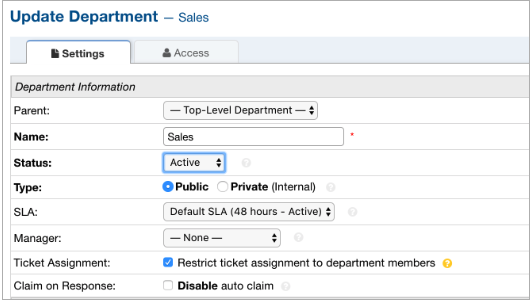

|

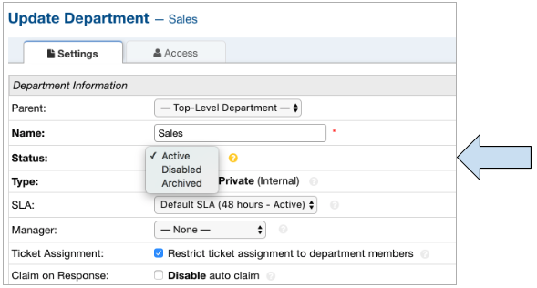

3. Modify multiple Departments at once.

    a. An agent can change the Status of multiple Departments at once by selecting the checkbox beside each Department to modify and selecting the desired option in the ‘More’ dropdown.

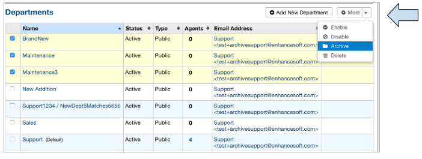

Help Topics:
-----------------

Help Topics behave in the same way as Departments. They may have a status of Active, Archived, or Disabled.

Closed ticket in Archived Help Topic:

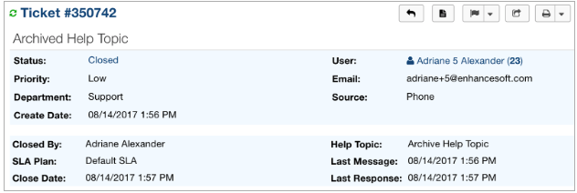

|

.. image:: ../_static/images/archives_closed_archived_ht2.png
  :alt: Closed Archived Department 2

User response to the Closed ticket:

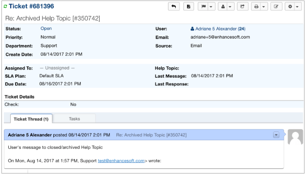

A new ticket is now opened referencing the ticket’s old title and number.

Closed ticket in Disabled Help Topic:

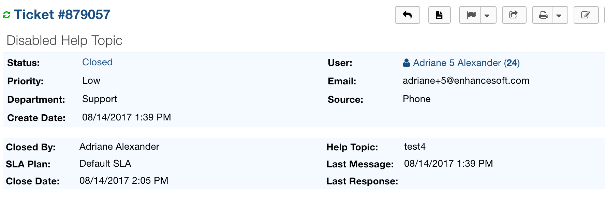

User response to the Closed ticket:

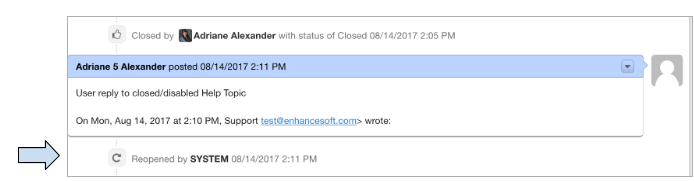

Changing the Help Topic Status:
-------------------------------

1. Go to:
Admin Panel | Manage | Help Topics

2. Click a Help Topic to modify.

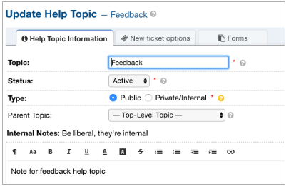

|

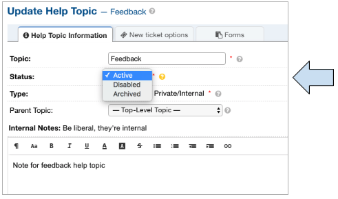

3. Modify multiple Help Topics at once.

    a. An agent can change the Status of multiple Help Topics at once by selecting the checkbox beside each Help Topic to modify and selecting the desired option in the ‘More’ dropdown.

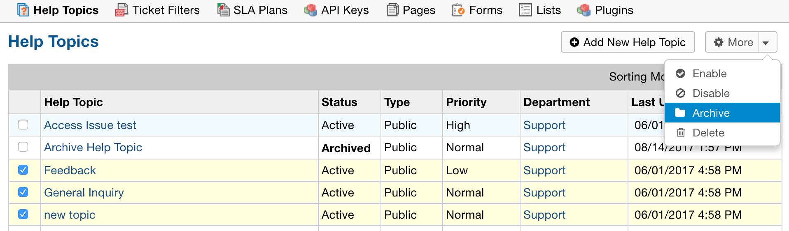

When viewing Dashboard Statistics for Departments and Help Topics, Agents will be able to see the statistics for Disabled or Archived items, and it will state whether the items were Archived or Disabled.

Departments:

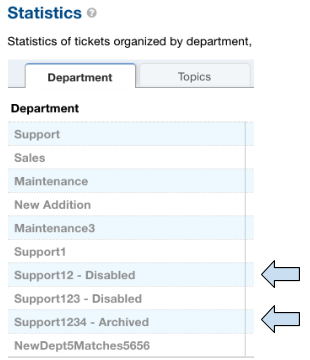

Help Topics:

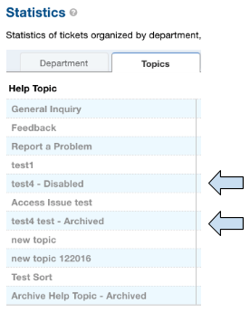
