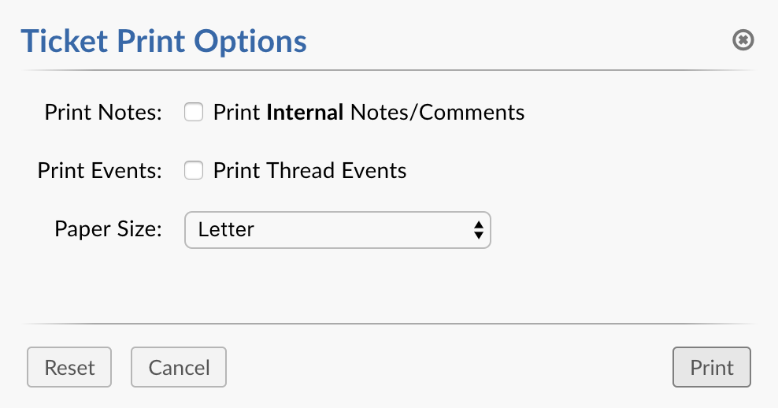
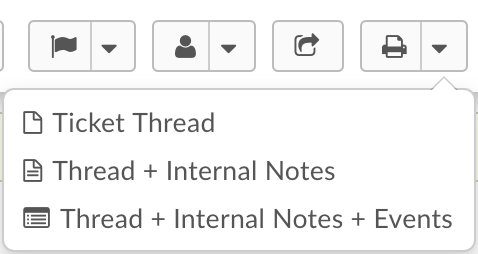
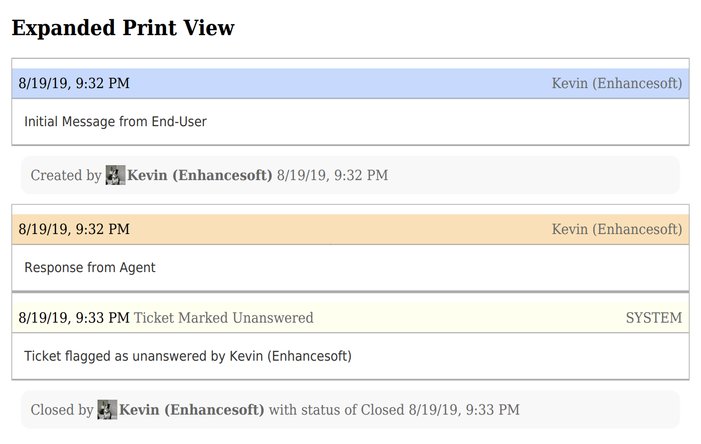

Expanded Print View
===================

The Expanded Print View feature allows an Agent to print more than just Thread Entries and Internal Notes. It offers the option of printing all of the Ticket's Thread Events in the PDF. Expanded Print View renders *all* Thread Events like Ticket changed Status, Field value updated, Ticket Owner changed, etc. This feature requires no special permissions or settings in order to utilize it.

Example Usage
-------------

There are two methods in which you can select the Thread Events option when Printing. The first method is by selecting a checkbox labled **Print Events: Print Thread Events** in the Ticket Print Options popup.

The second method to print all Thread Events is to select the **Thread + Internal Notes + Events** option in the Ticket Print dropdown.

Once you either select the checkbox or select the option in the dropdown you should see the Thread Events in your PDF file.

