.. |br| raw:: html

     

Multifactor Authentication
==========================

Multifactor Authentication, sometimes referred to as Two Factor Authentication, adds an extra layer of authentication set up for Agents.
|br|
when they log into the helpdesk. Once they correctly submit their username and password, they will be required to submit a token to finish logging into the helpdesk.

Agents can configure their Default 2FA settings by going to their profile.

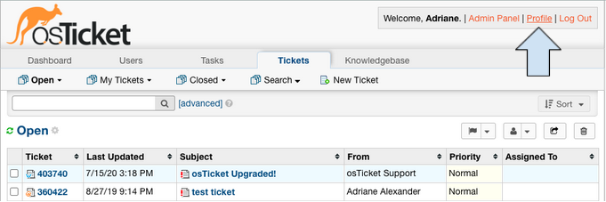

|br|

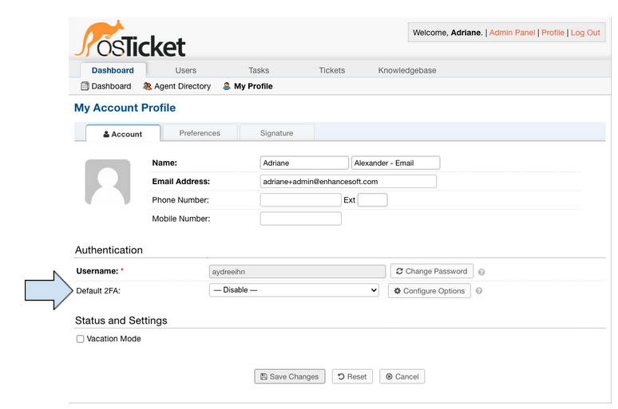

By default, Agents are not required to set up Multifactor Authentication. An administrator can require Multifactor Authentication by
going to:

Admin Panel | Settings | Agents | Require agents to turn on 2FA

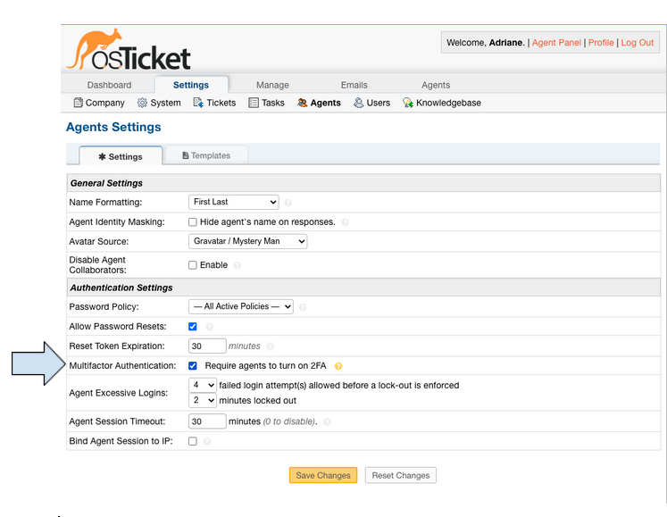

Once enabled, Agents will be required to configure and save their Default 2FA method before accessing the helpdesk.

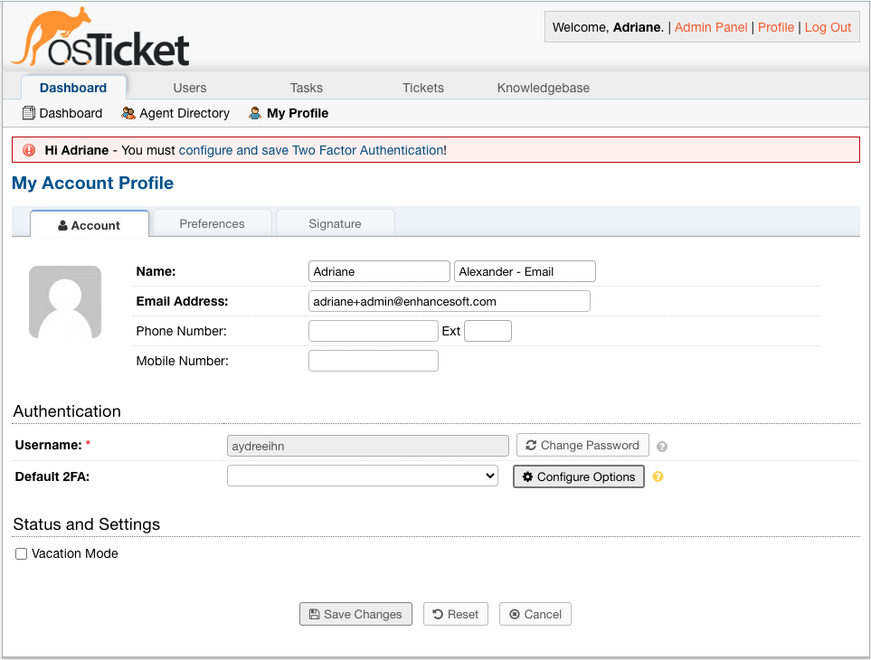

|br|

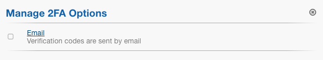

|br|

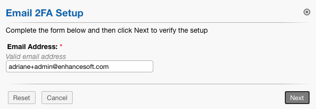

|br|

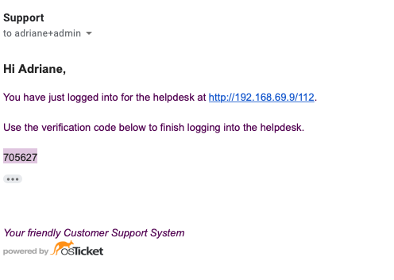

|br|

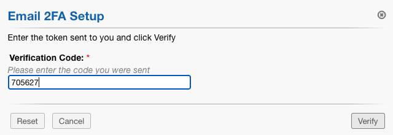

|br|

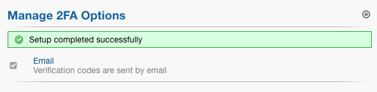

Once 2FA has been configured, the Agent must also save the configured method as well.

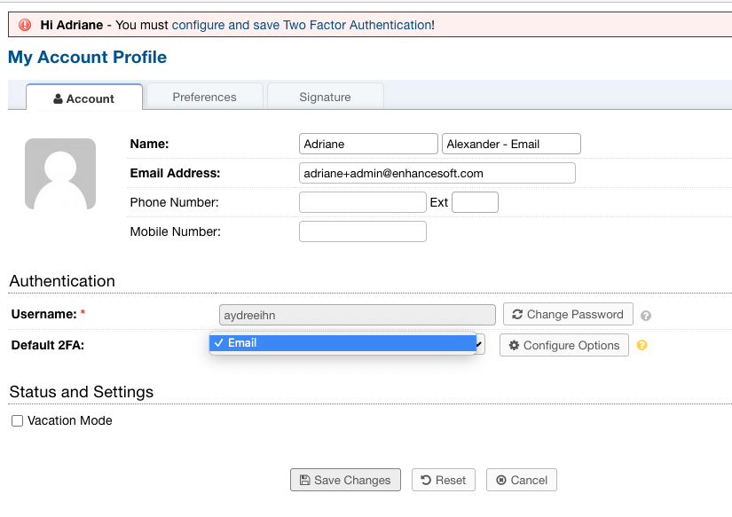

|br|

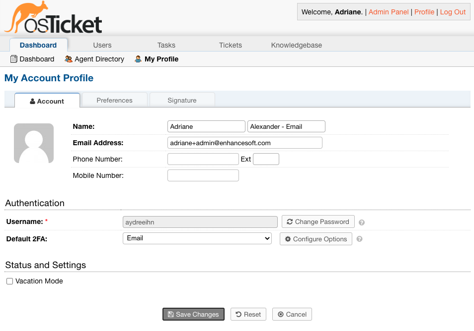

The next time the Agent logs into the helpdesk, they will be prompted to enter a token to finish logging into the helpdesk.

|br|

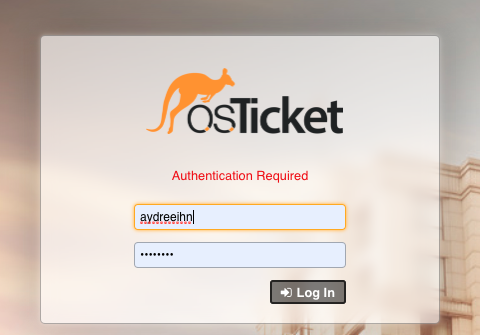

|br|

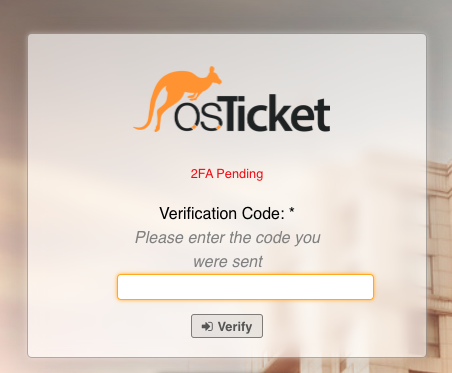

|br|

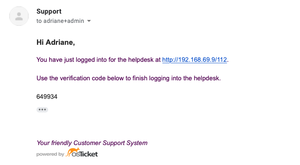

|br|

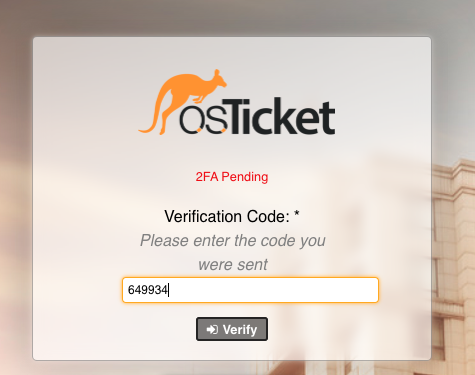

An administrator can edit the Email Template sent for the verification token by going to:

Admin Panel | Settings | Agents | Templates | Two Factor Authentication Email

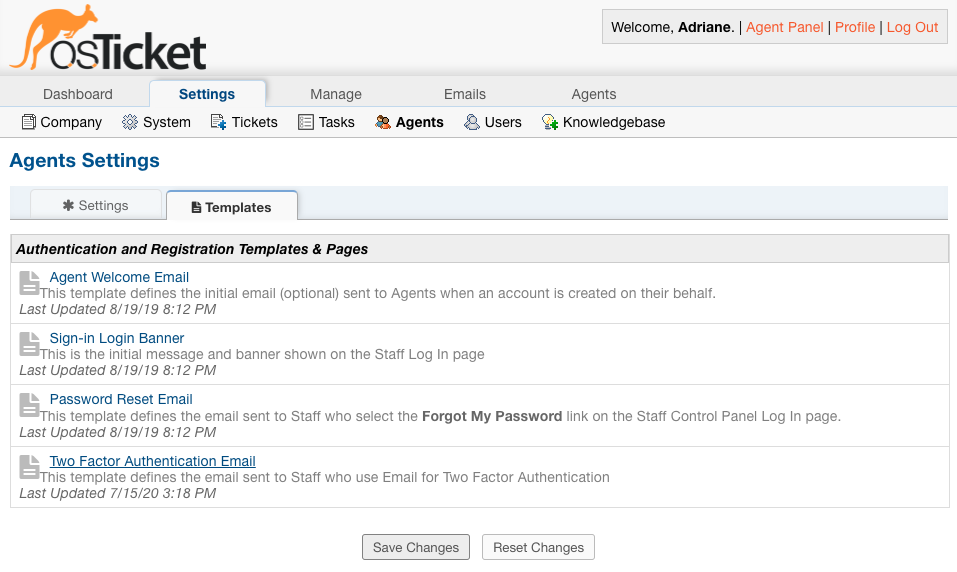

|br|

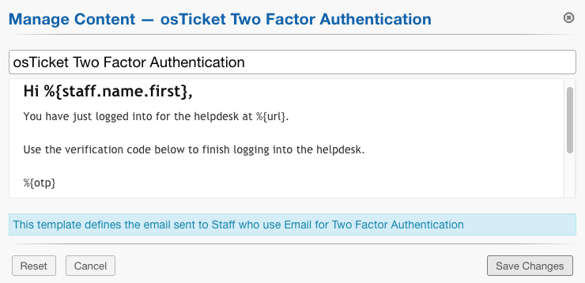

**Note:** The template variable that contains the token is %{otp}

In the event that an Agent becomes locked out of their account, an Administrator can reset their 2FA configuration by going to:

Admin Panel | Agents | click Agent | Reset 2FA

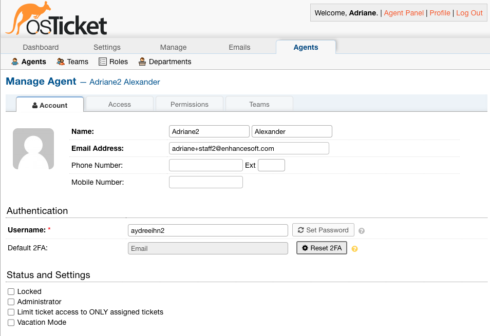
