Nested Knowledgebase Categories
===============================

Agents now have the ability to further organize their Knowledgebase by nesting categories beneath each other.

Configuration
-------------

First the Administrator should make sure that the Knowledgebase has been enabled.

Go to:
  Admin Panel | Settings | Knowledgebase | Enable Knowledge Base

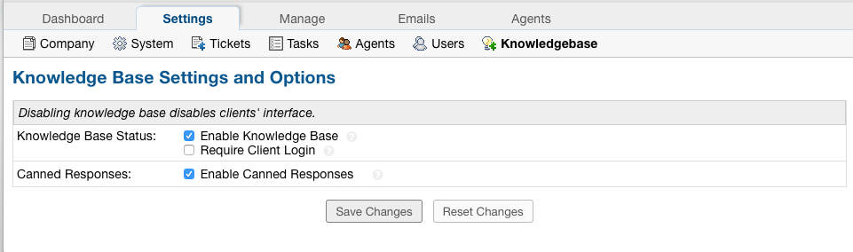

Next, an Agent should create a category.

Creating Categories
-------------------

Go to:
  Agent Panel | Knowledgebase Tab | Categories | Add New Category

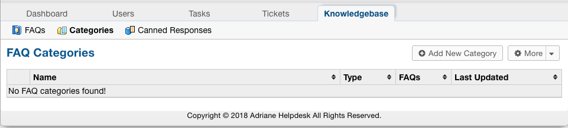

|

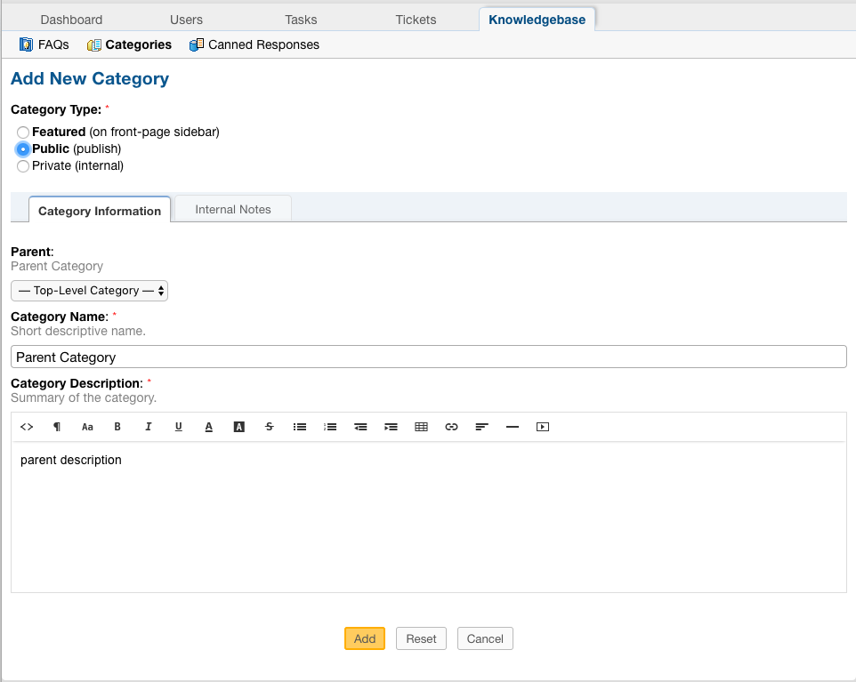

***Note:** The category must be set to Public to be seen in the Client Panel.

***Note:** There must be at least one FAQ in a Category for the Knowledgebase to be visible in the Client Panel.

Now that you have an existing Category, you have the option to create a Child category.

Go to:
  Agent Panel | Knowledgebase Tab | Categories | Add New Category

This time, choose the existing Categoy to be the Parent Category.

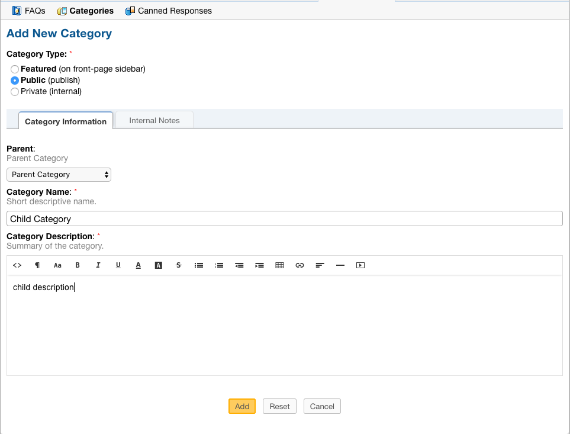

When viewing the Categories tab, Nested Categories are displayed like the following:

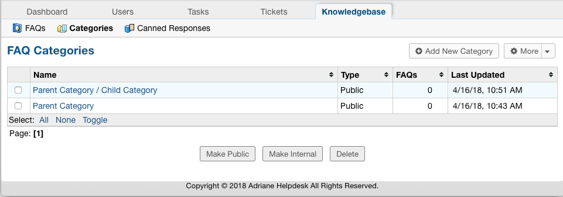

The name of the Parent is displayed first followed by the name of the Child, separated by '/'.

The final step is to add FAQ's to the categories.

Creating FAQs
-------------

Go to:
  Agent Panel | Knowledgebase Tab | FAQs | Click a Category | Add New FAQs

Adding an FAQ to the Parent Category:

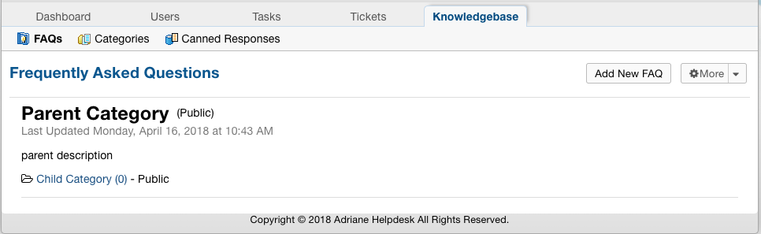

|

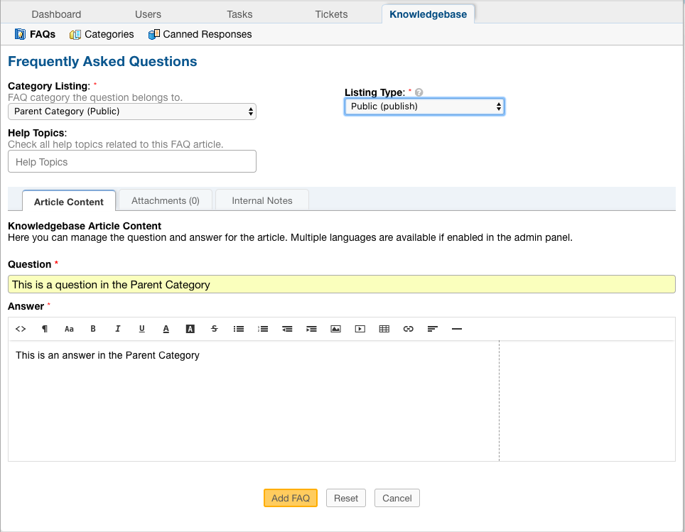

***Note:** The Listing Type must be set to Public to be seen in the Client Panel.

Adding an FAQ to the Child Category:

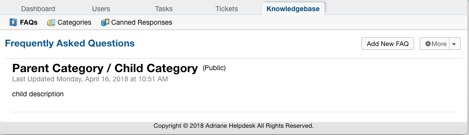

|

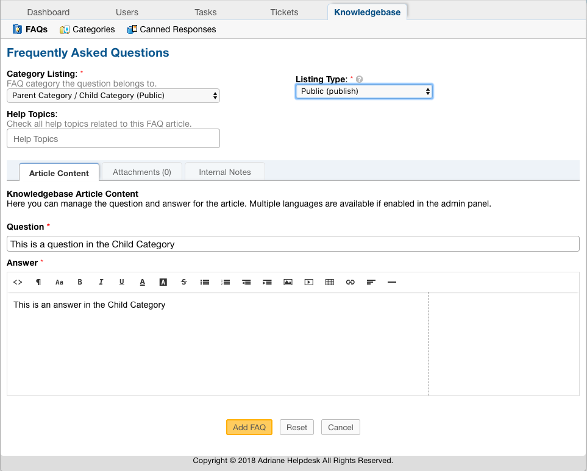

When viewing the FAQs tab, you see the Child Category listed as a folder beneath the Parent Category and a count of how many FAQs are within each.

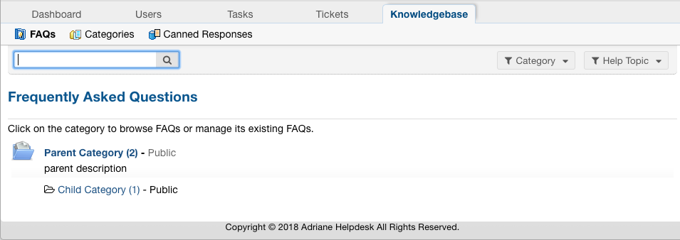

***Note:** The Parent Category has 2 FAQ's: one that was created in the Parent and one that was created in the Child category while the Child Category only has the FAQ that was created specifically for it.

Now that FAQs have been added, Users are able to see the Knowledgebase from the Client Portal:

List of all Categories:

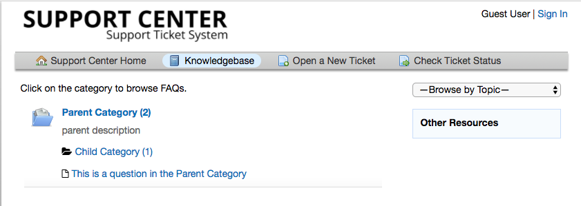

Parent Category:

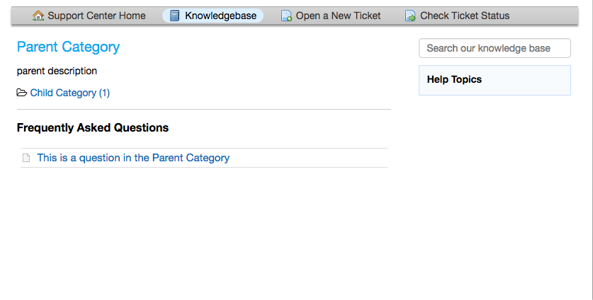

Child Category:

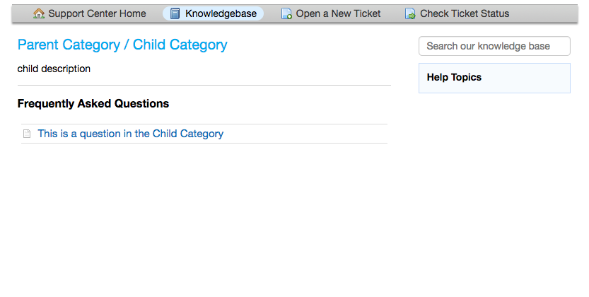
