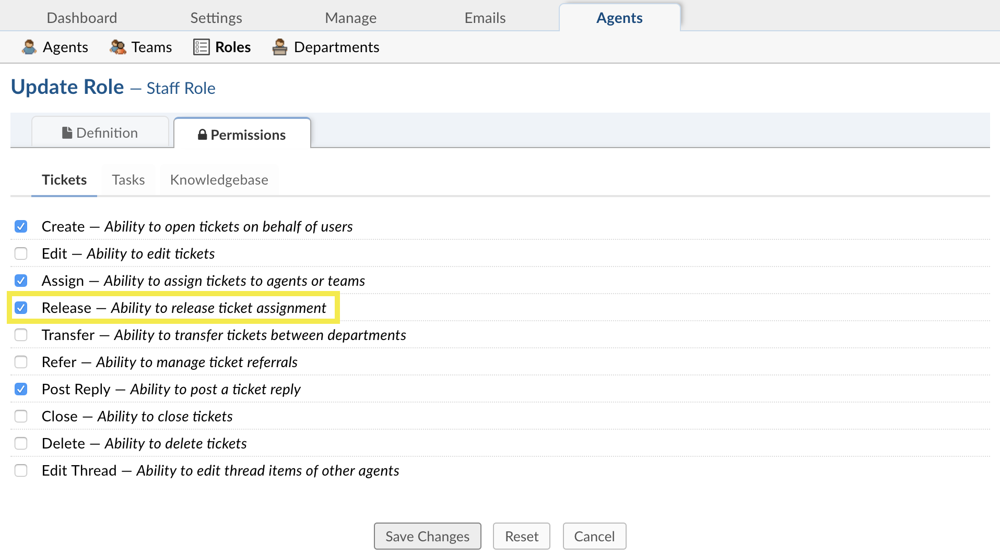
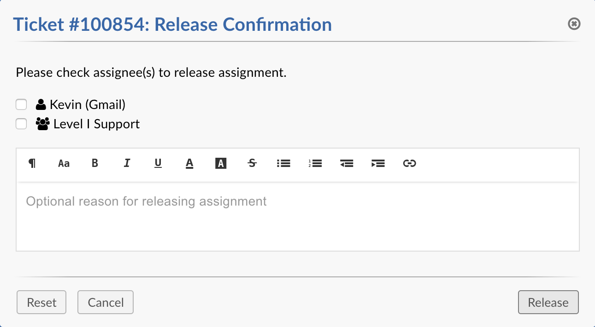
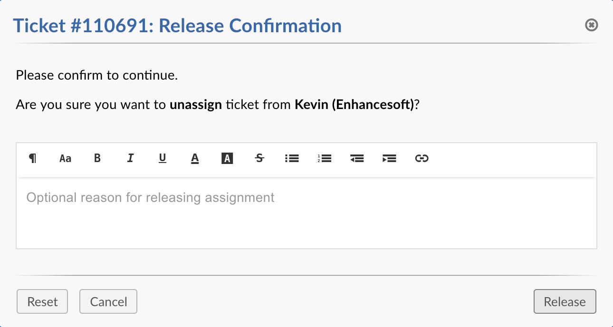
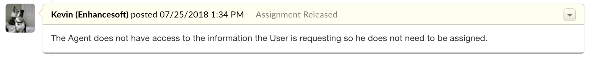

Release Assignment
==================

The Release Assignment feature allows Agents to release ticket assignment from other Agents and/or Teams. Agents may only access this feature if they have the new Release Role Permission assigned to them. An important thing to note is Department Managers do not need the Role Permission in order to release assignment of tickets within their Department.

Release Role Permission
-----------------------

To access the Release Assignment feature the Agent's assigned Role for the Department must have the Release Role Permission enabled. To enable the permission for any Role an Administrator may navigate to **Admin Panel > Agents > Roles** and click on the name of the desired Role. Under the **Permissions** tab, check the box next to the Release permission, and Save Changes.

Release Agent & Team
--------------------

Upon viewing an assigned ticket a **Release (unassign) Ticket** option will appear in the **More** dropdown (Cog-wheel Icon). Clicking this option will introduce a Release Confirmation modal on screen. If a ticket has both an Agent and Team assigned checkboxes will appear next to each name giving the option to choose whom to release assignment from. Checking both boxes will release assignment from both the Agent and Team. Checking one box will release assignment from only the selected Agent/Team.

Release Agent or Team
---------------------

If a ticket has only one Agent or Team assigned the modal will simply ask to confirm the release.

Internal Note
-------------

Both modals give Agents the ability to input a reason for releasing the assignment. If a reason is given it is added to the ticket thread as an Internal Note.

Thread Event
------------

When an Agent releases assignment a Release Thread Event is added to the ticket thread. This thread event shows who released whose assignment and contains a date and time stamp of when the released occurred.

