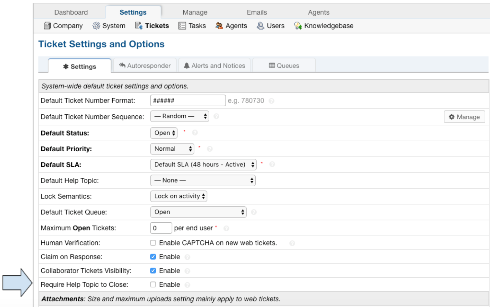
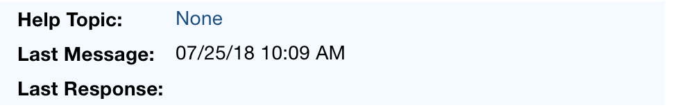
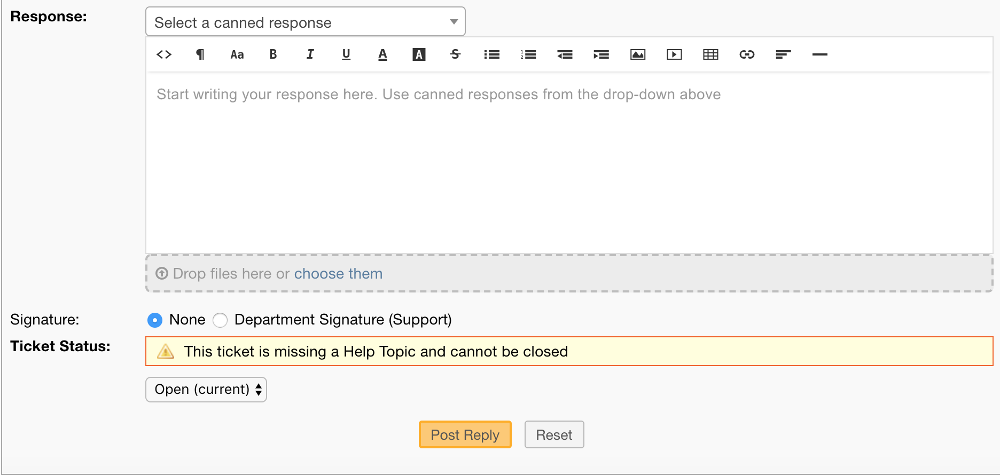
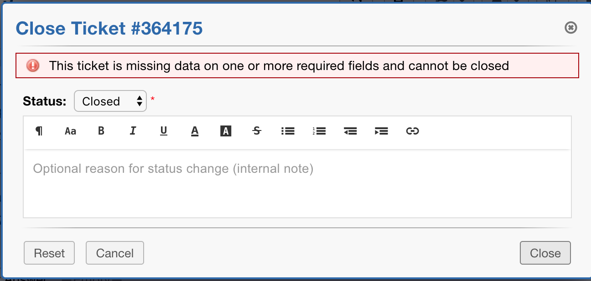

Require Help Topic
==================

Admins now have the option to require a Help Topic before a Ticket can be closed.

By default, this setting is NOT enabled.

To enable this setting, go to:

Admin Panel | Settings | Tickets | Require Help Topic to Close

If enabled, Tickets without a Help Topic will have a warning banner across the bottom of the page, a warning when trying to change the Ticket status to Closed, and a warning flag beside the Help Topic field when editing the Ticket.

Ticket Without Help Topic:

Ticket Warning Banner:

Status Warning Banner:

Edit Warning:

.. image:: ../_static/images/require_ht_warning3.png
  :alt: Edit Warning
