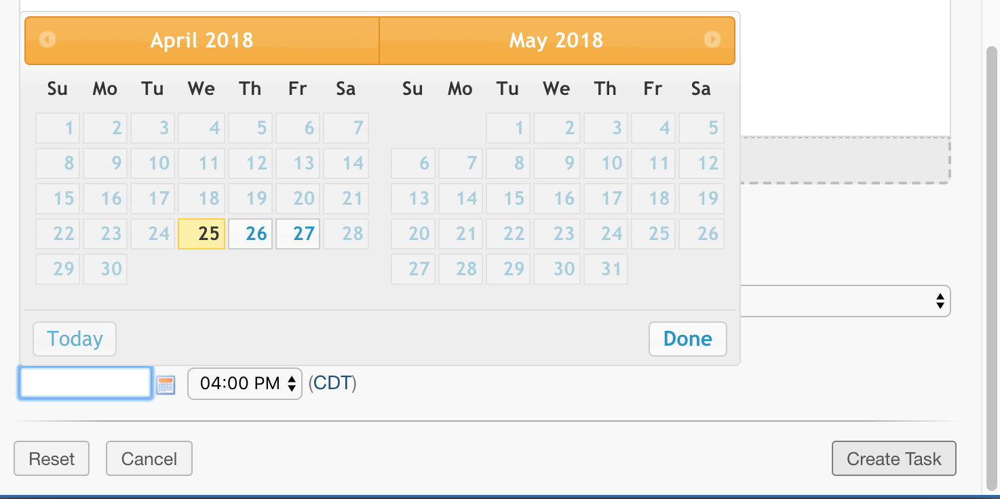
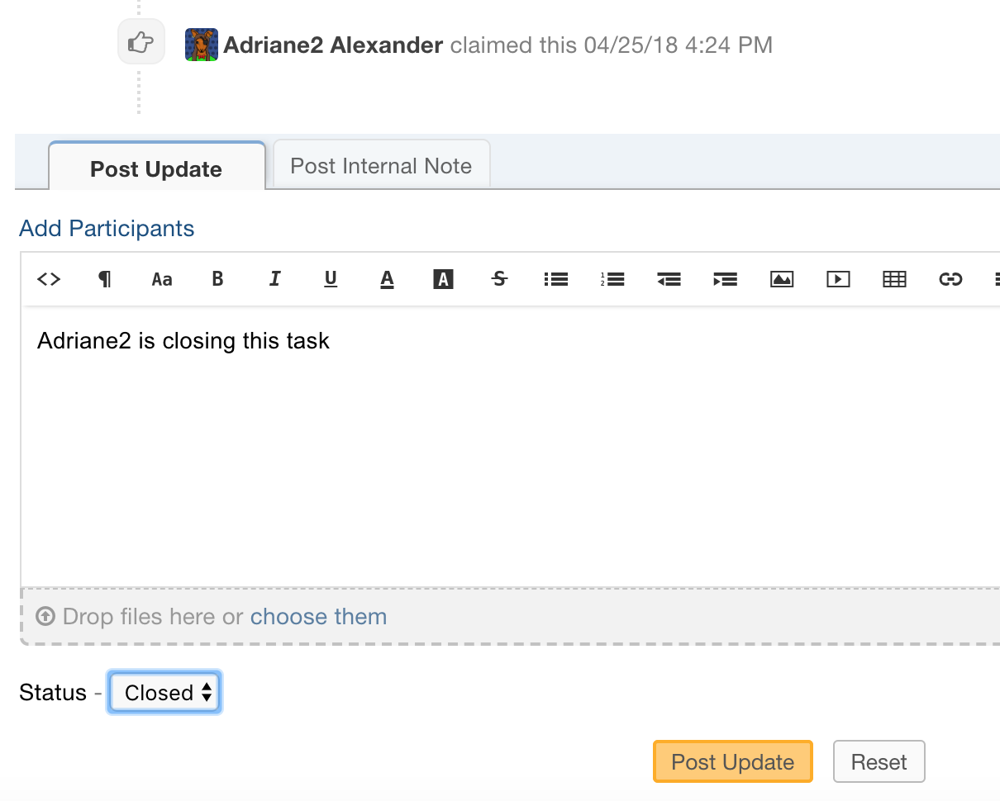
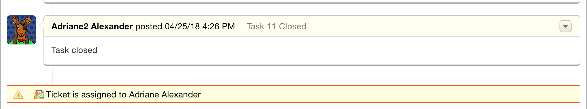
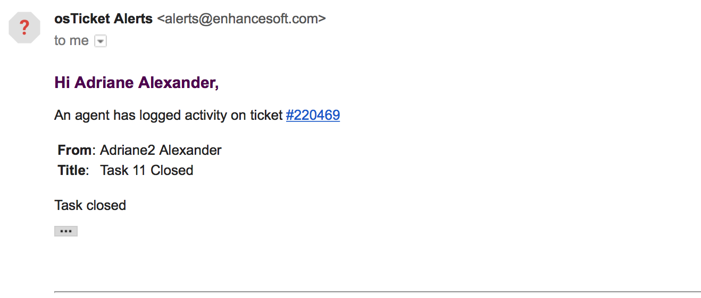
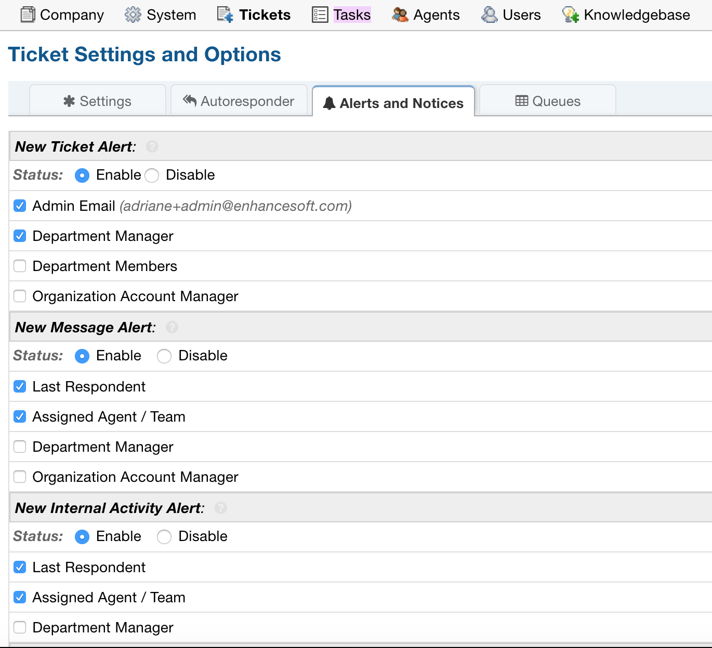

Task Revamp
===========

The Task Revamp improves upon the current functionality of tasks by adding the following:

#. Task due date must be before ticket due date
#. Add an Internal Note to the Ticket when a Task is completed
#. Send an Alert to the Assigned Agent/Team when task is complete

Task Due Date
-------------

When creating a Task for a Ticket, we now ensure that the Task's Due Date is before the Ticket's Due Date

Ticket Due Date:

.. image:: ../_static/images/trevamp_ticketdue.png
  :alt: Ticket Due Date

Task Due Date:

Internal Note
-------------

When a Task that is attached to a Ticket is closed, an Internal Note is attached to the Ticket.

Closing a Task:

Internal Note:

Email Alert
-----------

Additionally, an Email Alert is sent to specified Agents if they are configured.

Email Alert:

***Note:** In order to get the email notification, a different Agent must be closing the Task.

***Note:** In order to get the email notification, the proper Alert must be configured.

Since closing the Task creates an Internal Note on the Ticket, you must ensure that you have Alerts set up for Internal Notes.

To check the configuration, go to:

Admin Panel | Tickets | Alerts & Notices Tab

Make sure the 'New Internal Activity Alert' is Enabled and the desired Agents are checked to receive the Alert.

