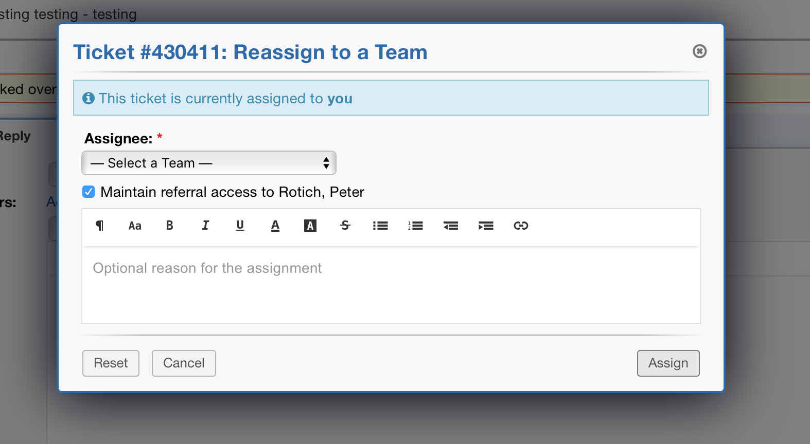
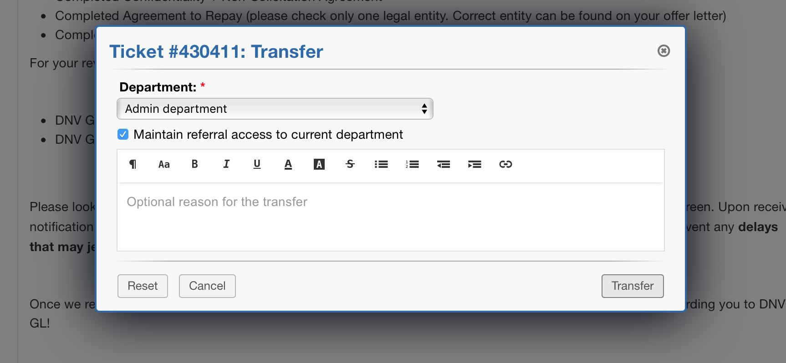
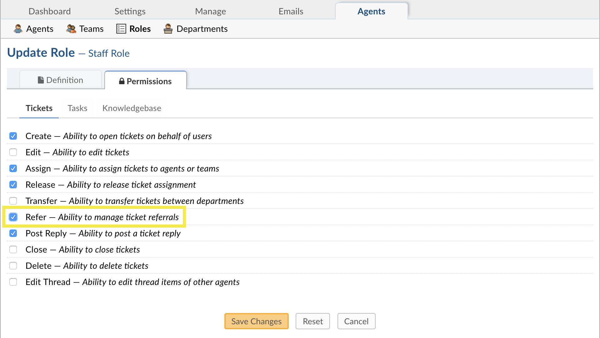
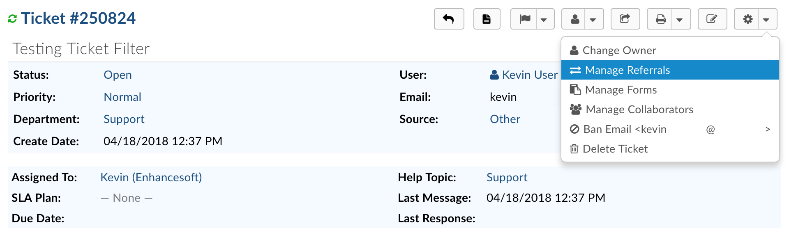

.. |br| raw:: html

     

Ticket Referral
===============

.. raw:: html

    

        <iframe width="560" height="315" src="https://www.youtube.com/embed/3QIXehb4Q9U" frameborder="0" allow="accelerometer; autoplay; encrypted-media; gyroscope; picture-in-picture" allowfullscreen></iframe>
    

The ticket referral feature allows for the ability to refer tickets (& any associated tasks) to an Agent, Team or Department who otherwise do not have access. Referrals can also be used to retain view only access to the ticket once referred rather than losing access to the ticket.​

The referred party only has view Role for the thread with the ability to post internal notes. It's important to note the ticket will technically still be the responsibility of the primary department and/or assignee. Transferring or assigning a ticket and unchecking the “maintain referral access” box in the pop-up is how an agent can relinquish the responsibility.

The permission to refer a ticket is tied to the Agent’s role permission for tickets of the department and included within the ability to transfer and/or assign tickets.

Agent & Team Referral
---------------------

Referring a ticket to an Agent or a Team is just like assignment without actually assigning. The referee will only have a view Role and current assignees retain the responsibility of the ticket.

Department Referral
-------------------

Department referral, unlike ticket transfer, is like assigning a ticket  to the entire department. Meaning agents who have access to the referred department will be able see the ticket. What they can do with the ticket will depend on the their individual assigned role in the ticket’s department, otherwise they’ll have a “view only” Role.

Managing Referrals
------------------

To Manage Referrals an Agent must have the Refer permission enabled in the Role for the Department they are referring from.

Ticket referrals can also be done independent of ticket transfer or assignments. This includes the ability to add new or remove prior referrals.

