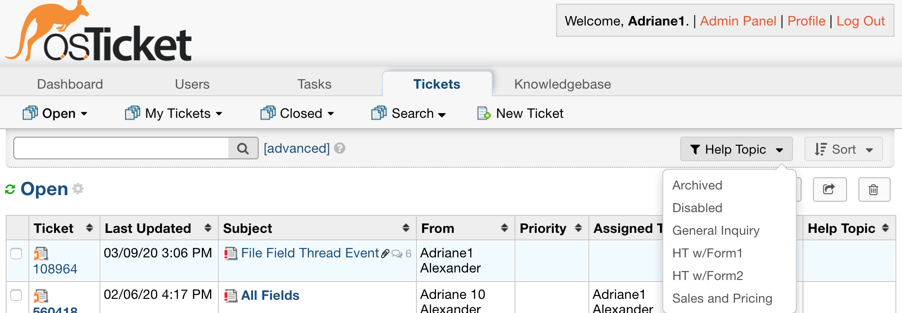

.. |br| raw:: html

     

Visibility Permissions
======================

New Permissions have been added to limit the visibility of Departments, Agents, and Help Topics based on an Agent's Department access.

.. raw:: html

    

        <iframe width="560" height="315" src="https://www.youtube.com/embed/oM-djMZQEvI" frameborder="0" allow="accelerometer; autoplay; encrypted-media; gyroscope; picture-in-picture" allowfullscreen></iframe>
    

These permissions can be found by going to:

Admin Panel | Agents | Select an Agent | Permissions Tab | Miscellaneous

**New Permissions:**
|br|
'Agent — Ability to see Agents in all Departments'
|br|
'Department — Ability to see all Departments'

Both of these boxes are checked by default for new Agents as well as existing Agents (in the case of an upgrade).

Throughout this documenation, as an example, let's say I have an Agent with Access to only the Support Department.

The Agent has the following set for Permissions:

.. image:: ../_static/images/visibility_permissions_boxes3.png
  :alt: Permissions Example

Agent — Ability to see Agents in all Departments
------------------------------------------------

When this box is unchecked for an Agent, the Agent will only be able to see Agents who belong to a Department they have access to within the Agent Panel.

An Administrator can easily see which Agents should be visible within the Agent Panel of the helpdesk by doing an Agent Export and comparing Department permissions for the desired Agent.

Here is what the export looks like. The names of Agents that will be visible are purple.

**Note:** Agents set to on **Vacation** do not show up throughout most of the Agent Panel.

Based on this export, Agent Adriane1 should be able to see Adriane2 and Adriane3 throughout the Admin Panel.

**Note:** They can see themselves as well.

.. image:: ../_static/images/visibility_permissions_boxes6.png
  :alt: Agent Visibility 1

.. image:: ../_static/images/visibility_permissions_boxes7.png
  :alt: Agent Visibility 2

This includes the following:

- Queue Assign Mass Process
- Ticket open Assign
- Ticket View assign
- Ticket Inline Edit Assign
- Ticket Refer Agent
- Assigned Staff Quick Filter
- Assignee Quick Filter
- Department Manager Quick Filter
- Agent Directory
- Task Creation
- Ticket Creation
- Advanced Searches

Department — Ability to see all Departments
-------------------------------------------

When this box is unchecked for an Agent, the Agent will only be able to see Departments they have access to within the Agent Panel.

Let's take a look at the Departments in our example helpdesk. Remember, Adriane1 only has access to the Support Department.

**Note:** Archived and Disabled Departments do not show up throughout the Agent Panel.

This includes the following:

- Ticket Transfers
- Task Transfers
- Ticket Refer Department
- Task Creation
- Ticket Creation
- Department Quick Filter
- Custom Department Field Quick Filters
- Advanced Searches

Canned Responses
----------------

This permission also limits Canned Responses that an Agent can see.

The Agent will only be able to see Canned Responses for Departments they can access (Primary or Extended Access) or Canned Responses assigned to all Departments.

Agents are only able to create/edit Canned Responses for Departments they have access to as well.

Help Topics
-----------

Help Topics are hidden from the Agent Panel if they are assigned a Department an Agent does not have access to and the Agent does not have the 'Ability to see all Departments' permission checked.

Here are the Help Topics for our example helpdesk:

If a Help Topic is Public, it will be shown in the Agent Panel.

If a Parent Help Topic is Private and assigned a Department an Agent does not have access to, we hide both the Parent and Children Help Topics.

If a Help Topic is assigned the System Default Department, it is shown throughout the Agent Panel.

**Note:** Archived and Disabled Help Topics do not show up throughout the Agent Panel.

Based on our screenshot, Feedback, Report a Problem, and Access Issue should be hidden based on the permission checked.

Archived and Disabled would not show up either, regardless of the permission since they are not Active.

**Note:** Even though we do not have access to the Outlook Department, General Inquiry will still show up since it is a Public Help Topic.

Filtered Topics:

**Note:** Archived or Disabled Help Topics still show up for quick filters and searches.

When the Department Permission box is checked, all Help Topics are visible.

Help Topics are filtered for:

- Inline Ticket Edit
- Ticket Edit
- Ticket Open
- Advanced Search
- Quick Filters
- Dashboard
- FAQs
