.. |br| raw:: html

     

Upgrade Overview (v1.11)
========================

Features Outlined in this Document
----------------------------------

* Custom Queues and Columns
* Advanced Search
* Inline Edit
* Ticket Referral
* Collaborators
* Export Agent CSV
* Department Access CSV
* Archive Help Topics/Departments
* Nested Knowledgebase Categories
* Task Revamp
* Release Assignment
* Dashboard Statistics
* Fix Most Redactor Issues
* Ticket Preview Custom Fields
* Fix Reset Button(s)
* Fix New Ticket Cancel Button
* Fixes issue with last_update ticket variable
* Fix DatePicker on client side
* Add Custom Forms to Ticket Filter Data

Custom Queues and Columns
----------------------------

**Summary:**
|br|
With Custom Queues and Columns, Agents can completely customize the way they view tickets in the help desk. This feature gives Agents the freedom to create personal queues that only they can see.  They can specify what the criteria is for the queue, what columns are displayed for the queue, and what quick filters they would like to see for the queue.

In addition to being able to create personal queues, Agents can also modify how existing queues show up specifically to them by editing the existing queues.

Links to Documentation:
|br|
:doc:`Custom Columns & Custom Queues (Admin) <../Features/Custom Columns & Custom Queues (Admin)>`
|br|
:doc:`Custom Columns & Custom Queues (Agent) <../Features/Custom Columns & Custom Queues (Agent)>`

Advanced Search
---------------

**Summary:**
|br|
Several improvements have been made to the Advanced Search to make it more user friendly and more efficient.

Links to Documentation:
|br|
:doc:`Advanced Search <../Agent/Tickets/Advanced Search>`

Inline Edit
-----------

**Summary:**
|br|
With Inline Edit, an Agent can modify an individual field on a ticket without having to edit the entire ticket. Within the ticket header, each field that can be edited inline is selectable (highlighted in blue) and can be changed by simply clicking the field value. Inline editing can be done on a ticket’s standard fields as well as custom fields.

Links to Documentation:
|br|
:doc:`Inline Edit <../Features/Inline Edit>`

Ticket Referral
---------------

**Summary:**
|br|
The ticket referral feature allows for the ability to refer tickets (& any associated tasks) to an Agent, Team or Department who otherwise do not have access. Referrals can also be used to retain view only access to the ticket once referred rather than losing access to the ticket.​

Links to Documentation:
|br|
:doc:`Ticket Referral <../Features/Ticket Referral>`

Tests:

***Tip:** Before doing these tests, do an Agent export to get a CSV of each Agent’s Department access.

.. csv-table::
   :widths: 10, 20, 10

   "**Action**", "**Steps to Follow**", "**Expected Result(s)**"
   "Refer a ticket to an Agent who does not have access to the ticket's |br| Department", "\1. Create a ticket in a Department that you can access but other Agents can not |br| 2. Within the ticket, click 'Manage Referrals' on the More dropdown |br| 3. Click the 'Refer' tab |br| 4. Select 'Agent' in the Referee list |br| 5. Select an Agent that does not have access to the Department |br| 6. Click Refer |br| 7. Have the referred Agent check to make sure the referred ticket is in their Queue", "The referred ticket will show up in the Agent's ticket queue"
   "Refer a ticket to a Department", "\1. Within the same ticket or a new ticket, click 'Manage Referrals' on the More dropdown |br| 2. Click the 'Refer' tab |br| 3. Select 'Department' in the Referee list |br| 4. Select a Department |br| 5. Click Refer |br| 6. Have an Agent from the referred Department who can not currently access the ticket's |br| Department check to make sure the referred ticket is in their Queue", "The referred ticket will show up in the queue of every Agent |br| in the assigned Department"
   "Refer a ticket to a Team of Agents who do not currently have |br| access to the ticket's Department", "\1. Within the same ticket or a new ticket, click 'Manage Referrals' on the More dropdown |br| 2. Click the 'Refer' tab |br| 3. Select 'Team' in the Referee list |br| 4. Select a Team |br| 5. Click Refer |br| 6. Have an Agent from the referred Team who can not currently access the ticket's |br| Department check to make sure the referred ticket is in their Queue", "The referred ticket will show up in the queue of every Agent |br| in the Team"
   "As a User, reply to a ticket through email adding another |br| Department's email to the recipients of the email", "\1. Within the same ticket or a new ticket, reply as an Agent so |br| that an email will go to the ticket User (be sure that you have a way |br| to access the User's email inbox) |br| 2. Go to the User's email inbox and find the email Alert |br| 3. Reply to the email and add the address for another Department in the |br| email recipients list |br| 4. As the Agent, go back to the ticket |br| and click 'Manage Referrals' to ensure the Department has been referred", "Any Departments that were included will now be |br| listed as referred Departments in the ticket"

Collaborators
-------------

**Summary:**
|br|
Previously, collaborators could only be added to tickets by copying someone in an email or when an Agent was posting a reply. Now collaborators can be added upon ticket creation as well.

Links to Documentation:
|br|
:doc:`Collaborators <../Features/Collaborators>`

It is important to understand which email templates can be expected to go out for each scenario of this feature. The templates will determine what users will see in Alert emails that are sent out by the system. In order to see the titles of the email templates have your administrator go to:

Admin Panel | Emails | Templates | Click the active templates

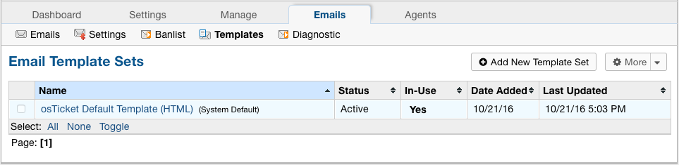

From here, the administrator can see the names of each template being referred to in the below test cases.

See the example of one of the names highlighted below:

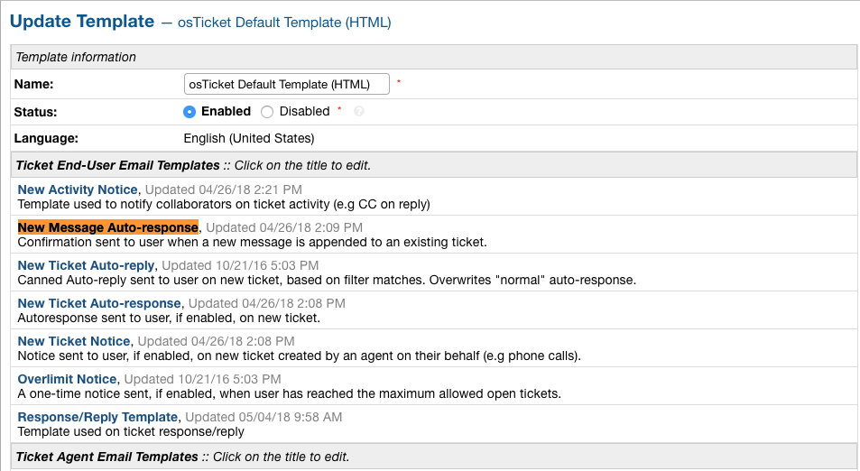

Templates used in this feature:

New Ticket Alert, New Ticket Auto Response, New Ticket Notice, Ticket Assignment Alert, Response/Reply Template, New Message Auto-Response, and Internal Activity Alert

Tests:

\*See screenshots below for an example of the types of emails to respond to

.. csv-table::
   :widths: 8, 10, 10

   "**Action**", "**Steps to Follow**", "**Expected Template (if Enabled)**"
   "User opens ticket through email", "\1. Send an email to a department", "\- Admin: New Ticket Alert |br| - User: New Ticket Auto Response |br| - Cc: None"
   "User opens ticket through email including CC", "\1. Compose a new email |br| 2. Put a department email in the To address field |br| 3. Put a personal email in the Cc field |br| 4. Send email", "\- Admin: New Ticket Alert |br| - User: New Ticket Auto Response |br| - Cc: None"
   "User opens ticket from front end", "\1. Go to helpdesk url |br| 2. Sign in as a User |br| 3. Create a new ticket", "\- Admin: New Ticket Alert |br| - User: New Ticket Auto Response |br| - Cc: Not an option"
   "Agent opens ticket on behalf of user from front end", "\1. Go to helpdesk url/scp |br| 2. Log in as an Agent |br| 3. Click New Ticket |br| 4. Choose a User for the ticket |br| 5. Save", "\- Admin: New Ticket Alert |br| - User: New Ticket Notice |br| - Cc: New Ticket Notice (copied on user email) |br| - Agent: Ticket Assignment Alert |br| (if agent assigns to someone else while creating)"
   "User replies to ticket from front end", "\1. Go to helpdesk url |br| 2. Sign in as a User that has been assigned to a ticket |br| 3. Click one of the User's ticket |br| 4. Reply to the ticket", "\- User: New Message Auto-Response |br| - Cc: New Activity Notice (copied) |br| - Agent: New Message Alert"
   "User replies to ticket from email", "\1. Go to your email inbox and look for an email template that |br| was sent to a user when a ticket was created for them |br| 2. Reply to that email", "\- User: New Message Auto-Response |br| - Cc: None |br| - Agent: New Message Alert"
   "Agent replies to user (front end only option)", "\1. Go to helpdesk url/scp |br| 2. Log in as an Agent |br| 3. Click on one of the Tickets that have already been created |br| 4. Reply to the ticket", "\- User: Response/Reply Template |br| - Cc: Response/Reply Template (copied on user email) |br| - Agent: None"
   "Cc reply from front end", "\1. Go to helpdesk url |br| 2. Sign in as a User that has been added as a Cc collaborator to a ticket |br| 3. Click one of the Collaborator's tickets |br| 4. Reply to the ticket", "\- User: New Activity Notice (Cc'd) |br| - Cc Poster: New Message Auto-Response |br| - Cc: New Activity Notice (copied on user email) |br| - Agent: New Message Alert"
   "Cc reply from email", "\1. Go to your email inbox and look for an email template that |br| was sent to a Cc'd Collaborator when a ticket was responded to |br| 2. Reply to that email", "\- User: None |br| - Cc Poster: New Message Auto-Response |br| - Cc: None |br| - Agent: New Message Alert"
   "Agent writes an internal note", "\1. Go to helpdesk url/scp |br| 2. Log in as an Agent |br| 3. Click a ticket |br| 4. Click the Post Internal Note tab |br| 5. Post the internal note", "\- User: None |br| - Cc: None |br| - Agent: Internal Activity Alert"

Email template that was sent to a user when a ticket was created for them:

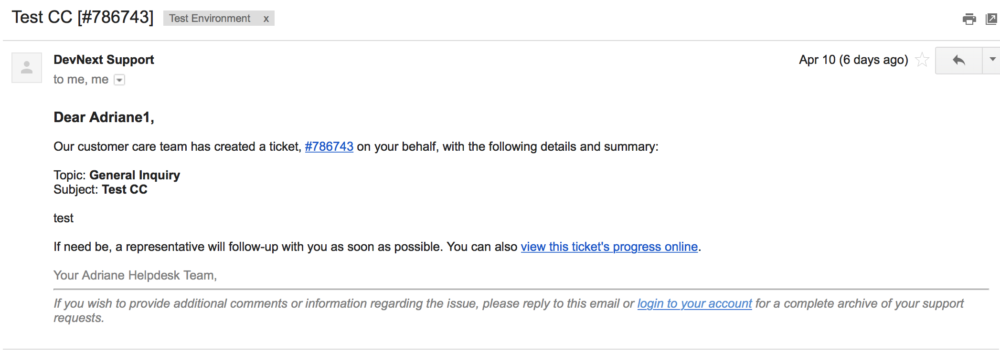

Email template that was sent to a Cc'd Collaborator when a ticket was responded to:

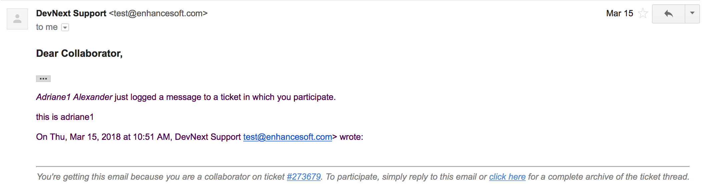

***Note:** You can look for the email that went to the email address assigned to the Cc collaborator you chose.

Export Agent CSV
----------------

**Summary:**
|br|
Administrators are now able to download a CSV export that displays all Agents in the system as well as their access to each Department.

Links to Documentation:
|br|
:doc:`Agent CSV Export <../Features/Agent CSV Export>`

Department Access CSV
---------------------

**Summary:**
|br|
Admins are now able to download a CSV export of which agents can access different departments.

Links to Documentation:
|br|
:doc:`Department CSV Export <../Features/Department CSV Export>`

Archive Help Topics/Departments
-------------------------------

**Summary:**
|br|
Occasionally it could become necessary to no longer use certain Departments or Help Topics within a helpdesk. Even though they will no longer be used in the future, there could be some Tickets that are still assigned to the Department or Help Topic. In addition, there are important Dashboard Statistics already stored. To resolve these issues, Admins may now choose to Archive Departments or Help Topics.

Links to Documentation:
|br|
:doc:`Department Help Topic Archiving <../Features/Department Help Topic Archiving>`

Tests:

Departments:

.. csv-table::
   :widths: 10, 10, 10

   "**Action**", "**Steps to Follow**", "**Expected Result(s)**"
   "Create a ticket in a Department you will plan to Archive", "\1. Go to: Agent Panel | Tickets | New Ticket |br| 2. Choose the Department you will archive |br| |br| OR |br| |br| 1. Create an email and send it to the Department you will Archive", "A new ticket will exist in the Department chosen"
   "Archive a Department", "\1. Go to: Admin Panel | Agents Tab | Departments |br| 2. Choose a Department |br| 3. Choose 'Archived' in the Status Dropdown |br| 4. Save Changes |br| |br| \*Be sure to choose a Department that you can send emails to for future steps below", "When viewing the list of Departments, the Status column |br| should say 'archived' for the modified Department"
   "Check the Archived Department in the Agent Dashboard", "\1. Go to: Agent Panel | Dashboard", "The Department should show up as 'Department - Archived' |br| in the Department column"
   "Make sure the Archived department is not |br| in the list when opening a new ticket", "\1. Go to: Agent Panel | Tickets | New Ticket |br| 2. Look at the Departments listed in the Department dropdown", "The name of the Archived Department should NOT show up in the list"
   "Email in a ticket to the Archived Department", "1. Create an email and send it to the |br| Department you Archived", "The new ticket that has been created should be assigned to |br| the default Department, NOT the Archived Department"
   "Close the ticket that was created in step 1", "\1. As an Agent, go to the ticket created in step 1 |br| (which should still be in the Archived Department) |br| 2. Close the ticket", "\- The ticket should still be in the Archived Department.  |br| - It should have a message at the bottom that reads |br| 'Current ticket status (Closed) does not allow the end user to reply.'"
   "As a User, reply to the ticket created in the ticket from step 1. |br| This ticket should still be in the Archived Department", "\1. Log into the Client Portal as the User assigned to the ticket |br| 2. Respond to the ticket |br| |br| OR |br| |br| 1. Respond to the ticket as the User by email", "\- A new ticket should have been created in the default Department |br| - The subject of the new ticket should say |br| 'Re:' + subject of ticket in archived department |br| + ticket # of ticket in archived department"
   "Create a ticket in a Department you will plan to Disable", "\1. Go to: Agent Panel | Tickets | New Ticket |br| 2. Choose the Department you will archive |br| |br| OR |br| |br| 1. Create an email and send it to the Department you will Disable |br| \*Note: Be sure to check that the email for this Department is still set |br| to the correct Department and not the Default Department", "A new ticket will exist in the Department chosen"
   "Disable a Department", "\1. Go to: Admin Panel | Agents Tab | Departments |br| 2. Choose a Department |br| 3. Choose 'Disabled' in the Status Dropdown |br| 4. Save Changes |br| |br| \*Be sure to choose a Department that you can send emails to for future steps below", "When viewing the list of Departments, the Status column should say |br| 'disabled' for the modified Department"
   "Check the Disabled Department in the Agent Dashboard", "\1. Go to: Agent Panel | Dashboard", "The Department should show up as |br|  'Department - Disabled' in the Department column"
   "Make sure the Disabled Department is not in |br| the list when opening a new ticket", "\1. Go to: Agent Panel | Tickets | New Ticket |br| 2. Look at the Departments listed in the Department dropdown", "The name of the Disabled Department should NOT show up in the list"
   "Email in a ticket to the Disabled Department", "\1. Create an email and send it to |br| the Department you Disabled", "The new ticket that has been created should be assigned to |br| the default Department, NOT the Disabled Department"
   "Close the ticket that was created before disabling the Department", "\1. As an Agent, go to the ticket created in step 1 |br| (which should still be in the Disabled Department) |br| 2. Close the ticket", "The ticket should still be in the Archived Department."
   "As a User, reply to the ticket created before the Department |br| was disabled. This ticket should still be in the Disabled |br| Department", "\1. Log into the Client Portal as the User assigned to the ticket |br| 2. Respond to the ticket |br| |br| OR |br| |br| 1. Respond to the ticket as the User by email", "\- The ticket should have an event that says |br| 'Reopened by SYSTEM' |br| - The response should be threaded into the ticket"

Help Topics:

.. csv-table::
   :widths: 10, 10, 10

   "**Action**", "**Steps to Follow**", "**Expected Result(s)**"
   "Create a ticket in a Help Topic you will plan to Archive", "\1. Go to: Agent Panel | Tickets | New Ticket |br| 2. Choose the Help Topic you will archive", "A new ticket will exist in the Help Topic chosen"
   "Archive a Help Topic", "\1. Go to: Admin Panel | Manage | Help Topic |br| 2. Choose a Help Topic |br| 3. Choose 'Archived' in the Status Dropdown |br| 4. Save Changes", "When viewing the list of Help Topics, the Status column |br| should say 'archived' for the modified Help Topic"
   "Check the Archived Help Topic in the Agent Dashboard", "1. Go to: Agent Panel | Dashboard", "The Help Topic should show up as |br| 'Help Topic - Archived' in the Topics column"
   "Make sure the Archived Help Topic is not in |br| the list when opening a new ticket", "\1. Go to: Agent Panel | Tickets | New Ticket |br| 2. Look at the Help Topics listed in the Help Topic dropdown", "The name of the Archived Help Topic should NOT show up in the list"
   "Close the ticket that was created in step 1", "\1. As an Agent, go to the ticket created in step 1 |br| (which should still be in the Archived Help Topic) |br| 2. Close the ticket", "\- The ticket should still be in the Archived Help Topic. |br| - It should have a message at the bottom that reads |br| 'Current ticket status (Closed) does not allow the end user to reply.'"
   "As a User, reply to the ticket created in the ticket from step 1. |br| This ticket should still be in the Archived Help Topic", "\1. Log into the Client Portal as the User assigned to the ticket |br| 2. Respond to the ticket |br| |br| OR |br| |br| 1. Respond to the ticket as the User by email", "\- A new ticket should have been created in the default Help Topic |br| - The subject of the new ticket should say |br| 'Re:' + subject of ticket in archived Help Topic |br| + ticket # of ticket in archived Help Topic"
   "Create a ticket in a Help Topic you will plan to Disable", "\1. Go to: Agent Panel | Tickets | New Ticket |br| 2. Choose the Help Topic you will disable", "A new ticket will exist in the Help Topic chosen"
   "Disable a Help Topic", "\1. Go to: Admin Panel | Manage | Help Topic |br| 2. Choose a Help Topic |br| 3. Choose 'Disabled' in the Status Dropdown |br| 4. Save Changes", "When viewing the list of Help Topics, the Status column |br| should say 'disabled' for the modified Help Topic"
   "Check the Disabled Help Topic in the Agent Dashboard", "1. Go to: Agent Panel | Dashboard", "The Help Topic should show up as |br| 'Help Topic - Disabled' in the Topics column"
   "Make sure the Disabled Help Topic is not |br| in the list when opening a new ticket", "\1. Go to: Agent Panel | Tickets | New Ticket |br| 2. Look at the Help Topics listed in the Help Topic dropdown", "The name of the Disabled Help Topic should NOT show up in the list"
   "Close the ticket that was created before disabling the Help Topic", "\1. As an Agent, go to the ticket created in step 1 |br| (which should still be in the Disabled Help Topic) |br| 2. Close the ticket", "The ticket should still be in the Archived Help Topic."
   "As a User, reply to the ticket created before the Help Topic was disabled. |br| This ticket should still be in the Disabled Help Topic", "\1. Log into the Client Portal as the User assigned to the ticket |br| 2. Respond to the ticket |br| |br| OR |br| |br| 1. Respond to the ticket as the User by email", "\- The ticket should have an event that says 'Reopened by SYSTEM' |br| - The response should be threaded into the ticket"

Task Revamp
-----------

**Summary:**
|br|
The Task Revamp improves upon the current functionality of tasks by adding the following:

* Ability to create a Task from a ticket thread
* Task due date must be before ticket due date
* Add an Internal Note to the Ticket when a Task is completed
* Send an Alert to the Assigned Agent/Team when task is complete

Links to Documentation:
|br|
:doc:`Task Revamp <../Features/Task Revamp>`

Release Assignment
------------------

**Summary:**
|br|
The Release Assignment feature has been with us for a while but only Department Managers can utilize it. We thought this was bogus so we improved upon the current functionality by adding the following:

* Release Role Permission (any agent with this permission can release assignment)
* Updated Release modal that gives the option to chose whom to release assignment from
* TextBox to optionally input a reason for releasing the assignment (saves as Internal Note)
* Thread Event for showing who released whose assignment along with a date and time stamp

Links to Documentation:
|br|
:doc:`Release Assignment <../Features/Release Assignment>`

Nested Knowledgebase Categories
-------------------------------

**Summary:**
|br|
Agents now have the ability to further organize their Knowledgebase by nesting categories beneath each other.

Links to Documentation:
|br|
:doc:`Nested Knowledgebase Categories <../Features/Nested Knowledgebase Categories>`

Dashboard Statistics
--------------------

**Summary:**
|br|
The Agent Dashboard has been updated to show what range of dates are being viewed, help tips are now displayed below each column in the table, a Deleted column has been added, and the calculations for Service and Response time have been improved.

Links to Documentation:
|br|
:doc:`Dashboard Statistics <../Agent/Dashboard/Dashboard>`

Overall View:

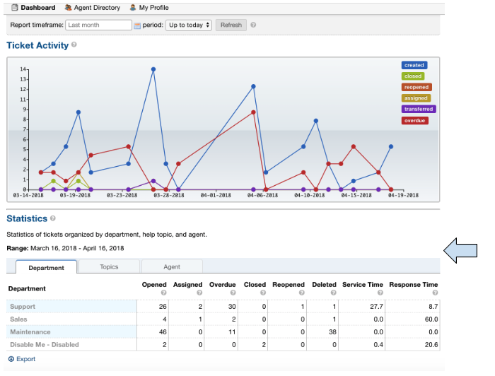

***Note:** The range of dates is changed using the ‘Report Timeframe’ at the top of the page.

**Service Time**
|br|
Refers to the duration of time that begins at the opening of a ticket and ends when the ticket is closed without being reopened again. The Service Time column measures the average Service Time per ticket, in hours, within the specified date span.

**Response Time**
|br|
Shows an average of the number of hours between when a user posted a message on a ticket and when an agent responded/replied to the customer.

Fix Most Redactor Issues
------------------------

**Summary:**
|br|
Previously, the text editor buttons didn’t work properly, like the Bold, Italics, Underline, etc. Instead of using the buttons like you would think (ie. highlight the text and click the button), you had to highlight the text, cut the text, click the button you desired (like Bold), and then paste the original text back in. This version added a fix to make the buttons work like intended.

**Tests:**

1. Login to helpdesk.
2. Click on any ticket.
3. Start typing a reply in the reply box.
4. Highlight some text.
5. Click Bold, Italics, etc.
6. See if the text takes on the new styling.

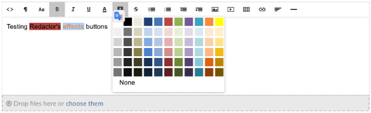

Fix Reset Button(s)
-------------------

**Summary:**
|br|
Previously the Reset buttons on Tickets never worked. If you clicked Reset nothing would happen at all. This version fixed the Reset buttons on tickets so that text in the reply box is reset and the draft (if any) is deleted.

**Tests:**

1.Login to helpdesk.
2. Click any ticket.
3. Insert text into the Reply box.
4. Wait 30 seconds for the draft to save.
5. Type in more text and wait an additional 30 seconds for the draft to save again.
6. You should now see a delete icon in the top right corner of the Reply box.
7. Click **Reset** and see if the text was removed and the delete icon went away. If so it was successful.

**Before**

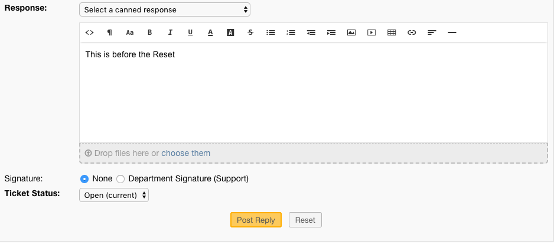

**After**

.. image:: ../_static/images/111overview_reset2.png
  :alt: Reset After

Fix New Ticket Cancel Button
----------------------------

**Summary:**
|br|
Previously the Cancel button on New Ticket creation never worked. If you clicked Cancel nothing would happen at all. This version fixed the Cancel button on New Ticket creation so everything entered would be canceled/reset and the page would redirect back to the ticket queue.

**Tests:**

1. Login to helpdesk.
2. Click the **New Ticket** button.
3. Start to fill out the New Ticket forms.
4. Scroll to the bottom of the page.
5. Click **Cancel** and see if all the fields were canceled/reset and the page redirects to the ticket queue.

**Before**

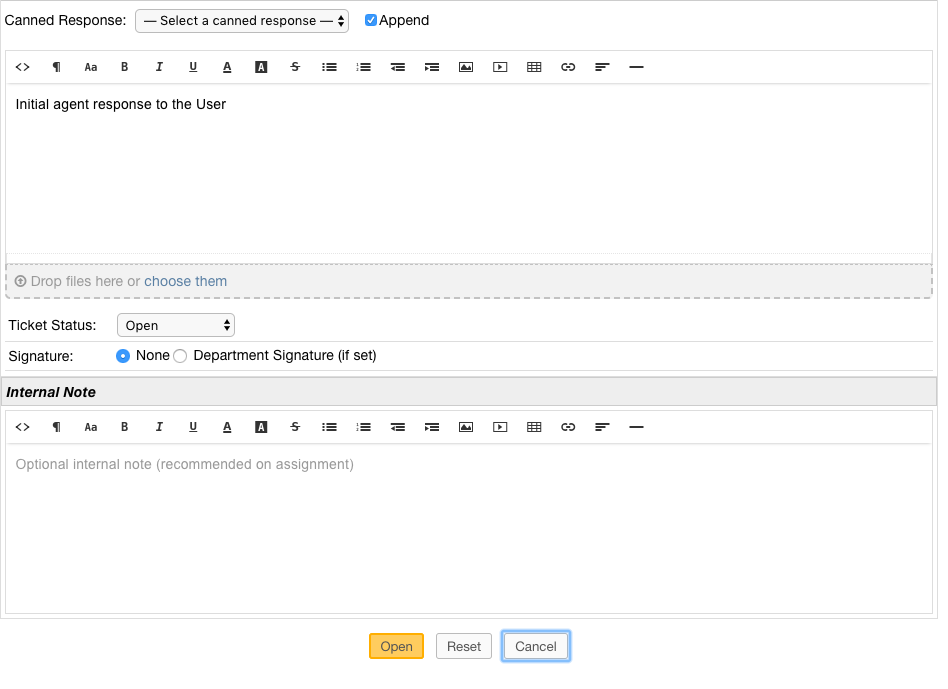

**After**

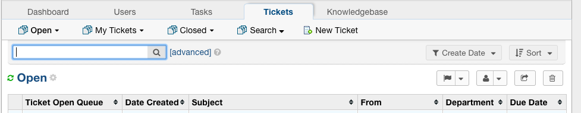

Fix %{ticket.last_update} Ticket Variable
-----------------------------------------

**Summary:**
|br|
The %{ticket.last_update} variable is used to show the User/Agent when the ticket was last updated. Previously, the %{ticket.last_update} ticket variable didn’t work. This was due to a small typo in the code. This version corrected the typo and fixed the variable.

**Tests:**

1. Login to helpdesk.
2. Go to **Admin Panel > Emails > Templates.**
3. Click the **System Default** Template Set.
4. Click the **Response/Reply Template**
5. Add **%{ticket.last_update}** anywhere in the body.
6. Save Changes.
7. Create a test-ticket using a personal email for the User’s email.
8. Respond back to that test ticket as Agent.
9. View the email you get as a User to see if the variable was replaced by an actual date.

**Template**

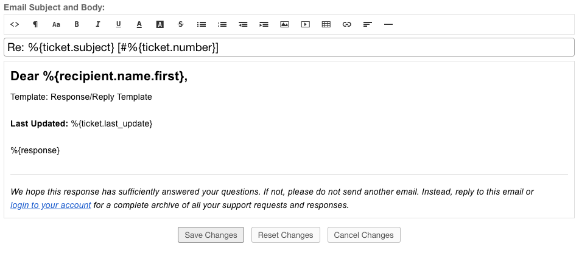

**Result**

Dear Adriane,

Template: Response/Reply Template

**Last Updated:** 04/16/2018 3:16PM

test

Fix DatePicker (Client Side)
----------------------------

**Summary:**
|br|
Previously, occasionally date picker fields on the Client Side would duplicate the days/months in the date string so the result would be something like “0404/0101/2018”. This version fixed the date pickers so it wouldn’t duplicate anything in the string giving you the correct date string.

**Tests:**

1. Login to helpdesk.
2. Go to **Admin Panel > Manage > Forms**
3. Click **Ticket Details** Form.
4. Add a custom field that is of type “Date and Time”.
5. Save Changes.
6. Go to Client Portal.
7. Open a New Ticket.
8. Add a date to the new custom field.
9. Create the ticket and make sure the date for that field in the header is formatted correctly.

**Custom Field Creation**

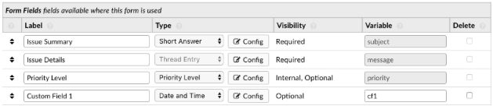

**Custom Field In Action**

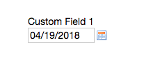

**Date In Header**

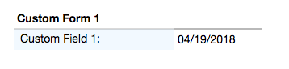

Add Custom Forms to Ticket Filter Data
--------------------------------------

**Summary:**
|br|
Previously, you could not add Custom Forms/Fields to Ticket Filter Rules. This version added the ability to add Custom Forms/Fields to Ticket Filter Rules so you can filter and perform actions on tickets that are created via API or Client Portal based on Custom Form/Field criteria.

**Note:**

Tickets created via email do not have custom forms/fields available until after creation; Ticket Filters are ran before tickets are actually created. So this feature doesn’t apply to tickets created via email.

**Tests:**

1. Login to helpdesk.
2. Go to Admin Panel > Manage > Ticket Filters.
3. Click Add New Filter.
4. Add any Filter Name you’d like.
5. Add 1 for Execution Order.
6. Make Filter Status Active.
7. Change Target Channel to Any.
8. Under Filter Rules tab, click the first dropdown.
9. Click any Custom Form Field name to add it.
10. Click the dropdown next to it to add a matching rule for the Custom Field.
11. Click Filter Actions tab.
12. Click the dropdown and add a Filter Action (such as Assign Agent/Team).
13. Once you add an Action you have to click the dropdown next to it to select the Actions value.
14. Once everything is completed, click Add Filter.
15. Double-check to make sure the Filter is Active and go to the Agent Panel to create a new Ticket.
16. On the new Ticket, fill out the Custom Form Field so it will match the Filter Rule.
17. Create the ticket and see if the Filter Action executed. (ie. set the Department, Assigned an Agent/Team, etc.)

**Creating Filter**

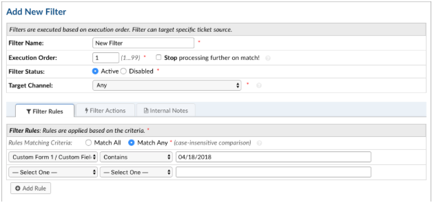

**Creating Ticket To Match Filter**

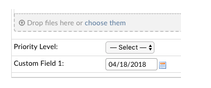

**Ticket Action Successful**

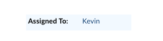
