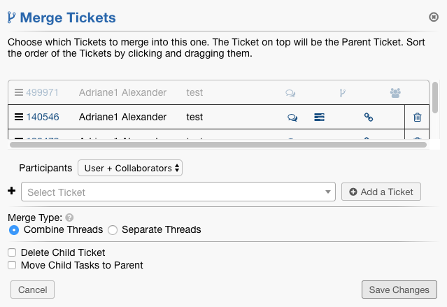
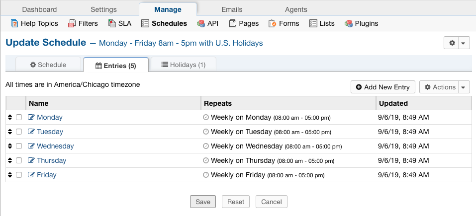
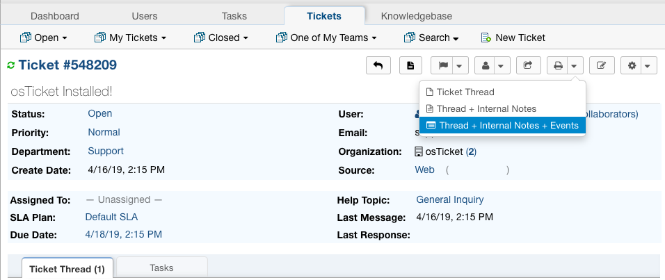
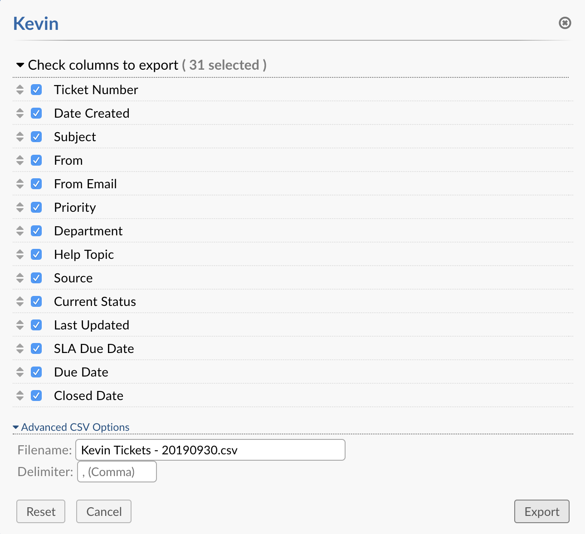
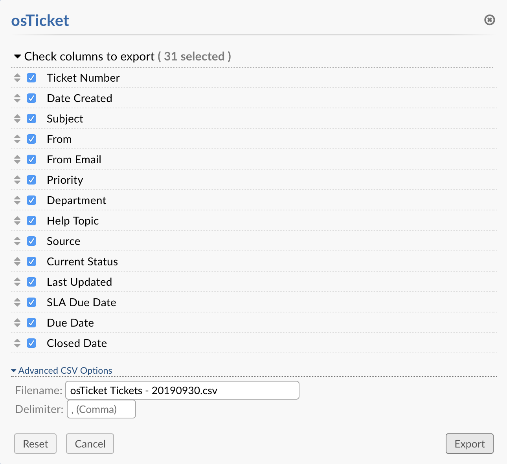
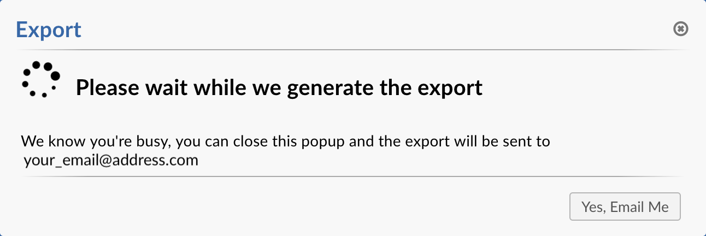
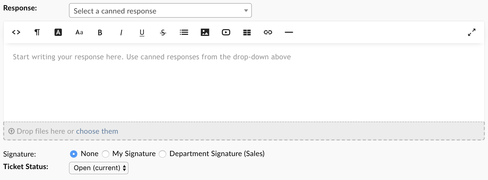

Upgrade Overview (v1.14.1)
============================

Features Outlined in this Document
----------------------------------

* Ticket Merge and Ticket Link
* Schedules and Business Hour SLA’s
* Expanded Print View
* Improved Export
* Updated Redactor

We’ve been hard at work getting these great new features ready for you. We invite you to download the preview release and share in our excitement!

http://osticket.com/download

Ticket Merge and Ticket Link
----------------------------

The Ticket Merge feature allows you to combine two or more Tickets so that their threads will all be in one Ticket. We will call this the Parent Ticket.

Linking allows you to group tickets together without actually manipulating any Tickets. It just gives you a quick way to access Tickets 
that may be related in some way.

Schedules and Business Hour SLA’s
---------------------------------

Service Level Agreement (SLA) defines a Grace Period, in hours, to which a task or service must be completed before it’s marked overdue. 

By default the Elapsed Time is based on Actual time – which assumes 24/7 service however, this is not ideal for businesses with specific business hours. For example, for an organization that operates Mon-Fri from 8am-5pm; if a ticket gets created  at 4 pm on a weekday, its business elapsed time at 8 am on the next weekday is 1 hour while its actual elapsed time is 17 hours. 

To provide a mechanism to specify Business Hours, osTicket uses the concept of Schedules to define Business Hours (working hours)  and Holidays (holiday hours) to which an SLA can be configured to use.

Expanded Print View
-------------------

Now, when an Agent prints a PDF of the Ticket, they will have the option to print Thread Events as well.

Improved Export
---------------

The exporter has been greatly improved by moving away from SQL-based exports that are prone to memory and timeout issues. What this means for osTicket users is the system will no longer timeout and fail no matter how much data you are trying to export. This applies to Queue Exports, Search Exports and has now been expanded to User/Organization Ticket exports. In addition, the Export popup has been added to User/Organization Ticket exports so you are able to customize what fields, etc. you see in exports. Lastly, you are given the option for the Export to be emailed to you on completion so you can continue answering tickets while the export is being generated.

**User Tickets Export**

**Organization Tickets Export**

**Export Email Option**

Updated Redactor
----------------

Finally we introduce to you, what everyone has been waiting for, the new improved Redactor! WOO HOO! Very exciting, we know. The time has finally come for the editor to be sleek, modern, and much more responsive. All custom features such as Image Annotation, Draft Save, etc. have been completely revamped to fit the new Redactor codebase. Every feature should work perfectly no matter what browser you use.

