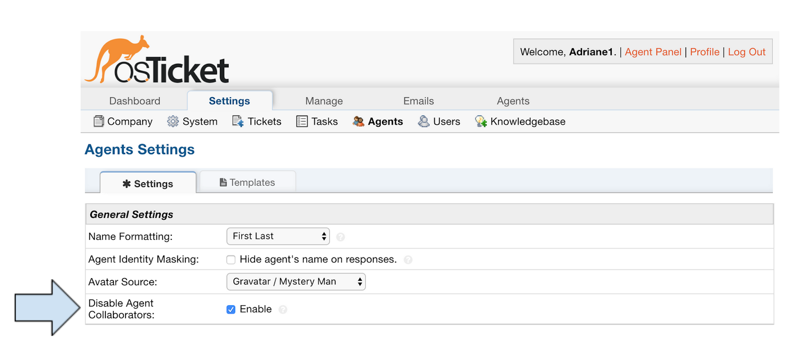
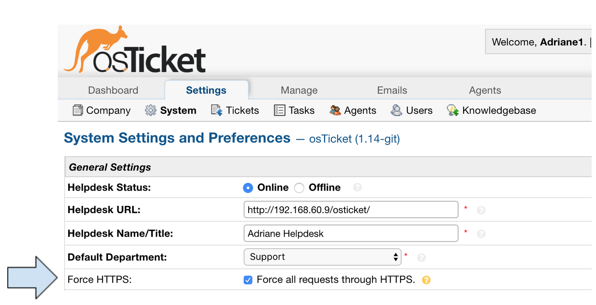
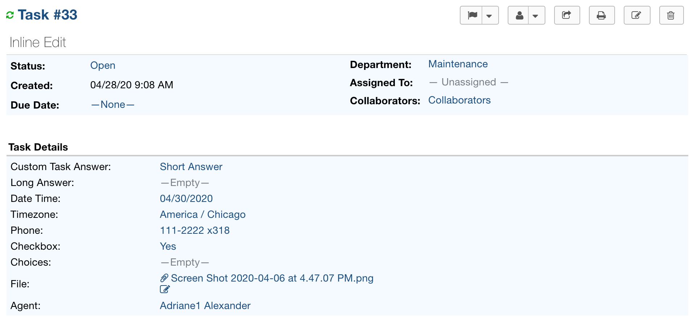

.. |br| raw:: html

     

Upgrade Overview (v1.14.2)
============================

Features Outlined in this Document
----------------------------------

* Configurable Agents As Collaborators
* Force HTTPS
* Task Inline Edit

We’ve been hard at work getting these great new features ready for you. We invite you to download the preview release and share in our excitement!

http://osticket.com/download

Configurable Agents As Collaborators
------------------------------------

This feature adds a new setting called "Disable Agent Collaborators" that allows Admins to globally configure whether or not to allow Agents to be added as Collaborators via Users.
In some use cases Agents do not want to be added as Collaborators on Tickets to avoid an overload of emails/alerts, etc.
This adds a new checkbox labeled Disable Agent Collaborators to:

Admin Panel > Settings > Agents

If this box is Enabled/Checked, Agents that are added as Collaborators by Users will automatically be disabled.
This disables the participant alerts for the Agents whilst giving other Agents/Admins the ability to enable them at a later date.

Force HTTPS
-----------

This feature introduces a checkbox in the System Settings to force HTTPS. This is for people who either can't or don't know how to configure redirect rules via the webserver.
If the setting is enabled, the system will redirect all osTicket web traffic to the HTTPS protocol automatically.
In addition this adds an HTTP_OK option that disables the HTTPS redirect for local calls such as cron, pipe, and cli. This also updates the remote piping scripts (automail.pl and automail.php) to include support for HTTPS.

Task Inline Edit
----------------

Inline Edit for Tasks allows you to edit individual fields on a Task rather than having to edit the whole Task.

