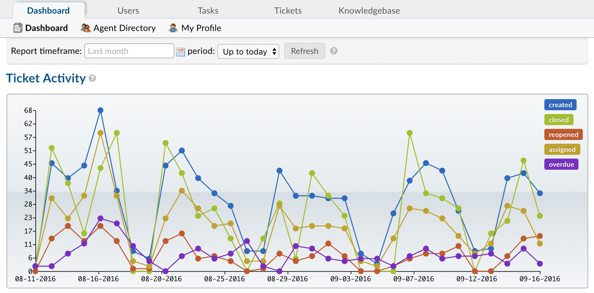

Data Extraction Guide
=====================

Exporting Ticket Data (CSV)
---------------------------

**Agent Panel > Tickets**

**Ticket Exports** allow Agents to export ticket header information in a **CSV format**. This export includes only metadata—such as ticket ID, status, creation date, assigned user, and other key details.

Agents can **customize** the exported data by selecting which metadata fields to include. Additionally, exports can be **filtered by queue** or **Advanced Search**, enabling Agents to refine results based on:

* Ticket Data
* User-related Data
* Custom Queue

This functionality provides a streamlined way to extract and analyze ticket data while maintaining control over the exported information.

Advanced Search
^^^^^^^^^^^^^^^

:doc:`Advanced Search <../Agent/Tickets/Advanced Search>` allows Agents to search and filter tickets based on unique ticket criteria. 

* Ticket Information
* User Information
* Organization Information
* Form Information

Ticket Header Information
^^^^^^^^^^^^^^^^^^^^^^^^^

`Ticket Header information <../Agent/Tickets/Tickets.html#ticket-header>`_ is available from the top of the ticket or the Ticket Header, Agents will see any data associated with the ticket from the built in Ticket Details form.

Customizing the Export Picker
^^^^^^^^^^^^^^^^^^^^^^^^^^^^^

`Customize the Export Picker <../Admin/Settings/Tickets.html#queues>`_ to add and remove the fields included in the export picker.

Dashboard Exports (CSV)
-----------------------

**Agent Panel > Dashboard Tab**

Meant to be a historical marker of the metadata in your help desk, the :doc:`Dashboard <../Agent/Dashboard/Dashboard>` will give you an overview of tickets in your help desk. The data can be filtered by date as well as Departments, Help Topics, and Agents. 

Export the Ticket Activity data to a CSV file by clicking the **Export** button at the bottom of the Dashboard.

|

