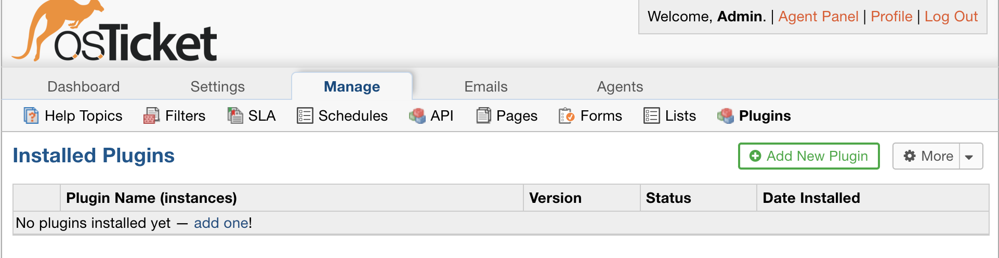
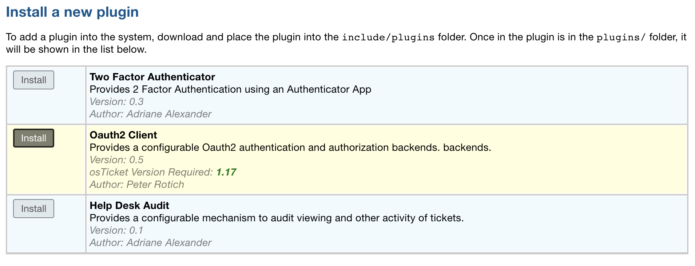
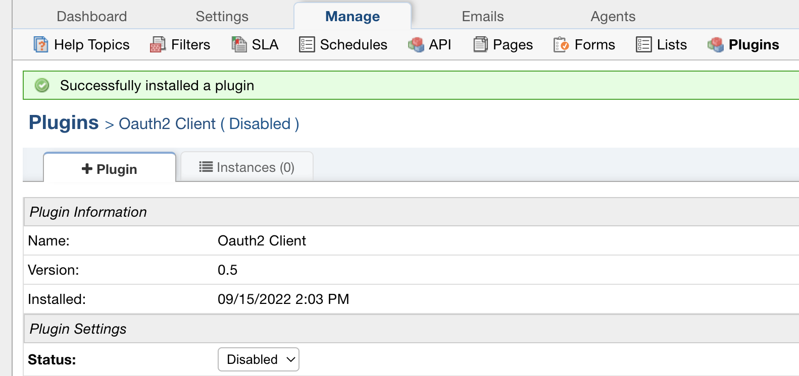
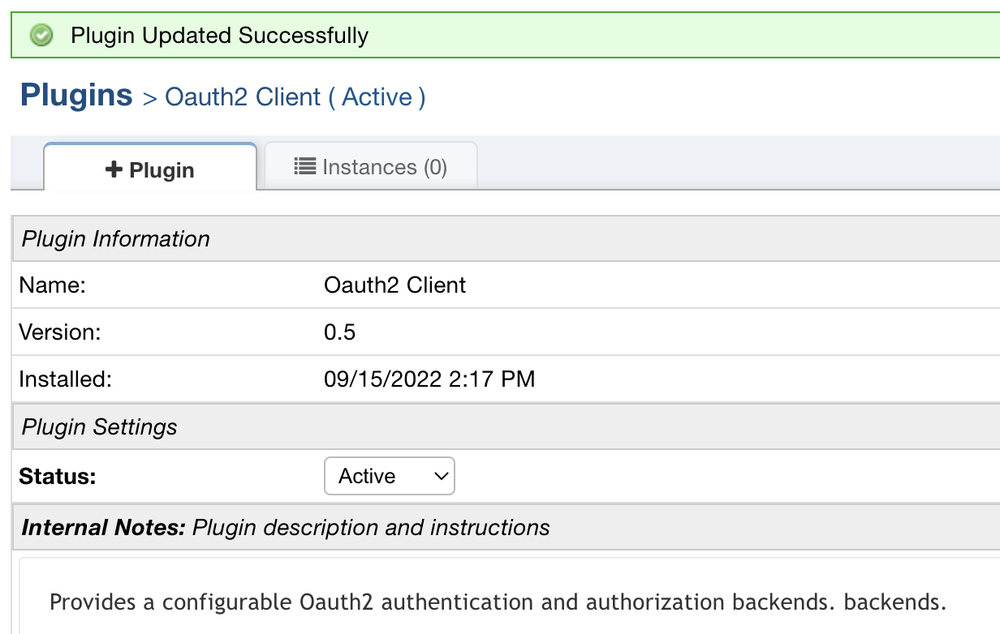

.. |br| raw:: html

     

OAuth2 Guide
============

OAuth Authentication allows Agents/Users the ability to use Single Sign-on to log into the helpdesk through the provider you set up. The most commonly used providers are Microsoft and Google.

Authentication
--------------

OAuth Authentication allows Agents/Users the ability to use Single Sign-on to log into the helpdesk through the provider you set up. The most commonly used providers are Microsoft, Google, and Okta.

**Guides:**

:doc:`Microsoft Authentication (SSO) Guide <../OAuth2/Microsoft Authentication (SSO) Guide>`

:doc:`Google Authentication (SSO) Guide<../OAuth2/Google Authentication (SSO) Guide>`

:doc:`Okta Authentication (SSO) Guide<../OAuth2/Okta Authentication (SSO) Guide>`

Authorization
-------------

OAuth2 Authorization allows emails the ability to authenticate against a mail server using the OAuth2 protocol. This eliminates the need to store the password locally and instead redirects you directly to the provider to login. Most provider's are phasing out Basic Authentication (username + password) for Modern Authentication (OAuth2) but if you host your own mailserver you may not have OAuth2 available. The most commonly used providers are Microsoft and Google.

**Guides:**

:doc:`Microsoft Authorization Guide <../OAuth2/Microsoft Authorization Guide>`

:doc:`Google Authorization Guide <../OAuth2/Google Authorization Guide>`

Setting Up The Plugin
---------------------

First you will need to download the plugin from our `website <https://osticket.com/download>`_. Make sure you have selected v1.17 or higher and select the 'Authentication :: Oauth2' plugin. Once the file is downloaded, copy the plugin file into the include/plugins folder and add the plugin:

Admin Panel | Manage | Plugins

|br|

|br|

|br|

Change the Status from 'Disabled' to 'Active' and click 'Save Changes'

