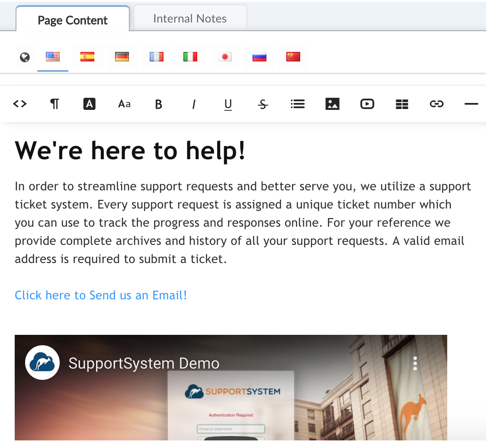
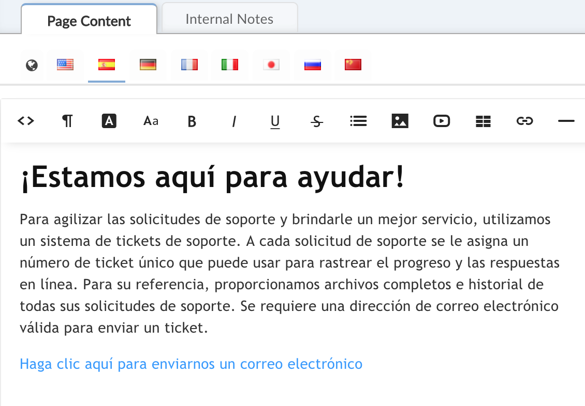
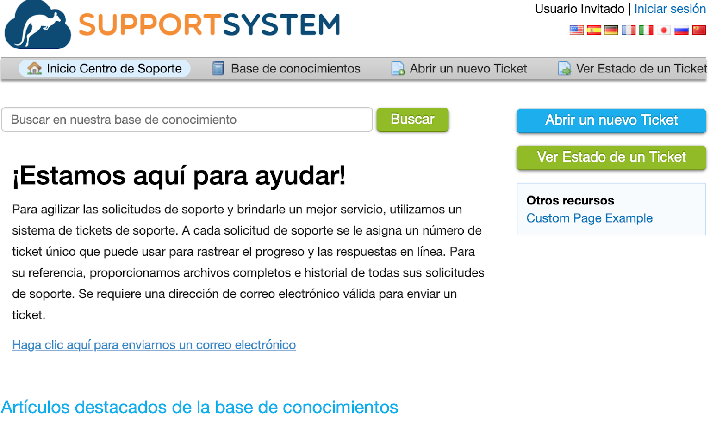
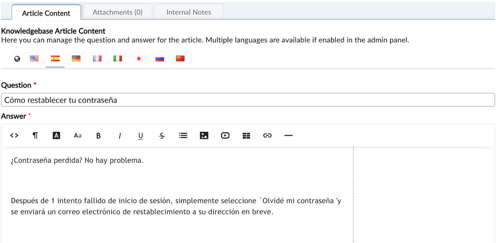
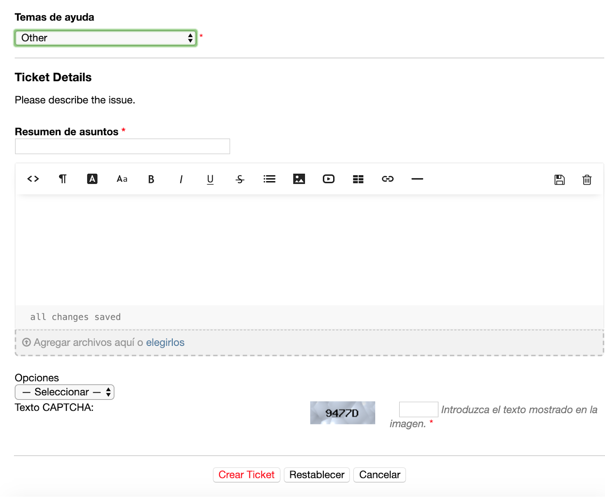
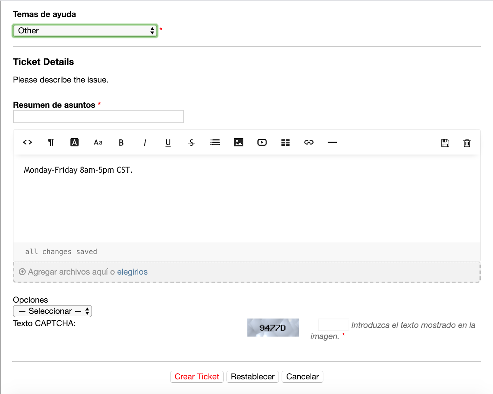

Translating Editable Text
-------------------------

Updating the Primary and Secondary system languages in your help desk will automatically translate the hard-coded areas such as configuration field labels and command bars as well. Follow the guide below for steps to also translate the administratively editable text in the help desk includes things like; All Email Templates, Custom Fields, Help Topics, Thank you Pages and Knowledgebase articles.

Although the selection of the preferred language by the end user will change the command bar and built-in field data, the Landing Page, or main body of text of the Client Portal needs to be translated in the Admin Panel > Manage > Site Pages.
Select a flag to translate the landing page for each available language.

View from Client Portal after selecting the Spanish Language Option:

**Translating Knowledgebase Articles**

The Knowledgebase is located within the Agent Panel under the Knowledgebase Tab. You can translate Categories and their FAQ’s by selecting the item and then clicking on the flag of the language to enter the translated text.

**Translating Custom Field Data**

Custom field labels are translated at Admin Panel > Manage > Forms. You can translate the field labels on any form by clicking on the globe icon of the field and adding the primary and/or secondary languages to the field. Once translated, this content will show for the end user or agent when they select their language preference. If the field is not translated, the original or default text will show.

User’s View from the Client Portal:

