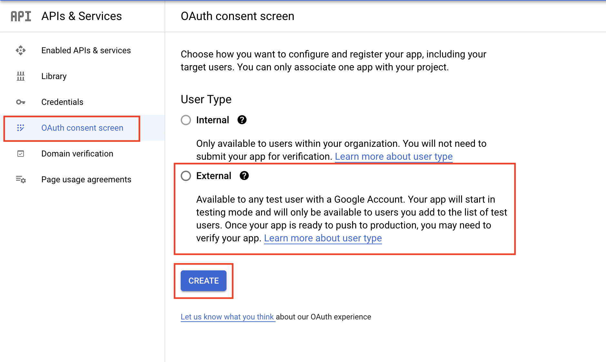
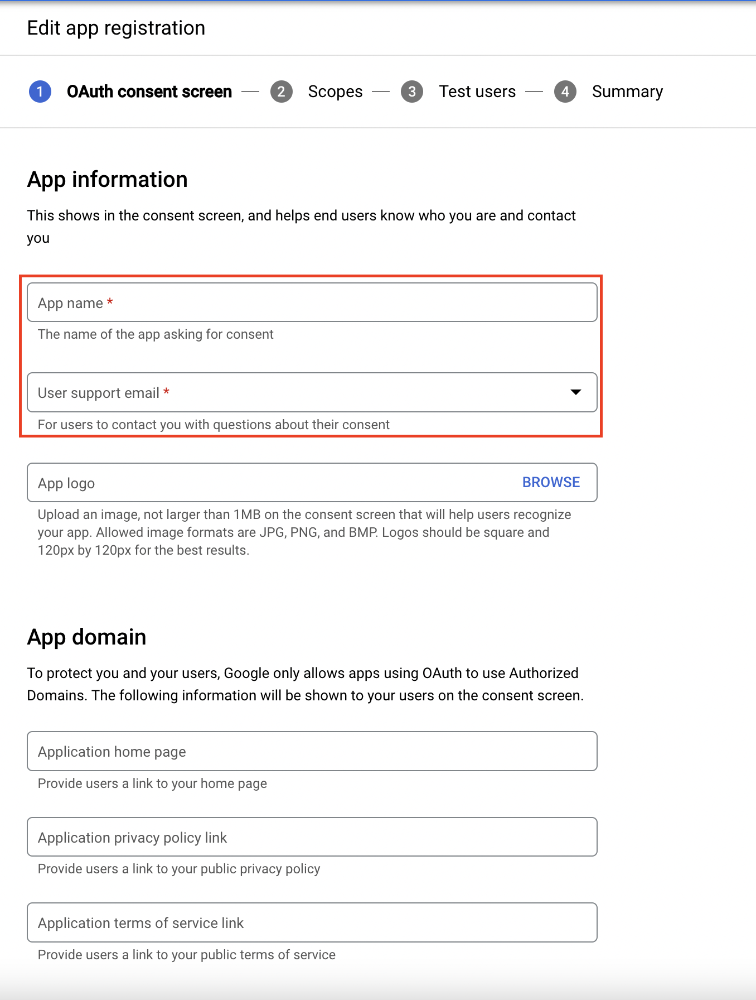

Google Authorization Guide
==========================

This guide will walk you through how to configure Modern Authentication (OAuth2) for a Google email. Please note, you must have the OAuth2 Plugin installed and enabled beforehand.

Configure Authorization
-----------------------

**Admin Panel > Emails > Emails > click a System Email**

First we will need to click on a System Email and go to the **Remote Mailbox** tab. Here you will select the **Authentication** method of **OAuth2 - Google**.

Once the option is selected you can click the **Config** button. Once the popup appears click the **IdP Config** tab to start configuring OAuth2. Here you will be presented with a form to input information from your provider (Google). Most of the information is prefilled and does not need to be changed. The important thing at this stage is to copy the **Callback Endpoint** (at the top of the popup) to your clipboard for a later step in this guide.

Once you've copied the **Callback Endpoint** let's head on over to **Google Cloud Console** (*preferably in a new tab*) to register a new project. In the Google Cloud Console let's click the current project name (or **My First Project** if you haven't created a project before) in the top left of the page.

Next, click the **New Project** button to create a new project.

This will give you a new form to input some basic project information such as the **Project Name** and **Location** (basically what organization you want to create the project under).

Now click **Create** and wait for the project to be created. Once created, we will click on the **Enabled API & services** tab and click the **+ ENABLE API AND SERVICES** button at the top of the page.

Here we will use the search bar and type '**gmail api**' and wait for the Gmail API to appear in the results.

.. image:: ../_static/images/g_oauth2_autho_7.png
  :alt: API Library Search

Click the **Gmail API** result and click the **Enable** button to enable Gmail API for this project.

Now we can configure the OAuth consent screen by clicking the **OAuth consent screen** tab. Here you can choose the **User Type** of **Internal** or **External**. If you use a personal Gmail account you will be limited to **External** only. Once you select your User Type click **Create**.

In the **App Information** section we will keep it simple for this guide and add only the **App Name** and the **User Support Email**. We will also be skipping the **App Domain** section however if you want to fill this information in please do so.

For this guide we will be skipping the **Authorized Domains** part as well but if you want to set this up please do so. Lastly, we can input the **Developer contact information** and click **SAVE AND CONTINUE**.

For the sake of this guide we will be skipping the next page so just click **Save and Continue**.

Now we can create the Client ID and Client Secret by clicking the **Credentials** tab and clicking the **+ CREATE CREDENTIALS** button at the top.

Once you click **+ CREATE CREDENTIALS** select the **OAuth client ID** option.

For **Application Type** select '**web application**' and this will automatically show a new form.

In the new form we can add a **Name** for the OAuth2 client. Next you will input the **Authorized Javascript origins** by pasting the **Callback Endpoint** we copied earlier and removing everything after the hostname. Lastly, we can input the **Authorized redirect URIs** by pasting the **Callback Endpoint** we copied earlier.

.. image:: ../_static/images/g_oauth2_autho_16.png
  :alt: Create OAuth client ID form

Once finished click **Create** and you will be presented with your **Client ID** and **Client Secret**.

Copy your **Client ID** and let's go back to the helpdesk to input this information. In the popup paste the **Client ID** in the **Client ID** field. Go back to Google Cloud Console, copy the **Client Secret**, go back to the helpdesk, and paste that in the **Client Secret** field. Now you can click **Submit** and you should be redirected to Google to authorize the connection.

Here it is **very important** to login to the email you are trying to configure in the helpdesk.

Once you login to the correct email you may be presented with a page that says "**Google hasn't verified this app**" if so just click **Continue**.

.. image:: ../_static/images/g_oauth2_autho_19.png
  :alt: Google hasn't verified this app message

Now it will bring you to a page that asks if you want to allow the application to have access to the google (email) account and you will click **Continue**.

After this you will be redirected back to the helpdesk and should see a green success banner. To confirm the connection was successful and that you received a token you can click **Config** again and you should see a new tab called **Token** that displays your token information. Now OAuth2 is configured for the email and you can move on to configure the rest of the :doc:`IMAP/POP3 and SMTP information <../Admin/Emails/Emails>`.
